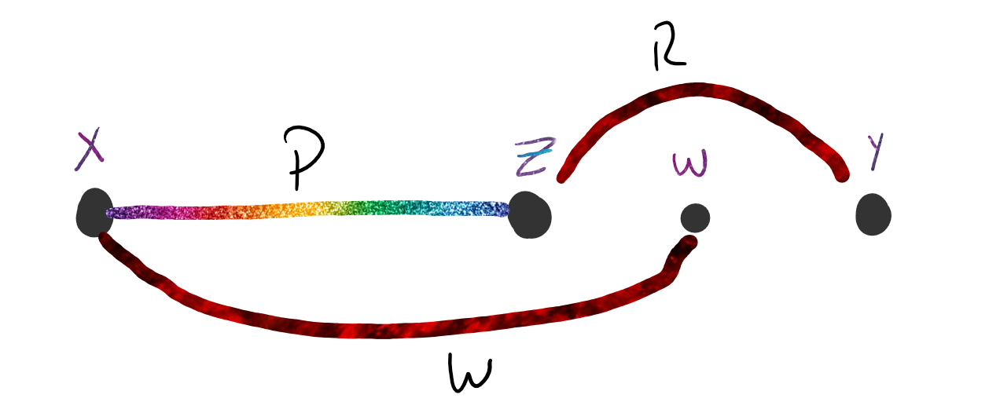

# Demostración

Sea $G$ un grado con 3 o mas vertices, entonces:
$$
G \text{ es }2-conexo \\\Leftrightarrow\\ \forall \text{ par de vertices }x,y~ \exist\text{ 2 caminos internamende disjuntos}\\\text{ (Hay un ciclo en $G$ que contiene a ambos vertices)}
$$

#### Demo

$\Leftarrow)$ **Por Contra reciproco**

Si $G$ no es $2-conexo $

$\Rightarrow$ Como es conexo tiene un vertice de corte ($v$)

$\Rightarrow$ $G-\{v\}$ tiene al menos 2 componentes. Si tomo $x \in V_G$ en una componente y tomo $y \in V_G$ un corte distinto, no hay camino $x-y$ en $G-\{v\}$ 

$\Rightarrow$ Todo camino $x-y$ contiene a $v$

$\Rightarrow \not \exist$ en $G$ caminos $x-y$ internamente disjuntos

$\Rightarrow)$ **Por Inducción**

Demuestro por induccion en la distancia entre $x,y$ ($d(x,y)$)

- Caso Base:

  Si $d(x,y)=1$, es decir, $e=\{x,y\} \in E_G$

  Como $G$ es $2-conexo$:
  $$
  K_v(G)\ge 2 \Rightarrow K_e(G)\ge2
  $$
  $\Rightarrow G-\{e\}$ es conexo

  $\Rightarrow$ hay en $G-\{e\}$ un camino $x-y$ . Dicho camino es internamente disjunto en $G$ con el camino $e$ anteriormente definido.

  $\Rightarrow$ Se cumple para $d(x,y)=1$ 

- Hipotesis Indictiva:

  Supongamos que es verdadero para $d(x,y)<n$

- Tesis Inductiva:

  Supongamos que es verdadero para $d(x,y) = n$

Si $d(x,y)=n \Rightarrow \exist$ en $G$ un camino de longitud $n$ de $x$ a $y$.

Sea $w$ un vertice adyacente a $y$ en dicho camino $\Rightarrow d(x,y)< n$, por lo que puedo usa la Hipotesis Inductiva.

$\Rightarrow \exist$ dos caminos internamente disjuntos $P$ y $Q$ entre $x$ y $w$   

Aqui tengo 2 casos:

- Caso 1:

  

  Como $G$ es $2-conexo$, $G-\{w\}$ es conexo, $\Rightarrow \exist R_{x,y}$ en $G-\{w\}$

  Sin perder generalidad suponemos que el ultimo vertice en comun con $P$ o $Q$ lo tiene con $P$ y se llama $z$.

  $\Rightarrow$ $P_{x,z}$ o $R_{z,y}$ es internamente disjunto con $Q \cdot <w,e,y>$

  

- Caso 2: 

  

  Se cumple la Tesis por que $<w,e,y>$ es $L_{x,y}$, $Q_{x,y}$ es otro $L_{x,y}'$ internamente disjunto con $L_{x,y}$
