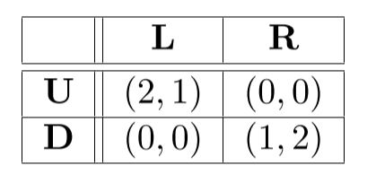

# Solving Normal-Form Games

Given $\mathcal G =(\mathcal N, \mathcal A,u)$ a normal form game, we can define the set of **mixed strategies** $\mathcal S_i$ for player $i$ as the set of all probability distributions over $\mathcal A_i$, $\mathcal S_i = \Delta(\mathcal A_i)$.

The player then will select a pure strategy according to the probability distribution. In this cases we'll extend the utility function to correspond with the expected utility:
$$
u_i(s) = \sum_{a\in A} u_i(a) \prod_{j\in \mathcal N} s_j(a_j) 
$$
We can also extend our existing concepts (*dominance, best response, nash equilibrium*) to mixed strategies, where the only difference is that now we are using the new utility function.

## Nash Equilibrium

In mixed strategies, we have the **Nash Theorem** that says that every game with finite number of player and action profiles has at least one Nash equilibrium.

The **support** of a mixed strategy $s_i$ for player $i$ is the set of pure strategies:
$$
\text{Supp}(s_i)=\{a_i/s_i(a_i) > 0\}
$$
Let $s\in \mathcal S$ be a Nash equilibrium and $a_i,a_i' \in \mathcal A_i$ actions from the support of $s_i$:
$$
u_i(a_i,s_{-i}) = u_i(a_i',s_{-i})
$$
We can use this to find the the Nash equilibrium. I will explain it with the following example:

We will compute the strategy for player 2 (column player). He can play $L$ with probability $p$ and $R$ with probability $1-p$. Because of the previous corollary, we can say that the Nash equilibrium exists when:
$$
\mathbb E u_1(U)= \mathbb E u_1(D) \\
2p + 0(1-p) = 0p + 1(1-p) \\
p= \frac 1 3
$$
If we do the same with player one, we'll find that there are 2 equilibriums at $[(\frac 2 3,\frac 1 3);(\frac 1 3,\frac 2 3)]$. This is calculated using the probabilities obtained previously. We know that player $2$ has probability $p$ and we can calculate the probability for player $1$ with $q$. This will result in the mixed strategies:
$$
\array{
\text{player 1}& (q,1-q)\\
\text{player 2}& (p,1-p)
}
$$
In games with more actions we cannot directly apply this method, but we can try to remove dominated strategies and search for a possible support.

### The Equilibrium Selection Problem

When there are multiple Nash equilibriums in a game, how do we know which one the player should play?

Because playing the Nash strategy doesn't guarantee the outcome, we have to use other methods that seek to maximize the outcome.

One of these methods is called **MaxMin** and it tries to play conservative strategies to be protected against a worst case action from the opponent. The **maxmin strategy** for player $i$ is defined as:
$$
{\arg \max}_{s_i} \min_{s_{-i}} u_i(s_i,s_{-i})
$$
 We can also define the **maxmin value** for player $i$ as
$$
\max_{s_i} \min_{s_{-i}} u_i(s_i,s_{-i})
$$
The other method is called **Minmax** and it tries to maximize punishment for strategies of the other platers. The **minmax strategy** for player $i$ is defined as:
$$
{\arg \min}_{s_i} \max_{s_{-i}} u_{-i}(s_i,s_{-i})
$$
 We can also define the **minmax value** for player $i$ as
$$
\min{s_i} \max_{s_{-i}} u_{-i}(s_i,s_{-i})
$$
According to **Von Neumann's Minimax Theorem**:

>In any finite, two-player zero-sum game, in any Nash equilibrium each player receives a payoff that's equal to both his maxmin value and the minimax value of his opponent.

This has the following consequences:

- $\max_{s_i} \min_{s_{-i}} u_i(s_i,s_{-i}) = \min_{s_{-i}} \max_{s_i}u_i(s_i,s_{-i}) $
- We can safely play Nash strategies in zero-sum games.

- All Nash equilibria have the same payoff.

### Calculating Nash Equilibrium Games

We use Linear programing to compute Nash equilibrium for a two-player, **zero-sum** game:
$$
\array{
	(1) && \max_{s,U} U \\
	(2) && \sum_{a_1\in \mathcal A_1}s(a_1)u_1(a_1,a_2) \ge U~~\forall a_2 \in \mathcal A_2 \\
	(3) && \sum_{a_1 \in \mathcal A_1} s(a_1) = 1 \\
	(4) && s(a_1) \ge 0~~\forall a_1 \in \mathcal A_1
}
$$
With this strategy, Nash equilibrium can be computed in polynomial time.

In **general-sum** games, we can also use linear programing, but it is more complex:
$$
\array{
(1) && \sum_{a_2 \in \mathcal A_2} u_1(a_1,a_2) s_2(a_2) + q(a_1) = U_1	~~ \forall a_1 \in A_1\\

(2) && \sum_{a_1\in \mathcal A_1} u_2(a_1,a_2) s_1(a_1) + w(a_1) = U_2	~~ \forall a_2 \in A_2 \\

(3) && \sum_{a_1 \in \mathcal A_1 } s_1(a_1) = 1\\
(4) && \sum_{a_2 \in \mathcal A_2 } s_2(a_2) = 1\\
}\\
q(a_1) \ge 0, w(a_2) \ge 0, s_1(a_1) \ge 0, s_2(a_2) \ge 0 ~~\forall a_1\in \mathcal A_1, \forall a_2 \in \mathcal A_2 \\
s_1(a_1) \times q(a_1) = 0, s_2(a_2) \times w(a_2) = 0 ~~ \forall a_1\in \mathcal A_1, \forall a_2 \in \mathcal A_2 
$$
This problem gets more complicated as you add more players.

### Regret

The concept of regret is useful when the other players are not playing completely malicious. By definition, a player $i$'s regret for playing an action $a_i$ if the other agents adopt action profile $a_{-i}$ is defined as:
$$
\left[ \max_{a'_j \in \mathcal A_i} u_i(a'_i,a_{-i}) \right] - u_i(a_i,a_{-i})
$$
A player $i$'s **maximum regret** for playing an action $a_i$ is defined as:
$$
\max_{a_{-i} \in \mathcal A_{-i}} \left(\left[ \max_{a'_j \in \mathcal A_i} u_i(a'_i,a_{-i}) \right] - u_i(a_i,a_{-i})\right)
$$
In a similar fashion, **minimax regret** actions for player $i$ are defined as:
$$
\arg \min_{a_i\in \mathcal A_i} \max_{a_{-i} \in \mathcal A_{-i}} \left(\left[ \max_{a'_j \in \mathcal A_i} u_i(a'_i,a_{-i}) \right] - u_i(a_i,a_{-i})\right)
$$

## Correlated Equilibrium

In a normal-form game $\mathcal G = (\mathcal N,\mathcal A,u)$ and let $\sigma$ be a probability distribution over joint pure strategy profiles, $\sigma \in \Delta(\mathcal A)$. We say that $\sigma$ is a **correlated equilibrium** if for every player $i$, every signal $a_i \in \mathcal A_i$ and every possible action $a_i' \in \mathcal A_i$ it holds:
$$
\sum_{a_{-i} \in \mathcal A_{-i}} \sigma(a_i,a_{-i})u_i(a_i,a_{-i})
\ge 
\sum_{a_{-i} \in \mathcal A_{-i}} \sigma(a_i,a_{-i})u_i(a_i',a_{-i})
$$
<u>The intuitive idea behind correlated equilibrium is that you have a randomizing factor that recommends actions to agents such that no agent wants to deviate.</u>  

For every Nash equilibrium there exists a corresponding Correlated Equilibrium.

We can compute the correlated equilibrium using linear programing:
$$
\array{
(1) && \sum_{a_{-i} \in \mathcal A _{-i}} \sigma(a_i,a_{-i}) u_i(a_i,a_{-i}) \ge \sum_{a_{-i} \in \mathcal A _{-i}} \sigma(a_i,a_{-i}) u_i(a_i',a_{-i}) \\
&&\forall i \in \mathcal N, \forall a_i,a_i' \in \mathcal A_i \\
(2) && \sum_{a\in \mathcal A} \sigma(a) \ge 0 \\
&& \sigma(a) \ge 0, \forall a \in \mathcal A
}
$$

## Stackelberg Equilibrium

An Stackelberg Equilibrium is a strategy profile that works with the following conditions:

- One agent is the **leader**, who publicly commits to a strategy.
- The other agents are the **followers**, that play a Nash equilibrium with respect to the commitment of the leader.

This strategy profile works towards maximizing the expected utility value of the leader:
$$
\underset {s\in \mathcal S, \forall i \in \mathcal N\setminus\{1\}, s_i \in BR_i(s_{-i})} {\arg \max} u_1(s)
$$
Because there may be multiple Nash equilibria, the followers need to break the tie and decide for one in an arbitrary, but well stablished way. From this we can derive two types of Stackelberg equilibriums:

- **Strong SE**: the followers select the Nash Equilibrium that maximized the outcome of the leader. All SE that don't require tie breaks are strong.
- **Weak SE**: The followers will select an equilibrium that minimizes the outcome of the leader.

The problem is polynomial for two players where player 1 is the leader and 2 is the follower. The baseline polynomial algorithm requires solving $|\mathcal A_2|$ linear programs:
$$
\array{
(1) && \max_{s_i \in \mathcal S_ 1} \sum_{a_1 \in \mathcal A_1} s_1(a_1) u_1(a_1,a_2)\\
(2) && \sum_{a_1 \in \mathcal A_1} s_1(a_1) u_1(a_1,a_2) 
\ge \sum_{a_1 \in \mathcal A_1} s_1(a_1) u_1(a_1,a_2') & \forall a_2' \in \mathcal A_2\\
(3) &&\sum_{a_1\in \mathcal A_1} s_1(a_1) = 1

}
$$
one for each $a_2 \in \mathcal A_2$ assuming $a_2$ is the best response of the follower.