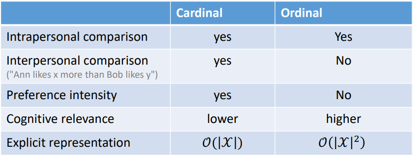

# Multiagent Resource Allocation

Multiagent Resource Allocation is the process of distributing a number of items amongst a number of agents. We can differentiate 4 parts of this process:

- **Resources**: The items they are distributing
- **Agent Preferences**: Why they want/need the item individually.
- **Social Welfare**: Why the want/need the items as a group.
- **Allocation Mechanism**: How they are going to distribute the resources.

This process is linked to *social choice*, meaning that the allocations are the alternatives over which agents express their preferences, and it is also linked to *game theory* because the allocation mechanisms are games.

## Resources

There are different types of resources, and they may require different resource allocation techniques.

The resources can be **continuous**, meaning that they can be arbitrarily divided, or **discrete**. They can also be **Divisible** or **indivisible**. Here discrete resources are indivisible while continuous resources can be either. If a resource can be assigned multiple times, we say it is **sharable**. A resource whose properties don't change is called **static**, while resources with properties that change are know as **non-static**. Finally, resources that have multiple copies are called **multi-unit**, while we call **single-unit** to resources that are unique.

**Tasks** may be considered resources with negative utility costs, and **task allocation** can also be regarded as a multiagent resource allocation problem. However, tasks are often coupled with constraints regarding their **coherent combination** (timing and ordering).

## Preference Representation

Agents may have preferences over the bundle of resources they receive or that is received by other agents (we call this **externalities**). So we need to find a language to represent this preferences.

We are going to use the following notation:

- $\mathcal A=\{1,\dots,n\}$ is the set of agents.
- $\mathcal R$ is the set of resources
- Agents have preferences over allocations $X \in \mathcal X$
- Allocation $X$ is a partial mapping of $\mathcal R$ to $\mathcal A$, because not all resources may be allocated.

A **preference structure** represents an agent's preferences over allocations $X\in \mathcal X$. Here we can denote 2 different preference structures:

- **Cardinal Preference**: This structure is a function $u:\mathcal X \rightarrow \text{Val}$ where $\text{Val}$ is usually a set of numerical values such as $\N$ or $\R$ (non negative).
- **Ordinal Preference**: In this case, the structure is a reflexive, transitive and connected binary relation $\preccurlyeq$ (equivalence relation) on the set $\mathcal{X\times X}$ which can be used to compare allocations.

Cardinal preferences can always be translated to ordinal preferences, but the same cannot be said for ordinal preferences.

==Look at the video to find out more about this==

If the allocations over which agents must express preference are bundles of indivisible resources from the set $\mathcal R$, then we have ${\# \mathcal X = 2^{\#\mathcal R}}$.

We can evaluate the representations in the following categories:

- **Expressive Power**: Can the chosen language encode all the preference structures we are interested in?
- **Succinctness**: Is the representation of typical preference structures succinct?
- **Complexity**: What is the computational complexity of related decision problems such as comparing two alternatives?
- **Cognitive Relevance**: How close is a given language to the way in which humans would express their preferences?
- **Elicitation**: How difficult is it to elicit the preference of an agent so as to represent them in the chosen language?

This can be decided in the following chart ==Verify with video!!==:

## Social Welfare

A problem in multiagent resource allocation is what kind of allocation we want to achieve? We use the term social welfare to describe metrics for assessing the quality of an allocation of resources.

There are two key indicators of social welfare:

- **Efficiency**: The chosen agreement should be such that no other agreement would be better for some and worse for other agents, meaning that we obtain **pareto optimality**. If the preferences are quantitative, the sum of all payoffs should be as high as possible (**utilitarianism**).
- **Fairness**: No agent should prefer to take the bundle allocated to one of its peers rather than keeping their own (**envy-freeness**). The agent that is going to be worst off should be as well off as possible (**egalitarianism**).

### Utilitarian Social Welfare

The utilitarian social welfare function (also called **collective utility function**) is defines as the sum of all individual utilities:
$$
\text{sw}_u(X) = \sum_{i\in \mathcal A} u_i(X)
$$
Maximizing this function improves efficiency. Also, adding a constant value to the utility function will not affect social welfare, this is called *zero-independent*.

### Egalitarian Social Welfare

The egalitarian social welfare function is defines as the worst individual utility:
$$
\text{sw}_e(X) = \min_{i\in\mathcal A} u_i(X)
$$
Maximizing this function improves the situation for the weakest member of the society

### Nash Product Social Welfare

The Nash Product Social Welfare function is defined as the product of all individual utilities:
$$
\text{sw}_n(X) = \prod_{i\in\mathcal A} u_i(X)
$$
This is a good measure of social welfare as long as all utility function can be assumed to be positive. This function increases the overall utility while reducing unequal distributions ($2\times 6 < 2 \times 4$). This is called **proportional fairness**.

The Nash CUF is also scale independent, meaning that it doesn't matter the unit of the individual agent utilities.

## Efficiency vs Fairness

Now we will discuss the tradeoffs of efficiency vs fairness. Here we will assume cardinal preferences, the utilitarian welfare function is considered to measure the efficiency of an allocation. An allocation is called **efficient** (or utilitarian) if it maximizes the sum of utilities of all agents (**social value**) .

We denote the social value of an efficient allocation as:
$$
\text{Efficient}(\mathcal X) = \sup_{X \in\mathcal X} \sum_{i\in\mathcal A}u_i(X)
$$

### $\alpha$-Fair Allocation

The **Constant Elasticity Social Welfare** function with **inequality aversion parameter $\alpha$** is defined as:
$$
\text{sw}(X,\alpha) = 
\left\{
	\array{
		\sum_{i\in \mathcal A} \frac{u_i(X)^{1-\alpha}}{1-\alpha} && \alpha \ge 0 \land \alpha \neq 1 \\
		\sum_{i\in\mathcal A} log(u_i(X)) && \alpha = 1
	}
\right.
$$
Depending on the value of $\alpha$, we are going to get the following social welfare function:

- $\alpha = 0$: Utilitarian SWF
- $\alpha = 1$: Proportional fairness (similar to Nash SWF)
- $\alpha \rightarrow \infty$: Egalitarian SWF

The $\alpha$-fair 