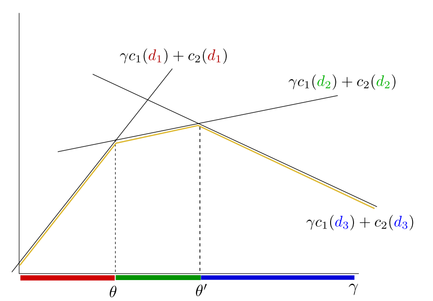

# Bayesian Decision Theory

Bayesian Decision making should be used when:

- Decisions do not influence the state of nature.
- A single decision is made and time constraints are ignored.
- The cost of obtaining measurements is not modelled

Bayesian strategies have 2 general **proprieties**:

- Each Bayesian strategy corresponds to separation of space of probabilities into convex subsets.
- Deterministic strategies are always better than randomized ones.

## Notation

$p(x = x') = 0.3 \rightarrow$ The probability of $x'$ happening is 0.3.

$p(x) \rightarrow$  the probability function or distribution.

## Formulation of the statistical PR problem

$X$ : is the **set of observations** (info about the object)

$K$: is the **set of classes**, what is not known about the object

$D$: is the set of possible decisions

$p_{XK}$: $X\times K \rightarrow \mathbb R$ is the **joint probability** that the object is in the state $k$ and the observation $x$ is made

$W$: $K \times D \rightarrow \mathbb R$ is the penalty (**loss**) function. its defined for Bayesian problems

$q: X \rightarrow D$ is the **decision function** assigning for for each $x \in X$ the decision $q(x) \in D$.

$R(q)$ is the expected loss of a given strategy (the **risk**). It can be formulated as the following mathematical equation:
$$
R(q)=\sum_{x \in X}\sum_{k\in K} p(X = x, K = k) \times W(k,q(x))
$$

## Formulation of the Bayesian Decision Problem

Knowing the sets $X,K$, the joint probability $p_{X,K}:X\times K \rightarrow \mathbb R$ and the penalty function $W:K\times D \rightarrow \mathbb R$. For the strategy $q:X \rightarrow D$, we can call the following function the **Bayesian Risk**:
$$
R(q)=\sum_{x \in X}\sum_{k\in K} p(X = x, K = k) \times W(k,q(x))
$$
The **Bayesian Strategy $(q^*)$** is the strategy which minimizes the Bayesian risk:
$$
q^*=\underset{q\in X \rightarrow D}{\text{argmin  }} R(q)
$$
Another way of writing the Bayesian Strategy is doing it for each $x\in X$:
$$
q^*(x) = \underset {d\in D}{\text{argmin}} \sum_{k\in K} p(k/x)\times W(k,d)
$$

### Classification with 0-1 Loss Function

In this case the set of possible decisions $D$ should coincide with the set of hidden states $K$. The loss function assigns penalty of the strategy is not correct.

We can calculate the partial risk for $x$:
$$
R(x,d) = 1 - p(d/x)
$$
and the optimal strategy for $x$ is:
$$
q^*(x) = \underset {d\in D} {\text{argmax }} p(d/x)
$$
The Bayesian strategy for this problem is:
$$
\text{For a given observation $x$, decide for the state with the }\\ \text{posterior probability $p(d/x)$ }
$$

### Bayesian Strategy with the Reject Option

We can formulate the Bayesian strategy with 3 possible answers:
$$
\{\text{positive},\text{negative},\text{not know}\}
$$
where we are penalizing more if you answer is wrong than if you say you don't know. With the 0-1 loss function, we can assign the new loss function as the following:
$$
\array{
	\text{correct answer}& \rightarrow &0 \\
	\text{wrong answer}& \rightarrow & 1\\
	\text{not known} &\rightarrow &\epsilon \in (0,1)
}
$$
We are assigning $\epsilon$ to the not known case within those values because:

- If $e \ge 1 $, then it's always better to guess that to say *not known*.
- If $e\le 0$, then it's always better to say *not known* than the right answer.

Let $X,K$ be the set of observations and states, $p:X\times K \rightarrow \mathbb R$ be the probability distribution and $D = K \cup \{\text{not known}\}$ be the set of decisions.

We will define $W(k,d)$ as:
$$
W(k,d)=
\left \{
\array{
		0 && d = k\\
		1 && d \neq k \text{ and } d\neq \text{not known} \\
        \epsilon && d = \text{not known}
}
\right.
$$
 To find the **Bayesian Strategy**, we need to minimize the partial risk:
$$
q^*(x) = \underset {d\in D}{\text{argmin }} \sum_{k\in K} p(k/x)\times W(k,d)
$$
The strategy $q^*(x)$ can be described as follows:

First, find the state $k$ which has the largest *posterior probability*. Let this probability be denoted by $p_{max}(x)$. If $1-p_{max}(x) < \epsilon$, then the optimal decision is $k$, else, the optimal decision is  *not known*.

### Likelihood Ratio

If the *prior probabilities* $p(K=k)$ and the penalty $W(k,d)$ are known then the decision $q^*(x)$ about the observation $x$ is:
$$
q^*(x)=\underset {d}{\text{argmin }}(\gamma(x)c_1(d) + c_2(d))
$$
and we are going to replace:
$$
c_i(d) = p(K=i) \times W(i,d)
$$
The subset of observations $X(d^*)$ for which the decision $d^*$ should be made is the solution of the following system of inequalities:
$$
\array {\gamma(x) c_1(d^*) + c_2(d^*) \le \gamma(x) c_1(d) + c_2(d) & d \in D\backslash \{d^*\} }
$$
This system is *linear* with respect to the likelihood ratio. 

Any Bayesian strategy divides the real axis $[0,\infty)$ into $\#D$ intervals $I(d), d\in D$. The decision $d$ is made for an observation$x\in X$ when the likelihood ratio $\gamma = \frac {p_{X/1}(x)}{p_{X/2}(x)}$  belongs to the interval $I(d)$.