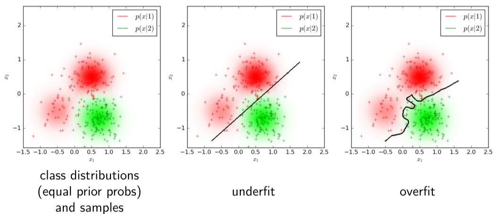

# Perceptron Classifier

## Classifier Design

In **Bayesian classifiers**, the object of interest is characterised by obsevable properties $x\in X$ and its class membership (hidden state) $k \in K$. The objective of these classifiers is to find a strategy that has some optimal properties and the Bayesian decision theory solves the problem of minimization if risk.

In the case of **Parameter estimation**, we are assuming that the probability has a particular form with a small number of parameters, that we are then trying to estimate with the training data set $(\mathcal T)$. In this case we need to decide on which estimation principle should be used, and it has some drawbacks:

- There is no direct relationship between known properties of the estimated probability and the properties of the obtained classifier.
- If the form of the estimated probability function is not the same form of the true probability function, the classifier may be arbitrarily bad.

But it also has its benefits:

- The implementation is often straight forward.
- Performance on test data can be predicted by cross validation.

## Empirical Risk Minimization

We can also create a classifier based on **risk minimization** that does not try to estimate the probability function. We need to find a decision function that minimizes some criterion function on the training set that approximates the risk (the true risk is unknown). 

We are defining **Empirical Risk** as the training set error, and based on this we try to approximate the true risk:
$$
R_{emp}(q_\theta(x)) = \frac 1 L \sum_i^L W(q_\theta(x_i),k_i)\\
\theta^* = \underset \theta {\arg\min} ~R_{emp}(q_\theta (x))
$$
Examples of this are Perceptron and Neural networks.

A big problem with empirical risk minimization is that small empirical risk does not imply a small true expected risk, because our models tend to **overfit**

### Structural Risk Minimization Principle

We want to minimize the risk $R$:
$$
R(q) = \sum_{x,k} p(x,k)W(q_\theta(x),k)
$$
But we do not know the probability distribution $p(x,k)$. We can get around this by using the Vapnik and Chervonenkis inequality:
$$
\Pr\left(R(q) \le R_{emp}(q) + \sqrt{\frac 1 N \left[h \left(\log\left(\frac {2N}h\right) + 1\right)- \log\left(\frac \eta 4\right)\right]}\right) = 1-\eta
$$
Where $N$ is the training set size, $h$ is the VC dimension (capacity) of the class strategies $Q$, and $0 < \eta < 1$. Now the term does not depend on the unknown $p(x,k)$ and the VC dimension $h$ is known for some classes of $Q$, for example, linear classifiers.

## Linear Classifiers

For some statistical models, the Bayesian and non-Bayesian strategy is implemented by a **linear discriminant function**. The capacity of linear strategies in an $n$-dimensional space is $n+1$, thus the learning task is well-posed. this means that a strategy tuned on a finite training multiset does not differ much from the correct strategy found for a statistical model.

There are efficient learning algorithms for linear classifiers, and even some non-linear discriminant functions can be implemented as linear after expanding the dimensions.

Considering a dataset $\mathcal T = \{(x_1,k_1),\dots,(x_L,k_L)\}$ with $x_i \in \R^D$ and $k_i \in \{1,-1\}$, we say that this data is **linearly separable** (for 2 classes) if there exists a hyperplane which divides $\R^D$ into two half-spaces such that the data of a given class are all in one half-space. Formally, the data are separable if:
$$
\exists e \in \R^{D+1}/ sign\left(x \times \left[\array{1 \\ x_i}\right]\right) = k_1\\
\forall i \in \{1,\dots,L\}
$$

### Perceptron Classifier

The perceptron classifier takes a training dataset composed of 2 classes and tries to find a weight vector $w$ and offset $w_0$ such that:
$$
\array{ 
w \times x_j + w_0 > 0 && \text{if } k_j = 1 \\
w \times x_j + w_0 < 0 && \text{if } k_j = -1 \\
}
$$
Or, using the same approach as in the logistic regression lecture, we can combine the parameters as:
$$
x_i' =k_i\left[\array{1 \\ x_i}\right], w' = \left[\array{w_0\\w}\right]
$$
And we can create a single function for all classes:
$$
w' \times x_i' > 0~~~\forall i \in \{1,\dots,L\}
$$
From now on, we will call $x = x', w = w'$.

In order to reach our goal, we are going to use the **perceptron algorithm**:

1. Initialize the variables:
   $$
   t = 0, w^{(t)} = 0
   $$

2. Find a wrongly classifies observation $x_i$:
   $$
   w^{(t)} \times x_i \le 0
   $$

3. If there is no misclassified observation then terminate. Else:
   $$
   w^{(t+1)} =  w^{(t)} + x_i
   $$

4. Go back to step 2.

According to the **Novikoff Theorem**:

> Let the data be linearly separable and let there be a unit vector $u$ and a scalar $\gamma \in \R^+$ such that:
> $$
> \array{
> w \times x_i \ge \gamma &\forall i\in\{1,\dots,L\}&||u|| = 1
> }
> $$
> Let the norm of the longest vector in the dataset be $D$:
> $$
> D = \max_{x\in\mathcal T}||x||
> $$
> Then the perceptron algorithm will finish in a **finite number of steps** $t^*$ such that:
> $$
> t^* \le \frac {D^2}{\gamma^2}
> $$

You can also think about the Perceptron algorithm as a way to minimize a weight vector, and the best way to do this is with a gradient descent, and the perceptron algorithm is a gradient descent method.

#### Non-Separable Data

Where exists a version of the Perceptron algorithm that can handle non-separable datasets. To do this we need to use the following algorithm:

1. Initialize the variables:
   $$
   w^{(0)} = 0, E = |T| = L, w^* = 0
   $$

2. Find all misclassified observation $X^-$:
   $$
   X^- = \{x\in X / w^{(t)} \times x \le 0\}
   $$

3. If $|X^-| < E$ then:
   $$
   E =  |X^-|, w^* = w^{(t)}
   $$

4. If we reach the terminal condition, exit the algorithm. Else:
   $$
   w^{(t+1)} = w^{(t)} + \eta_t \sum_{x\in X^-} x
   $$

5. Go to step 2.

This algorithm converges to with probability 1 to the optimal solution, but the convergence rate is not known. The terminal condition is a complex function of the quality of the best solution, time since the last update and requirements on the solution.

Another way to solve the non-separable dataset problem is by **lifting the dimensions**. The idea here is to convert a dataset of dimension $d$ to dimension $d'$ such that the data is separable in $d'$ dimensions. This is done using a mapping function:
$$
\phi:\R^d \rightarrow \R^{d'}
$$
We can create this mapping function in such a way that the algorithm will converge faster.

