# Operations on Finite Automata

## Determination

We say that two automatas $M_1,M_2$ are **equivalent** if they accept the same language:
$$
L(M_1) = L(M_2)
$$
For every nondeterministic finite automaton (NFA) $M$ there exists an equivalent deterministic finite automaton (DFA) $M'$. This is achieved with an algorithm called **determination of NFA**.

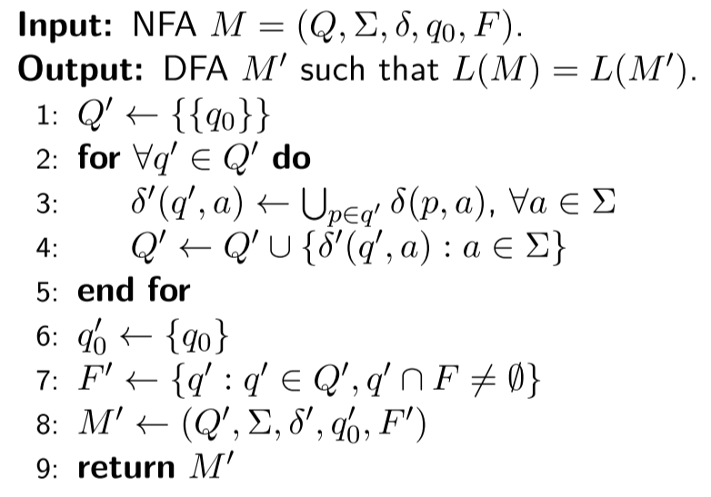

Given the size of the original automaton $|Q_{NFA}| = n$, the new, deterministic automaton's size can be up to $|Q_{DFA}|=2^n$.

## Homogeneous Finite Automaton

An **Homogeneous Finite Automaton** is described as $M=(Q,\Sigma,\delta,q_0, F)$, and $Q(a)$ are the set of <u>targets states</u> $\forall a \in \Sigma $. In this automaton, for all pair of symbols $(a,b)/ a\neq b, a,b\in \Sigma$ it holds that $Q(a) \cap Q(b) = \empty$.

A set of **Target States** are are a group of stats that receive a transition from a given action:

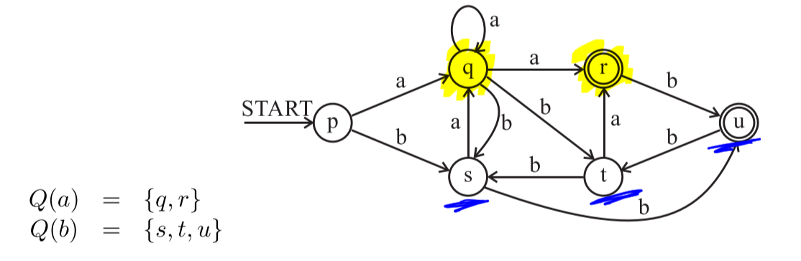

### Theorems

Let $M=(Q,\Sigma,\delta,q_0,F)$ be an homogeneous automaton.

- The set of states of the automaton $M$, without unreachable states is partitioned as follows:
  $$
  \array{
  Q = \biguplus_{a\in\Sigma\cup\{\epsilon\}} Q(a) &
  \text{where } &
  Q(\epsilon) = \{q_0\} \setminus\bigcup_{a\in \Sigma} Q(a)
  }
  $$

- Given $M$, a $NFA$. The number of states of the equivalent $DFA$ $M'=(Q',\Sigma,\delta',q'_0,F')$ gained by the standard determinization algorithm is bounded by the following equality:
  $$
  |Q'| \le \sum_{a\in \Sigma} (s^{|Q(a)|})-|\Sigma| + 1
  $$

## Union of Languages

We can join different $NFA$ automaton to be able to join different languages. In the following algoithm we'll show you how to do it while deleting $\epsilon$-transitions:

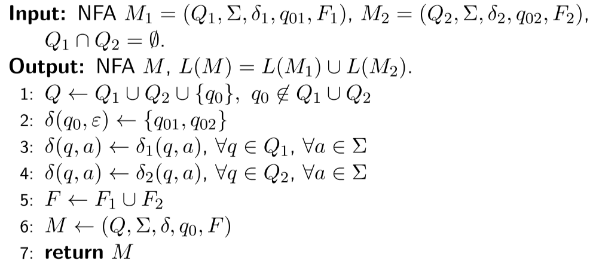

### Total NFA

We call an $NFA$  $M=(Q,\Sigma,\delta,q_0,F)$ a <u>total NFA</u> if the mapping:
$$
\array{
\delta(q,a) \neq \empty &&
\forall q \in Q, a \in \Sigma
}
$$
Basically, we say that an NFA is total if all states are connected with all actions.

We can **join** languages in parallel runs using the following algorithm:

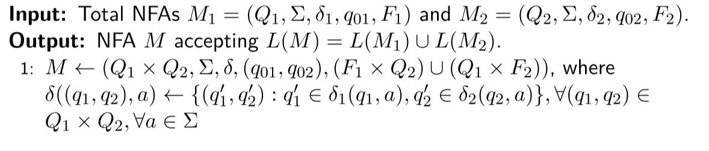

## Intersection of Languages

There are also algorithms to create the intersection of different languages. In order to achieve this we have to utilize this algorithm:

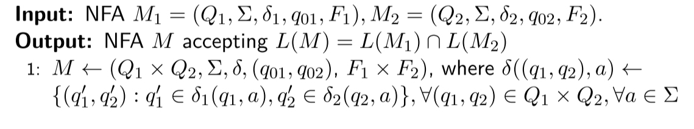

There's another algorithm that creates the intersection, but <u>only keeps the acceesible states</u>:

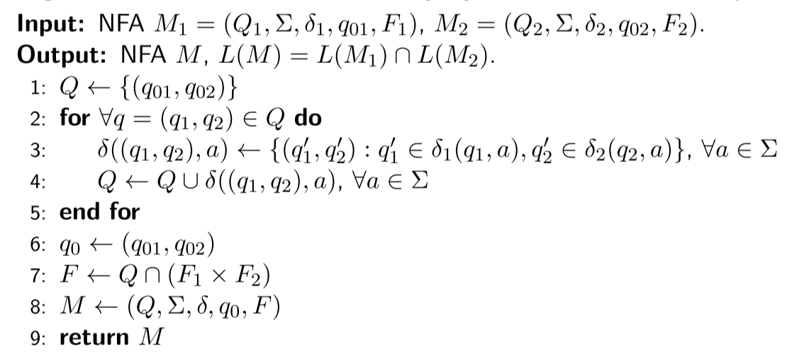

## Complement of Language

This operation works by swapping the final states for non-final states. It can be calculated with the following algorithm:

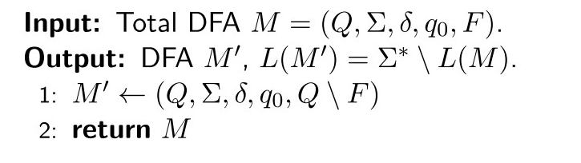

## Product of Languages

The product of 2 languages is defined as the concatenation of the strings of both automaton. In this case, we have to connect all outputs from the first automata to all inputs of the second automata.

We can do this by merging both automaton with $\epsilon$-transitions:

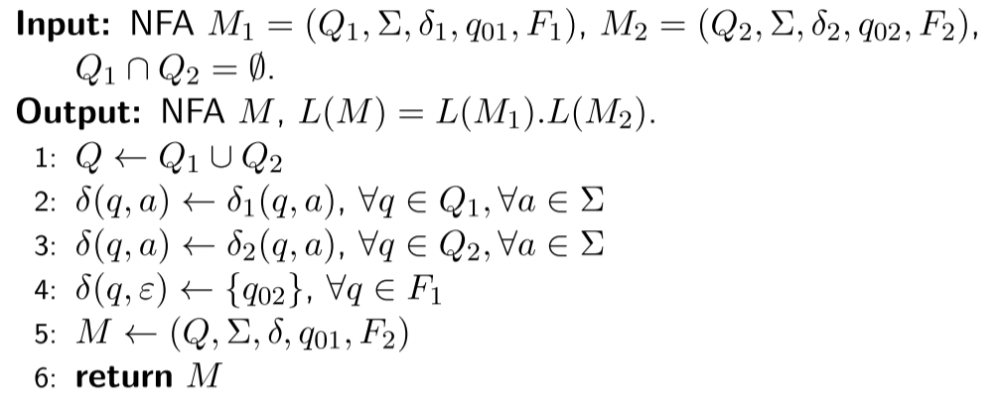

 Or, without using them:

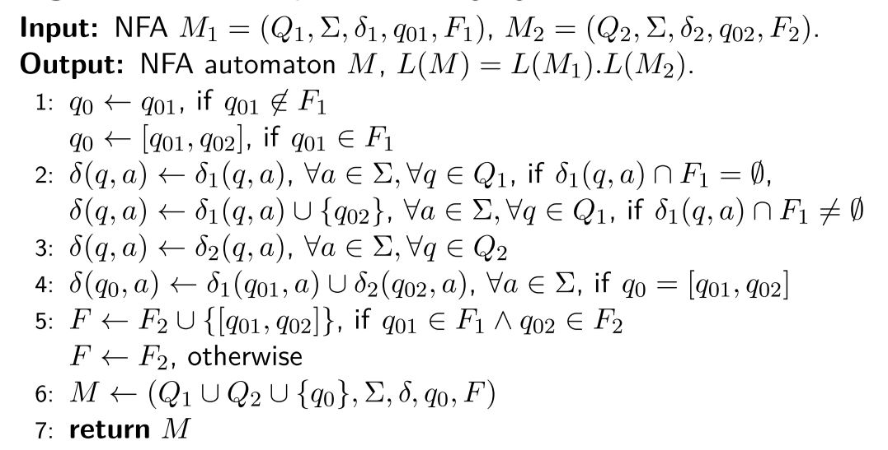

## Iteration of a Language

When we iterate through a language, we are actually feeding back the output of the automaton to the input. 

There's an algorithm for this operation that uses $\epsilon$-transitions:

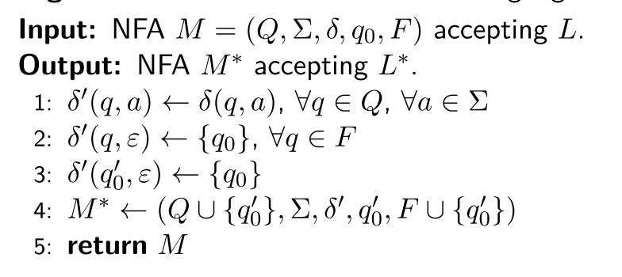

Here we can see a variant that does not create any $\epsilon$-transitions:

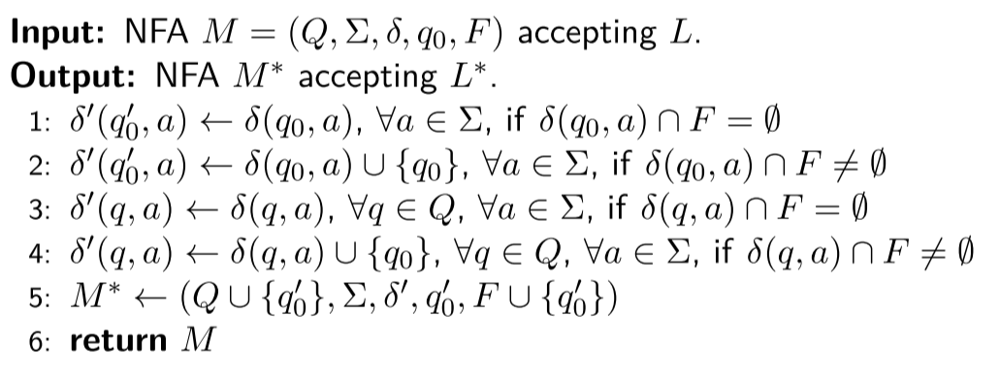

## Minimal DFA

Let $M=(Q,\Sigma,\delta, q_0,F)$ be a DFA. $M$ is called minimal DFA if:
$$
\not \exists M' = (Q',\Sigma,\delta',q_0',F') / L(M) = L(M') \land |Q|>|Q'|
$$
To obtain the minimal form of a DFA, we can use the following algorithm:

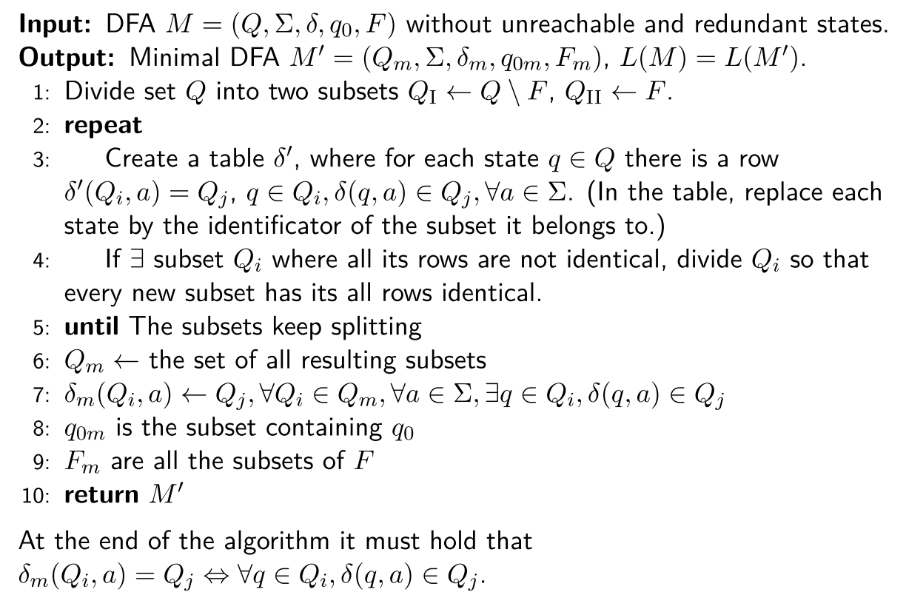