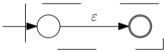
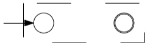
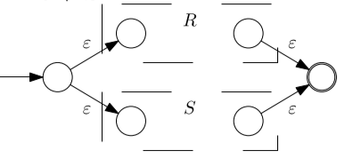
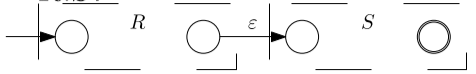
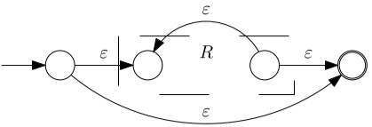

# Conversions

## Between RE and FA

There are several methods to convert a regular expression into a finite automaton.

### Method of Neighbors

Also called Glushkov's method.

To use this algorithm we need to assign all symbols of the regular expressions a number from $1$ to $n$. Then we will create each of the following sets:

- $Z$: This set is also named starter set. It contains all the symbols that can be the first element of a string.
- $P$: Also called set of neighbors, here we store all the possible combinations of two symbols that can be next to each other in any possible string of the language. Later we will use this set to create the transitions.
- $Q$: It is the set of all states. We always have to include the state $q_0$ because we are going to add it manually and all the other states will be the numbers $1,\dots,n$ from before.
- $F$: It is composed of all the symbols that can be the last elements of a string.

Lastly, we are going to stablish the transition function $\delta$. First we will connect the new state $q_0$ to all initial states from $Z$, because the elements are written as $\text{symbol}_{state}$, this means that we'll create the following mapping:
$$
\delta(q_0,\text{symbol}) = \text{state}
$$
Then, we will create the transitions from the set $P$. Here our elements are written as $\text{letter}_\text{state1}\text{transition}_{\text{state2}}$ and we will map them as:
$$
\delta(\text{state1},\text{transition}) =\text{state2}
$$
All undefined transitions will be redirected to $\empty$.

We can also see the algorithm here and it returns a NFA with no $\epsilon$-transitions:

1. We need to assign numbers to all symbols in the regular expression $V$.

2. To create the starter set $Z$ we need to select all the symbols that can be the first element of any resulting string.

3. To create the set of final states $F$ we need to select all the symbols that can be the last element of any resulting string.

4. To create the neighbors set $P$ we need to select all pairs of symbols that can be together in any resulting string.

5. For each pair of symbols in the neighbors set $P$, we can create the transition functions for our resulting automaton:
   $$
   \array{a_1b_2 &\Rarr &1\overset {b}{\rarr} 2}
   $$

6. We create the initial state $q_0$ and we connect it to all the symbols in the starter set $Z$. The transition value is defined by the letter of the symbol:
   $$
   \array{a_1 & \Rarr& q_0 \overset a \rarr 1}
   $$

7. We assign the set $F$ to the final states set of the automaton.

The result is a non-deterministic, Homogeneous finite automaton without epsilon transitions.

We can see now a more formal definition of the algorithm.

### Method of Derivatives

This algorithm works using the theorem of *Bound of Dissimilarities*:

>Every regular expression has only a finite number of dissimilar derivatives

More specifically, the following corollary:

> DFA can be constructed from a Regular Expression using the algorithm if only similarity among derivates is recognized.

The main idea of this algorithm is to accumulate unique derivatives in a set until no more expressions are added.

Each of the expressions in that set will represent a state, where the original expression is the initial state. The final states are decided as the expressions within the set that contain the empty string in the language they represent.

The transitions are created from the derivation themselves, for example if I have the following set:
$$
U = \{ab,b\}
$$
Then I would have a transition from $ab \overset a {\rightarrow } b$. This is because:
$$
\frac {\part ab}{\part a} = b \\
$$
The actual algorithm can be found here:

1. Create a set that contains only the initial regular expression $V$:
   $$
   U = \{V\}
   $$

2. Differentiate all the regular expressions in the set $U$ by all the symbols in the alphabet. Add all the results to the set $U$.

3. If no new regular expressions have been added in the past step, continue to the next one. Else, repeat step $2.$

4. The initial state $q_0$ is the input regular expression $V$.

5. The set of states of the automation is the set $U$.

6. The transitions are defined by which symbol derives what regular expression.

7. The formulas that can express $\epsilon$ are the final states.

The result is a total deterministic finite automaton.

A more formal version of the algorithm can be found here.

### Thompson's Method

Thompson's method works constructing and merging different automaton. The most basic parts of the automaton are:

- $U = \epsilon$:

  

- $U = \empty$:

  

- $U = a, \forall a \in \Sigma$:

  

- $U = R + S$

  

- $U = R.S$:

  

- $U = R^*$

  

After combining all the parts we will obtain a NFA with epsilon transitions.

## Between FA and RE

We are using the following theorem:

> For every NFA $M$ a regular expression $V$ can be constructed such that:
> $$
> L(M) = L(V)
> $$

We are also defining an **Extended Finite Automaton (EFA)** $M$ is $(Q,\sigma,\gamma,q_0,F)$ where:

- $Q$ is a finite set of states.

- $\Sigma$ is a finite input alphabet.

- $\gamma$ is a mapping function from $Q\times Q \rightarrow R_T$ ($R_T$ is a subset of REs over $\Sigma$)

- $q_0$ is the initial state, $q_0 \in Q$

- $F$ is the set of final states, $F \subseteq Q$ 

  If the transition from $p$ to $q$ is not defined, then $\gamma(p,q) = \empty~~\forall p,q \in Q$ 

> Let $M = (Q,\Sigma,\gamma,q_0,F)$ be an EFA. Assume that $q\in Q$ is neither a start state or a final state, then the equivalent EFA is $M' = (Q \setminus \{q\},\Sigma,\gamma',q_0,F )$ where the mapping $\gamma'$ is defined for every pair $p,r \in (Q\setminus\{q\})$ as:
> $$
> \gamma'(p,r) = \gamma(p,r) + \gamma(p,q)\gamma(q,q)^*\gamma(q,r)
> $$

### Elimination of States

Elimination of States works by removing states on the NFA and replacing them with regular expressions that represent that state. To work with this algorithm we need to create a new initial state is connected using an $\epsilon$-transition to the previous initial state. In the same way, we need to connect all the final states to a new final state using $\epsilon$-transitions. In the end we should only have the new initial and final states that we just created.

Here's the algorithm:

1. We add the states $q'$ and $f'$ as the initial and final states to the automaton. We also add $\epsilon$-transitions from $q'$ to the previous initial state $q_0$ and from the previous final states to $f'$.

2. One by one we remove states from the automaton in the following ways:
   $$
   \array{A \overset 1 \rarr B \overset 0 \rarr C & \Rarr & A \overset{10}\rarr C\\
   
   A \overset 1 \rarr B  \overset 2\lrarr B \overset 0 \rarr C & \Rarr &A \overset {12^*0} \rarr C \\
   C \overset 2\larr A \overset 1 \rarr B \overset 0 \rarr C & \Rarr & A\overset {10+2}\rarr C
   }
   $$

3. The resulting regular expression between $q'$ and $f'$ is the output of the algorithm:
   $$
   q' \overset V \rarr f'
   $$

We can also remove all useless or unnecessary states.

A more formal version of the algorithm can be found here:

### Solution of Regular Equations

The idea on this algorithm is to create regular equations from the automaton and them solve them, creating the Regular Expression. For this we have to take into considerations all transitions from a state. For example, if the state A has a transition to state B with the action 1 and to itself with the action 2, we get the following regular expression:
$$
X_A = X_A2 + X_B2
$$
If the state is also final, then we have to add $+ ~\epsilon$. 

All we have to do now is to solve all the regular equations and express the resulting regular expression as:
$$
V \leftarrow X_{p_1} + X_{p_2}+ \dots + X_{p_i}~~~\forall p_i \in F
$$
Here is the formal algorithm:

## Between RG and RE

### Regular Equation

We can convert the production rules of the grammar into regular equations and then solve the system. This conversion works in the following way:
$$
\array{
S\rarr bS |aA & \Rarr & S= bS + aA\\
A \rarr aA & \Rarr & A = aA + \empty = \empty
}
$$

### Non-Terminal Elimination

This method is very similar to the elimination of states and it follows this algorithm:

1. Add states $q'$ and $f'$ as the new initial and final states of the automaton.

2. Connect all the terminal states to $f'$ and $q'$ to the initial state with $\epsilon$-transitions

3. For each non-terminal symbol we remove them in the following way:
   $$
   \array{S \rarr A1|A2 & \Rarr & S\rarr A(1+2)}
   $$
## Between RE and RG

### Method of derivatives

Here we go through the same procedure as in the method of derivatives for the conversion from RE to FA.

### Method of Incremental Construction

This method is similar to Thompson's method but with the following predefined grammars:
$$
\array{G_\epsilon = (\{s\},\empty,\{S\rarr \epsilon\},S)\\
G_\empty = (\{S\},\empty,\empty,S)\\
G_a = (\{S\},\{a\},\{S\rarr a\},S)}
$$
Another change here are the operations. The standard operations for grammars are defined as:
$$
\array{
A + B &= &G(A) \cup G(B)\\
AB &=& G(A).G(B) \\
A^* &=& G(A)^*
}
$$

## Between RG and FA

There only is one conversion between regular grammars and finite automata. We need to follow this algorithm:

1. For each non-terminal symbol in the grammar we create a new non-final state in the automaton.

2. We create one final state $K$

3. If there is an $\epsilon$-rule with the start symbol in the left-hand side, the initial state is also final.

4. For each production rule we add a transition in the following way:
   $$
   \array{A\rarr aB &\Rarr &  A \overset a \rarr B \\
      A \rarr a & \Rarr & A \overset a \rarr K \\
      A \rarr b|aB & \Rarr & B \overset a \larr A \overset b \rarr K
     }
   $$

## Between FA and RG

This algorithm is the reverse as the conversion from RG to FA:

1. For each state in the automaton we create a non-terminal symbol.

2. The non-terminal symbol that corresponds to the initial state is the starting symbol.

3. For each transition we add a new  production rule in the following way:
   $$
   \array{
      A \overset a \rarr B & \Rarr &A \rarr aB\\
      A \overset a \rarr |B| & \Rarr & A \rarr a| aB
      }
   $$
   Where $|B|$ means that $B$ is a final state

4. If the initial state is also final, we need to add an $\epsilon$-rule to the initial state. 

This may transform the grammar into a non-regular one and in that case we need to fix it by adding a new rule and initial state: 
$$
\array{\array{S \rarr \epsilon|aS|\dots\\A \rarr bS|\dots\\\vdots} &\Rarr & \array{S' \rarr \epsilon | aS|a|\dots\\
   S \rarr aS|a|\dots\\
   A \rarr bS|b|\dots\\
   \vdots
   }}
  
$$
