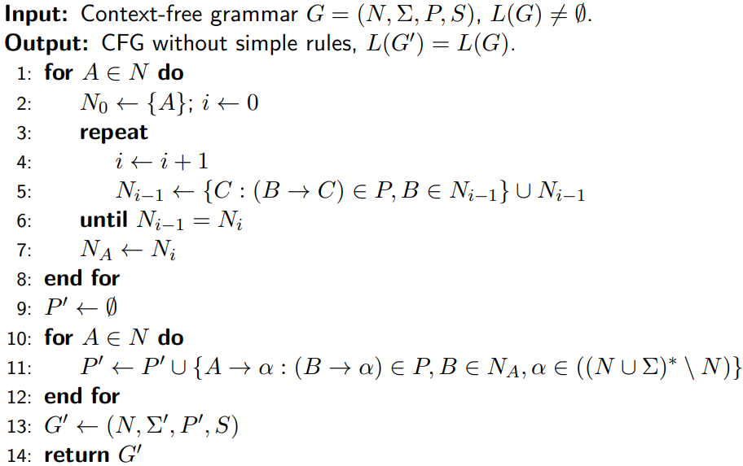

# Context-Free Grammars

Context-free grammars are used to describe most of the syntactic structures of programming languages.

We say that a context-free grammar $G = (N,\Sigma,P,S)$ is **ambiguous** if there exists a sentence $w \in L(G)$ that is the result of two different parse trees. Otherwise we say that the grammar is **unambiguous**.

In many cases it is possible to remove the ambiguousness from the grammar, but if it is impossible, we call them **inherently ambiguous languages**. It is impossible to create a algorithm to decide whether a given GFG is ambiguous.

A context-free grammar $G = (N,\Sigma,P,S)$ is **cycle-free** if not derivation of the following type is possible:
$$
A \Rarr^*A
$$
A context-free grammar $G = (N,\Sigma,P,S)$ is **proper** is it is cycle-free, $\epsilon$-rule free and it contains no redundant symbols.

There are also a few important theorems:

- **Rule Exclusion Theorem**:

  Let context-free grammar $G = (N,\Sigma,P,S)$  and $(A\rarr \alpha B \beta) \in P$ with $\beta,\alpha \in (N\cup\Sigma)^*$$, B \in N, A \neq B$ .

  Let $B\rarr \gamma_1 | \dots|\gamma_k$ be all the rules in $P$ with the symbol $B$ on the left-hand side. Let $G'=(N,\Sigma,P',S)$ where:
  $$
  P'=P \cup\{A \rarr \alpha \gamma_1\beta|\dots|\alpha\gamma_k\beta\} \setminus \{A \rarr \alpha B \beta\}
  $$
  Then:
  $$
  L(G) = L(G')
  $$

- If a context-free grammar $G = (N,\Sigma,P,S)$  has not $\epsilon$-rules and simple rules, the it is cycle-free.

- If $L$ is a context-free language, then it can be generated by some proper grammar $G$.

## Transformations of CFG

### Decide whether the language is empty

### Removal of unreachable symbols

We say that a symbol $X \in N \cup \Sigma$ is **unreachable** in a context-free grammar $G = (N,\Sigma,P,S)$ if $X$ does not appear in any sentential form, meaning that there are no derivations that of the form:
$$
S \implies\alpha X\beta,~~~~ \alpha,\beta \in (N\cup \Sigma)^*
$$
We can remove these symbols with the following algorithm:

### Exclusion of redundant symbols

A symbol $X\in N\cup \Sigma$ is **redundant** in $G = (N,\Sigma,P,S)$if there does not exists:
$$
S \Rightarrow^* wXi \Rightarrow^*wxy,~~~~ w,x,y \in \Sigma^* 
$$
Also, if a context-free grammar is **reduced** if it does not contain any redundant symbol. We can remove all redundant symbols with the following algorithm:

### Exclusion of $\epsilon$-rules

A context-free grammar $G = (N,\Sigma,P,S)$ is **$\epsilon$-rule free** if:

- $P$ contains no $\epsilon$-rule

- $P$ contains only one $\epsilon$-rule of the form:
  $$
  S \Rarr\epsilon
  $$
  And $S$ does not appear on the right side of any rule in $P$.

We can remove all $\epsilon$-rules with the following algorithm.

### Exclusion of simple rules

## Chomsky Normal Form

A context-free grammar $G = (N,\Sigma,P,S)$  is in **Chomsky Normal Form** if every rule in $P$ is in one of the following forms:

- $A\rarr BC$
- $A\rarr a$
- $S \rarr \epsilon$ if $\epsilon \in L(G)$ and $S$ does not appear in the right-hand side of any rule. 

$A,S,B,C \in N, a \in \Sigma$.

> Let $L$ be a context-free language, $L$ is a language generated by a grammar in Chomsky Normal Form.

Because of this theorem, we can convert all grammars into Chomsky Normal Form with the following algorithm:

### Cocke-Younger-Kasami Algorithm

For each context-free grammar $G = (N,\Sigma,P,S)$ in Chomsky Normal Form there exist an algorithm that can decide if a given string is part of the language the grammar generates. 

This algorithm has complexity of $O(n^3)$ and we can find it here:

## Recursive Context-Free Grammar

A non terminal symbol $A$ in a context-free grammar $G = (N,\Sigma,P,S)$ is called **recursive** if there exists a derivation:
$$
A \Rarr^*\alpha A \beta
$$
For some $\alpha,\beta \in (N\cup\Sigma)^*$. If $\alpha = \epsilon$, then we call $A$ a **left-recursive symbol**, in the same way we call $A$ a **right-recursive symbol** if $\beta = \epsilon$.

If a grammar has at least one non-terminal recursive symbol, we call it a **recursive grammar**. 

Following the next algorithm, we can remove left-recursion from a grammar.

  