# Elasticity and its Applications

## Elasticity

Elasticity measures how much one variable responds to changes in another variable. For example, one time of elasticity measures how much demand will fall if you raise your prices.

The exact definition says that elasticity is a numerical measure of the responsiveness of $Q^d$ or $Q^s$ to one of its determinants.

### Percentages

The standard method of calculating percentages gives different answers depending on where you start. Because of this, we will use a midway point, which is the halfway between the start and end value:
$$
\frac{\text{end value } - \text{start value}}{(\text{end value } + \text{start value}) \times 0.5} \times 100 \%
$$

## Price Elasticity of Demand

The price elasticity of demand is calculated as:
$$
\text{Price elasticity of demand} = \frac {\text{% change in $Q^d$}}{\text{% change in $P$}}
$$
It measures how much $Q^d$ responds to a change in $P$. It can be said that it measures the price-sensitivity of buyer's demand.

Price elasticity of demand changes differently with different types of goods:

- Price elasticity is higher when close substitutes are available.
- Price elasticity is higher for narrowly defined goods than broadly defined ones.
- Prices elasticity is higher for luxuries than for necessities.
- Prices elasticity is higher in the long run than in the short run.

The price elasticity of demand is closely related to the slope of the demand curve. *The flatter the curve, the bigger the elasticity*. 

### Classification of demand curves

- **Perfectly Inelastic Demand**

  The demand is perfectly inelastic when the a change in price doesn't generate a change in $Q^d$. It means that there's not price sensitivity from the consumers

  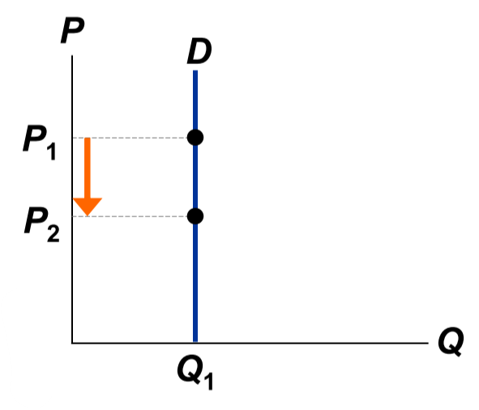

- **Inelastic Demand**

  We talk about inelastic demand when the price elasticity is lower than 1. It represents when a change in price is higher than the change in demand it caused.

  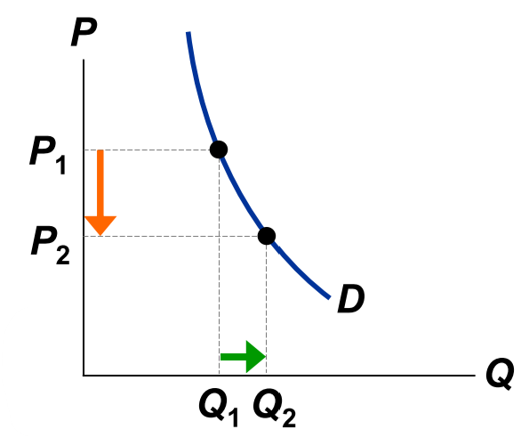

- **Unit Elastic Demand**

  Unit elastic demand is a consequence of when a change in price affects the demand in a similar way, with a price elasticity of 1.

  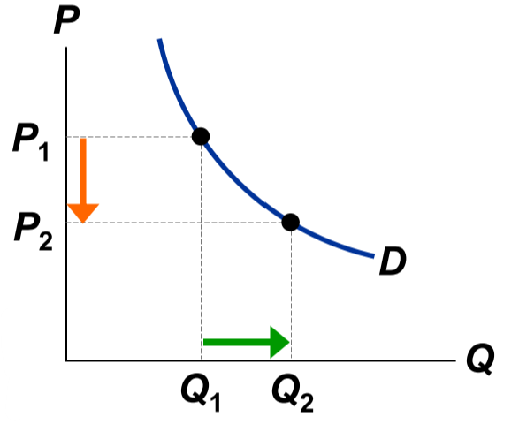

- **Elastic Demand**

  It usually means that the customers' price sensitivity is relatively high. If the price is lower, then the good will be in more demand. It is represented with a price elasticity bigger than 1.

  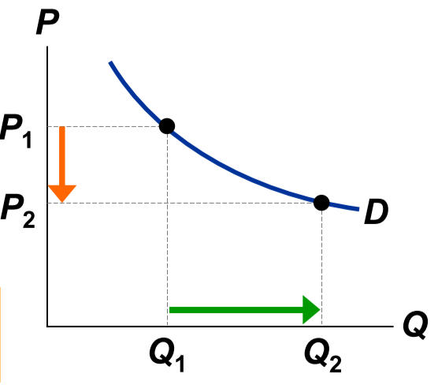

- **Perfect Elastic Demand**

  It's the extreme where the no change in price will affect the demand. It is represented with an price elasticity of infinity.

  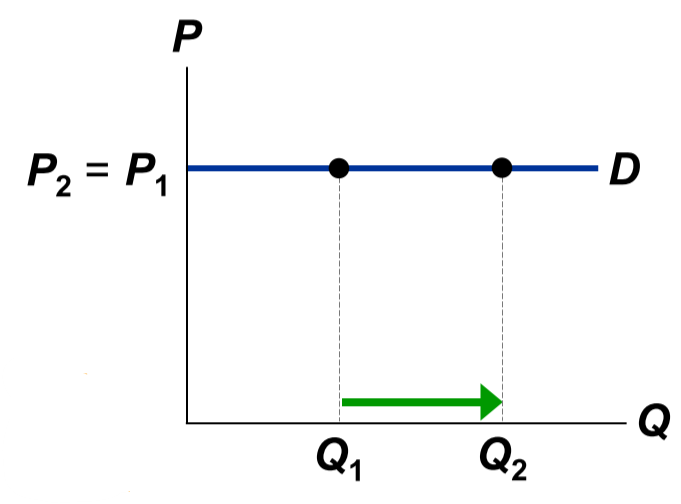

### Total Revenue

For any demand curve, we can say that the revenue is represented by the area beneath the curve. Knowing this, we can say that the revenue is calculated as:
$$
\text{revenue} = P \times Q
$$
In this example we can see the change in total revenue:

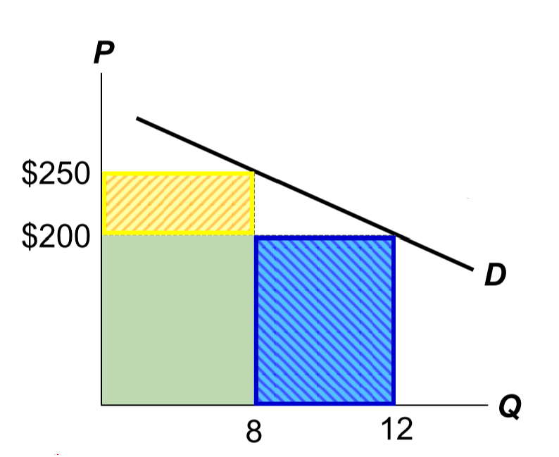

With an elastic demand (elasticity  = 1.8), we lower our prices from \$250 to \$200 in order to have a bigger demand. But after the thinking about it, our current revenue is $\$2000 = \$250 \times 8$ and our possible revenue if we lower our prices will be $\$2400 = \$200 \times 12 $.

We can see that even though our prices would be lower, our revenue would be higher.

## Price Elasticity of Supply

The price elasticity of supply is calculated in a similar way to the demand's price elasticity:
$$
\text{Price elasticity of supply }= \frac{\text{% change in $Q^s$}}{\text{% change in $P$}}
$$
It also follows a similar logic: *the flatter the curve, the bigger the elasticity*.

### Classification of Supply Curves

- **Perfectly Inelastic**

  It's caused then the price increases without affecting the supply. It shows that the good has no sellers price sensitivity. Its represented with 0 elasticity.

  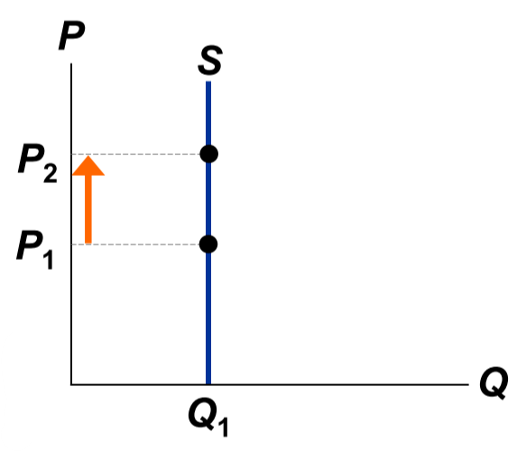

- **Inelastic**

  Inelastic curves represent a sellers' low price sensitivity, with an elasticity of less than 1.

  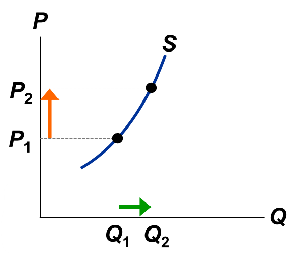

- **Unit Elastic**

  The elasticity is 1, with intermediate sellers' price sensitivity.

  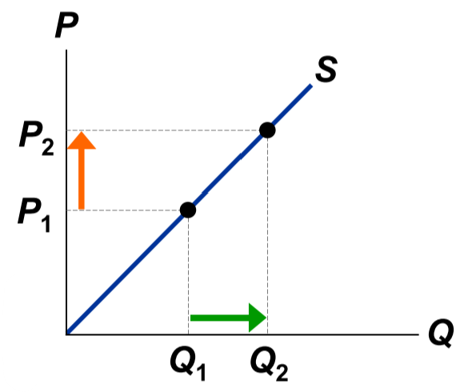

- **Elastic**

  It usually means that the sellers' price sensitivity is relatively high.t is represented with a price elasticity bigger than 1.

  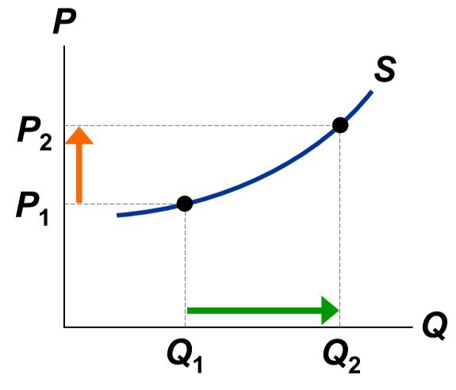

- **Perfectly Elastic**

  It's the extreme where the no change in price will affect the supply. It is represented with an price elasticity of infinity.

  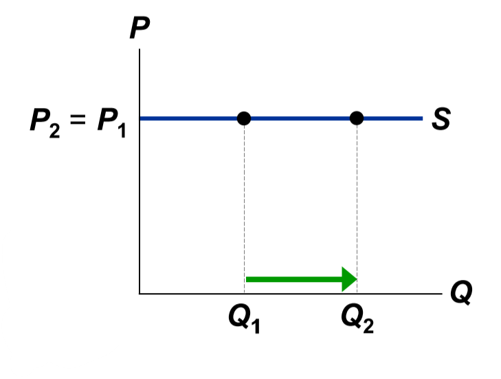

### The Determinants of Supply Elasticity

The more easily sellers can change the quantity they produce, the greater the price elasticity of supply. For most goods, price elasticity of supply is greater in the long run because firms can build new factories or new firms can enter the market.

## Other Elasticities

### Income Elasticity of Demand

It measures the response of $Q^d$ to change in consumer's income.
$$
\text{Income elasticity of demand} = \frac{\text{% change in $Q^d$}}{\text{% change in income}}
$$
Because an increase in income causes an increase in demand of normal goods, the income elasticity of normal goods is going to be higher than 0 and for inferior goods lower than 0.

### Cross-Price Elasticity of Demand

It measures the response of demand for one good to changes in the price of another good:
$$
\text{Cross-price elasticity of demand} = \frac{\text{% change in $Q^d$ for good 1}}{\text{% change in price of good 2}}
$$
Substitutes present a cross-price elasticity greater than 0, while complements have an elasticity lower than 0.