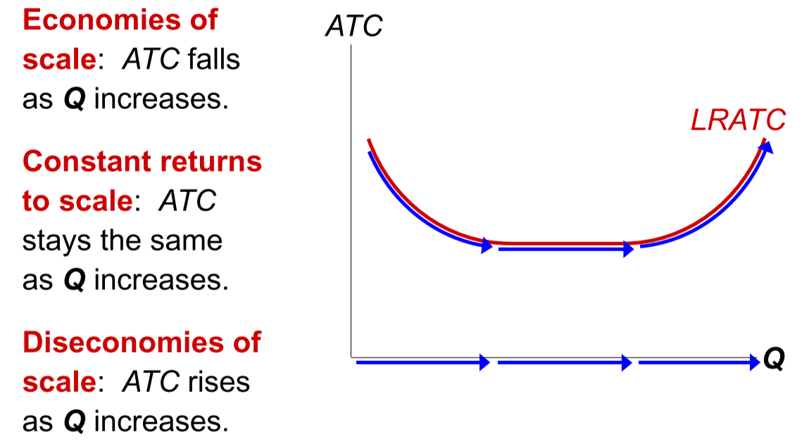

# The Costs of Production

## Total Revenue, Total Cost and Profit

We will assume that any firm's goal is to maximize profit, which is calculated as the following:
$$
\text{Profit} = \text{Total Revenue}-\text{Total Cost}
$$
Where $\text{Total Revenue}$ is the amount of money a firm receives from the sale of its output, while $\text{Total Cost}$ is the market value of the input a firm uses in production.

### Costs

Costs are made out of 2 different categories:

- **Explicit Costs**: Requires the firm to pay money for it. For example paying wages to workers.
- **Implicit Costs**: Doesn't require to pay money for it. For example the opportunity costs of the owner's time.

### Profit

Profit can also be divided into 2 categories:

- **Accounting Profit**: It is the total revenue minus the total <u>explicit</u> costs.
- **Economic Profit**: It's the total revenue minus the total costs (including explicit and implicit costs).

## The Production Function

A production function shows the relationship between the quantity of inputs used to produce a good and the quantity of output of that good. It is usually represented with a graph or a table.

### Marginal Product

The marginal product of any input is the increase in output arising from an additional unit if that input (considering all other inputs constant). 

For example, the **marginal product of labor** can be expressed as:
$$
\text{MPL} =\frac {\Delta Q}{\Delta L}
$$
The marginal product of any input declines as the quantity of the input increases.

### Marginal Cost

The marginal cost (MC) is the increase in Total Cost from producing one more unit. It is expressed as:
$$
\text{MC} = \frac{\Delta \text{TC}}{\Delta Q}
$$
This variable is important because it can tell you whether you should produce or or less of your output. If the cost of the additional product (MC) is less than the revenue we would get from selling it, the our profits would rise  if we produce more.

### Fixed and Variable Costs

**Fixed Costs (FC)** are the ones that do not vary with the quantity of output produced, such as its the case with rent or equipment.

**Variable Costs (VC)** are the ones that vary with the quantity of output produced, such as its the case of wages or materials.

**Total Costs (TC)** is the sum of the variable costs and fixed costs.

## Costs in the Short and Long Run

In the **short run**, some inputs are fixed, such as factory, lands, etc. This is not the case in the **long run**, as it is possible to build new factories or sell land.

### LRATC Curve

The LRATC curve is also called Long Run Average Total Cost. This curve helps people decide whether they should invest in different size of assest in the begining of an endeavor. Depending on the expected output of the business, it may be better to invest in a bigger, more expensive factory from the beggining.

This curve is affected by the so called **scales of production**. 

### Economies of Scale

Economies of scale occur when increasing production allows greater specialization and workers become more efficient on one single task. But this brings another problem: **Diseconomies of scale**.   

This effect is caused when the size of the organization increases so much that the average total costs increase because of coordination problems.

