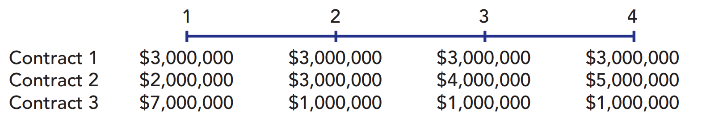

# Assignment #3: Time Value of Money

## 9

> You want to buy a car, and a local bank will lend you **\$20,000**. The loan would be fully amortized over **5 years** (60 months), and the nominal interest rate would be **12 percent**, with interest paid monthly. What would be the monthly loan payment?

Knowing that this is fully ammortized loan, we can use the following equation to calculate the anual payment and then we will divide it by 12 monts. 
$$
\$20,000 = \sum_{x=1}^5\frac {\text{PMT}}{(1+0.12)^x}\\

\text{PMT} = \$20,000 \times \sum_{x=1}^5(1 + 0.12)^x = \$5548.19
$$
And now, dividing it per month we get a monthly payment of:
$$
\$462,35
$$
I'm assuming the interest is yearly and not monthly because the numbers are gigantic in that case.

## 10

> Find the interest rates earned on each of the following:

### A)

> You borrow \$700 and promise to pay back $749 at the end of 1 year.

Because it is only one year, we can get the intereset with a simple division:
$$
\text{interest} = \frac{\$749}{\$700} = 7\%
$$

### B)

> You lend \$700 and the borrower promises to pay you $749 at the end of 1 year.

The interest should be the same as the exercise before: $7\%$

### C)

> You borrow \$85,000 and promise to pay back $201,229 at the end of 10 years

Knowing the future and present value, we can calculate an anual interest rate of $15\%$:
$$
\text{FV} = \sum_{x = 1}^{10} PV (1+i)^x
$$

### D)

> You borrow \$9,000 and promise to make payments of $2,684.80 at the end of each year for 5 years.

We are in the same case as in exercise 9, dealing with fully ammortized loans. In this case we will obtain a $15\%$ yearly interest if we solve for $i$ in the following formula:
$$
\$9,000 = \sum_{x=1}^5 \frac{\$2684.8}{(1+i)^x}
$$

 ## 13

> A rookie quarterback is negotiating his first NFL contract. His opportunity cost is **10 percent**. He has been offered three possible 4-year contracts. Payments are guaranteed, and they would be made at the end of each year. Terms of each contract are listed below
>
>  
>
> As his advisor, which would you recommend that he accept?

Taking into account the opportunity cost, we can calculate the total value of the contract over 4 years:
$$
\array{
\text{contract 1}:&\$3\text{M} \times 1.1^3 + \$3\text{M} \times 1.1^2 + \$3\text{M} \times 1.1^1 + \$3\text{M} = &\$13,923,000\\
\text{contract 2}:&
\$2\text{M} \times 1.1^3 + \$3\text{M} \times 1.1^2 + \$4\text{M} \times 1.1^1 + \$5\text{M} =
&\$15,692,000\\
\text{contract 3}:&
\$7\text{M} \times 1.1^3 + \$1\text{M} \times 1.1^2 + \$1\text{M} \times 1.1^1 + \$1\text{M} =
&\$12,627,000
}
$$
So, as his advisor I would recommend the player to take the **second contract**.

