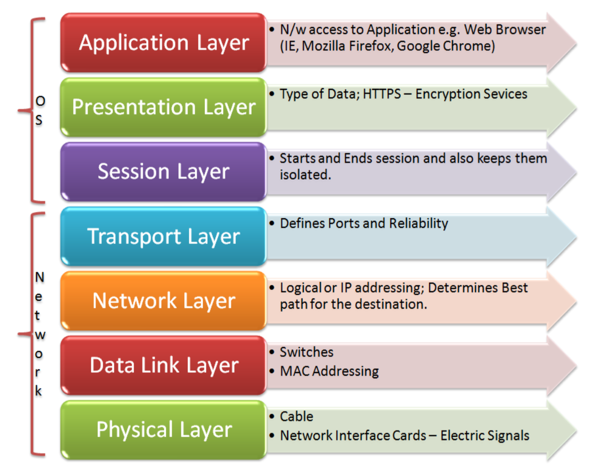
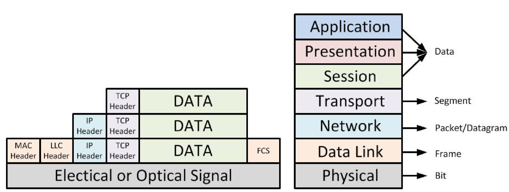
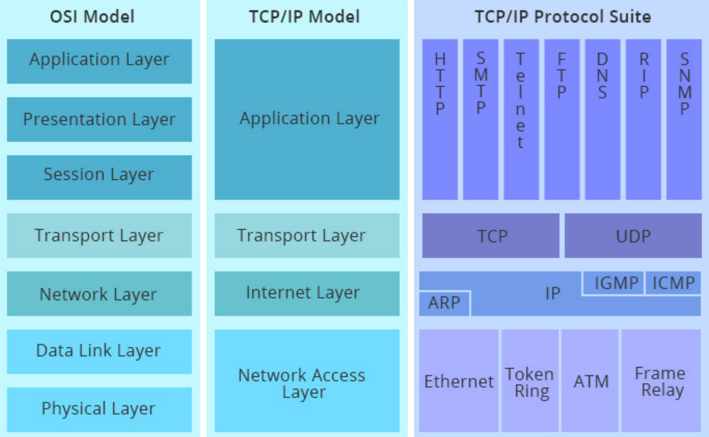

# OSI Model

The OSI model is composed by several layers represent the communication between two computers. Each layer in the model represents an important part of the process. The main idea of the layers is to simplify the design and allow for independence of each part. Also, each layer has its own protocols that define the means of communication between two parties.

Layers only interact with neighboring layers and they work using services from the lower level and providing services to their upper layer. Each layer contributes to the packet in the following way:

### Physical Layer

The Physical Layers transmits bits from one device to another through a channel. This can be any any physical medium such as cable, fiber optics or air through WIFI. This layer defines how the cable is attached to the network adapter and what transmission techniques are used to send data.

### Data Link Layer

It connects bits from the physical layer into frames (logical and structured parts of data) and it is responsible for transferring them from one computer to another without errors (using error checking and error correction).

It controls access to the shared medium and has an unique address in the scope of the network segment. A good example of this would be the Ethernet or WIFI protocol, where the unique address would be the MAC address.

### Network Layer

The network layer handles addressing and routing of data between networks and it also has an unique address in the scope of the whole network. In this case the unique address would be the IP address.

### Transport Layer

The transport later, which implements the Transport Control Protocol (TCP), handles error recognition and manages end-to-end control. It also transfers data between processes and separates data of processes at the same device, basically distributing the packets between all the processes in the device.

### Session Layer

It creates a logical interface for the applications and holds the connection even in cases of temporary communication blackout. Amongst its responsibilities are synchronization, authentication and control of access rights.

### Presentation Layer

It cares about syntax and semantics, mostly about encoding, formatting and presentation of data. It is also in charge of encryption and compression and is preformed by the operating system. Examples of this are text encodings like ASCII or EBDIC.

### Application Layer

It represents the services that directly support applications such as software for file transfer, database access, email among others. Examples of this are HTTP and SMTP.

## OSI and TCP/IP Models

The main difference between this models is the structure of the packets, mainly the fact that the TCP/IP model has only 4 layers. This is because the OSI model is more recent and was designed to suit all networks.