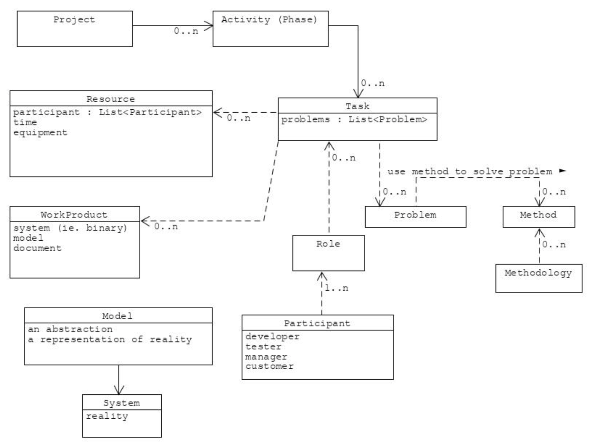

# Introduction

## Software Engineering

Software engineering is an engineering discipline that is concerned with all aspects of software production, which includes development, validation, testing and evolution.

It differs from Computer Science because while Computer Science is theoretical and concerns itself with the fundamentals, Software Engineering deals with the practicalities of developing and delivering software.

### Problems to overcome

#### Complexity

Software systems can include a huge number of functions and components, and they are usually worked on by people with different backgrounds. This leads to projects that no single person can completely understand.

Things can get some complicated that some projects are never completed. This is called <u>vaporware</u>.

#### Change

Requirements are updated when errors are discovered and when developers get a better understanding of the application. Also, Long term projects often involve a high rate of staff-turnaround.

The client's own needs may change during the development and even important technological changes may occur.

This is why it is impossible to have an static set of requirements during an software project. 

### Aspects

Software Engineering involves different aspects:

- **Modeling**: It's important to focus only on the relevant parts of the systems and ignore everything else.
- **Problem Solving**: We should strive to find acceptable solutions to the problems we are facing. We are not looking for the perfect system, but one that's good enough for the client's requirements.
- **Knowledge Acquisition**: We should gain sufficient knowledge about the problem domain and formalizing it to build a model.

### Concepts

Each **project** is composed of a number of **activities**, and each activity is composed of a number of **tasks**. A **task** represents an atomic unit of work that can be managed. It consumes a **resource** and produces a **work product**.

A **work product** can either be a **system**, a **model** or a **document**. 

**Resources** are either **participants**, **time** or **equipment**.

All persons involved in the project are referred as **participants**. Each participant has one or more **roles**. A **role** is a set of responsibilities in the **project** or **system** and it is associated with a set of **tasks**.

The term **system** refers to the underlying reality, while a **model** refers to any abstraction of the reality. A **notation** is a graphical or textual set of rules. A **method** is a repeatable technique for solving problems while a **methodology** is a collection of methods for solving a class of problems.

### Activities

Software Engineering involves a particular set of activities:

- **Software Specification**: The process of understanding and defining requirements and constraints of the system being designed. This includes  subcategories:

  - <u>Feasibility Study</u>: Whether the system is actually doable
  - <u>Requirements elicitation and analysis</u>
  - <u>Requirements Specification</u>
  - <u>Requirements validation</u>

- **Development**: It is the process of converting the system specifications into an executable system. It is conformed by 5 main activities:

  - <u>Architectural Design</u>
  - <u>Interface Design</u>
  - <u>Component Design</u>
  - <u>Database Design</u>
  - <u>Implementation</u>

- **Validation**: It is the process of verifying if a system both conforms to its specifications and meets the user experience. There are 3 main activities:

  - <u>Development Testing</u>
  - <u>Systems Testing</u>
  - <u>Acceptance Testing</u>

- **Evolution and Maintenance**: The process of systems enhancement and optimization. It's conformed by 4 activities:

  - <u>The problem and modification analysis</u>
  - <u>The modification design and implementation</u>
  - <u>The acceptance of modifications</u>
  - <u>The migrations process</u>

  