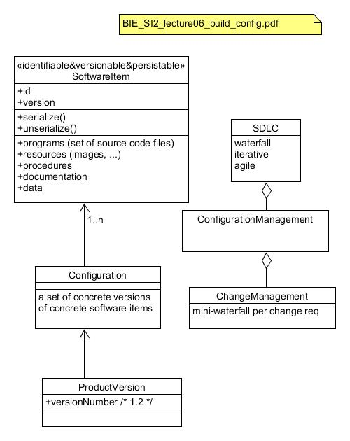

# Configuration Management

A **software product** is the complete set of computes programs, procedures, related documentation and data intended for delivery to the client/user. A **software item** is any identifiable part of a software product in a continuous or the final stage of development. 

The **Software Configuration management** is a part of the  **Software Development Life-Cycle** (SDLC) and is used to ensure the full and transparent configuration of software product and related documentation throughout the whole project life-cycle.  Inside the Software Configuration Management we have the **Change Management** is some ==WHAT==

The relation between this concepts is best expressed in the following chart:

Inside the configuration of a software product we have to ensure rules and order for a software product. The configuration itself is a set of software items that belong to a software product.

In order to **reach the goal** of the software product we have to ensure that all software items are kept and that all software items and the software product itself are identifiable. We also have to ensure that making changes to the software product does not harm the product itself.

According to the ISO specification, we need to achieve the following items:

- Identification and record of every SW item.
- Identification and record of the product.
- Ability to provide data for :
  - Generating versions of the product.
  - Updating the versions of the product.
- Ability to ensure proper implementation of changes.
- ability to report on the status of the configuration.
- Ensuring that more than one person can manage the correct update of the product.

### Version Control

The configuration manager depends on **version control**. Version control allows us to keep a record of every SW item and identification of the product. We have two types of version control systems:

- **Centralized**: It uses a centralized repository and local client copies. Each client has to synchronize its copy with a branch in the centralized repository. Its emphasis is on synchronization, tracking and backup.
- **Distributed**: Each client ahs its own repository and share changes based on trust. There may not exists a main branch. The emphasis is on sharing changes.

### Continuous Management

The continuous management plan should contain:

- **Introduction**: It says the purpose, scope, method and condition of use of the product.
- **SCM Manager**: It communicates the organization, responsibilities and authority, as well as the policies, regulations and procedures.
- **SCM Activities**: This is the version control system and the changes control system.
- **SCM Schedules**: A coordination schedule with other project activities.
- **SCM Resources**: It's the tools used and their use in the project. Here are also specifies the physical and human resources.

# Build Process

It's a process where we are cleating a delivery and installing it in an environment. Here we have to be able to deliver the product as a whole and repair little bugs as fast and cheap as possible. We also have to be able to deal with different types of environments such as servers, operating systems and databases.

We can distinguish two different types of deliveries:

- **Big Delivery**: It's the release of a new build or version of our product.
- **Small Delivery**: It's a release that aims to fix or patch a bug with no major changes.

The delivery process has to be simple and automated, and it has to keep track of the operations with logs and reports from the automated delivery system.

### Continuous Integration

For the build process we use Continuous Integration. Usually when new changes are committed to a certain branch, the CI process begins. Here we run automatic tests compile and deploy our application to a testing platform where we do more test such as performance test, users test and other manual tests. If all tests pass, then we'll deliver the software to our deployment environment.

To achieve CI we need to maintain a code repository and automate the build process and the testing itself. The building process has to be fast and that everyone can see the result of the latest build. The final delivery process must be automated.

### DevOps

DevOps is build above CI. It make the whole process faster.

