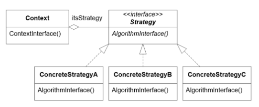
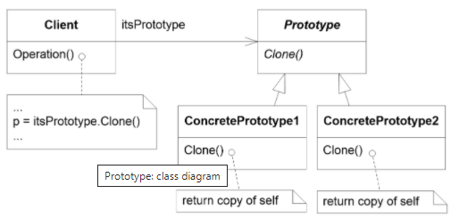
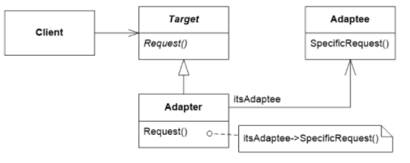
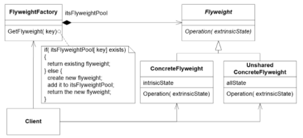

# Architecture and Design

## The Symptoms of Poor Design

The main symptoms of poor design can be described in 3 categories:

- **Rigidity**: The design is hard to change because every change affects too many parts of the system
- **Fragility**: Making a change breaks unexpectedly other parts of the system
- **Immobility**: It is hard t reuse the code in other application because it is too entangled with the current application.

But this condition can also manifest itself with other symptoms, such as:

- **Viscosity**: It is hard to do the right thing and we are forced into hacks.
- **Needless Complexity**: Overdesign of the system
- **Needless Repetition**: ???
- **Opacity**: disorganized expression.

## Design Principles

While the following are not patterns to implement in your code, they are principles that you should respect to maintain a good design. They don't try to solve a specific problem but the overall structure of the program.

- **DRY**

  Do not Repeat Yourself. Every piece of knowledge must have a single, unambiguous, authoritative representation within a system.

- **KISS**

  Keep It Simple, Stupid. Simple code is often less code, and it takes less time to write, has less bugs and is easier to modify. Extra complexity should be avoided.

- **SoC**

  Separation of Concerns tries to separate a computer program into distinct sections such that each addresses a separate concern. Programs that employ this principle are called modular and they are achieved by encapsulating information and hiding it behind an interface.

- **YAGNI**

  You Aren't Going to Need It. A programmer should only add the needed functionality and abstain to add anything else.

- **Law of Demter**

  Each unit should only have limited knowledge about other units. In OOP terms, a class can only call its methods and not the methods of their variables.

- **ZOI Rule**

  The Zero One Infinity rule talks about setting an arbitrary limit to the number of instances of a particular entity. This rule says that you can either have 0 instances, 1 instance or infinite instances.

- **SOLID**

  SOLID stands for a set of principles that complement each other well:

  - <u>**S**ingle Responsibility Principle (SRP)</u>: Each class should handle 1 thing or have one responsibility. If they have more they should be split into two or more.
  - <u>**O**pen-Closed Principle (OCP)</u>: Classes should be open for extension, but closed for modification. This means that you can add functionality to a class by extending, but you shouldn't modify it.
  - <u>**L**iskov Substitution Principle</u>: Subtypes must be substitutable for their base types in structural way and also in a behavioral way.
  - <u>**I**nterface Segregation Principle (ISP)</u>: Clients should not be forced to depend on methods that they don't use. The clients should receive interfaces only with the necessary methods.
  - <u>**D**ependency-Inversion Principle (DIP)</u>: The main idea here is that high level modules should not depend on low level modules, both must depend on abstractions.

## Design Patterns

### MVC

MVC or Model View Controller is an architectural pattern that decouples interactive applications into 3 components.

This pattern has the benefit that you can have multiple views for the same model and change freely the "look and feel" of the application, but it can also lead to increased complexity and a close connection between the view and the controller.

### MVP

This pattern is similar to MVC, with the difference that now there is no controller and all inputs and outputs are managed by the view. This queries and changes go through the presenter, which will affect the model and send the changes back to the view.

### MVVM

Model View View-Model is an attempt to solve the GUI testing problem of MVP. Here the view is stateless and the state container is the View-Model.

### Observer

The Observer pattern tries to abstract coupling between Subject and Observers. The main idea is that observers can be added to a given subject without making any changes and the subject can broadcast messages to them.

When implementing this patter, the programmer has to be aware of possible deadlocks and unexpected updates.

### Factory Method

The creation of concrete instances violates the Dependency inversion principle and this pattern tries to tackle that problem.

### Factory

It is very similar to the previous pattern but now every class has its own factory class that only creates it.

### Abstract Factory

Abstract factories are used to create a set of objects that extend a main object. There is a main abstract factory and then, according to the differences in the objects we can create different factories to create them.

The benefits of this approach is that the clients is isolated from the concrete implementation of classes and it makes exchanging product families very easy. On the other side, supporting new kinds of products requires changing the abstract factory interface.

### Strategy

The Strategy pattern tries to define a family of algorithms and encapsulate them in a base class, making them interchangeable.

### State

The State pattern allows an object to alter its behavior when its internal state changes.

### Visitor

It allows to add new operations to a class hierarchy without changing its classes.

It is applicable when you want many distinct and unrelated operations without messing with the structural classes. 

### Proxy

The Proxy provides a surrogate or a placeholder for another object to control access to it.

### Command

The Command pattern encapsulates a message request as an object that will later be invoked. 

This pattern is useful when you need to queue different actions and the commands may have different life times than the original object.

### Memento

It creates an snapshot of an object's internal state which can be later restored.

It provides a way of recording the internal state of an object in a separate object without violating the encapsulation principle and it eliminates the need for multiple creation of the same object for the sole purpose of saving its state.

The issue with it is that it must provide 2 types of interfaces, a narrow interface for the care taker and a wider interface for the originator.

### Bridge

The Bridge pattern aims to provide portability and "bridge" the differences between non-compatible standards or operating systems.

### Builder

The Builder separates the construction process from the concrete representation.

### Prototype

Prototype specifies the kind of objects to create using a prototype and creating new objects by copying it

### Singleton

It ensures a class has only one instance and provides a global access point to it. While it's easy to use, it is a bad practice because it introduces a global state and makes your code not portable

### Facade

It provides a simple interface to a group of objects that have complex and general interfaces. The pattern enforces low coupling with external subsystems and libraries.

### Adapter

The Adapter convers the interface of a class into another interface, which the client expects.

### Flyweight

It uses sharing to support a large number of fine-grained objects efficiently.

It is used when the application uses a large number of objects and the storage costs are high.

### Composite

It is a tree structure that represents part-whole relationships.

### Decorator

The decorator attaches additional responsibilities to an object dynamically.

 This provides more flexibility than static inheritance but it also has a lot of little objects.

### Chain of Responsibility

The Chain of responsibility is a method of passing a request among a chain of objects.

 It reduces coupling between sender and receiver and it has a lot of flexibility in assigning responsibilities to objects, but it has performance issues.

### Template Method

It defines a skeleton for an algorithm in a base class and lets the subclasses redefine the steps.

### Mediator

It encapsulates the interaction of a set of objects.

This pattern centralizes controls, abstracts object cooperation and limits subclassing of colleague classes. 

### Iterator

It represents sequential access to container elements without exposing its underlying representation.

### Interpreter

It defines a grammatical representation for a language and an interpreter to interpret the grammar.

### Marker Interface

It provides a means to associate metadata with a class where the language does not  have explicit support for such metadata. Sort of expanding the concept of reflection to and adding new data to a class.

### Mock Object

It simulates objects that mimic the behavior of real object in controlled ways. One use case it unit testing.

### Module

It implements the concept of software modules in a programming language with incomplete direct support for the concept. It organizes code in certain ways to accomplish a particular function. It can be implemented using a specialization of the singleton pattern.

### Twin

It allows developers to model multiple inheritance in programming languages that do not support it.

It's applicable to model multiple inheritance and to avoid some of its problems. It requires message forwarding, may be less efficient than inheritance.

### Servant

An object used to offer some functionality to a group of classes without defining that functionality in each of them. It promotes separation of concerns.

### Active Record

It is an approach to accessing data in a database where each table or view is represented as a class and an instance represents a single row of that table. CRUD operations are made using transactions.

### Data Mapper

A data access layer that performs bidirectional transfer of data between a data store and an in-memory data representation. It is an improvement over Active Record and its goal is to keep an in-memory persistent representation of another data store. 

## Architectural Patterns

The following patterns are not designed to do a specific thing, but to organize the structure of a whole project.

### Component- Based Architecture

It is the idea that software is made up of different components and its an answer to the *"software crisis"* where monolithic applications where hard to maintain. It heavily enforces the separation of Concerns principle and so, each component must be easily substitutable. 

An example of this are web services, libraries, and classes.

### Layered Architecture

A layered architecture is a design with different levels of abstraction which partitions the concerns of the application into stacked groups

### Client-Server Architecture

This architecture partitions tasks between the providers of a resource (servers) and the service requesters (clients). It is usually dictated by a 1:N relationship from the servers to the clients, where we can use the advantages of the mediator pattern.

### Service-Oriented Architecture

A service is a discrete unit of functionality that can be accessed remotely and acted upon and updated independently. It is based in the principles of independent vendors, product and technologies and less about how to modularize an application.

### Pipes and Filters

IT is used as a chain of processing elements arranged so that the output of each element is the input of the next. It is usually a linear and one-directional component-based architecture. Bash is a good example of it. 

### Database Centric Architecture

It is used in systems where the databases play a crucial role. It is similar to the client-server architecture, but here the server only takes CRUD operations. An application state is represented by its data and it can be stored, stopped, and restored from a database like it neve stopped. 

### Rule-Based Architecture

It is used as a way to codify the problem-solving capabilities of human experts into programs. It interprets the situation in a **match-resolve-act** cycle:

1. **Match**: The left-hand side matches against the known contents of the memory and it returns a conflict set, which consist of instantiations of all satisfied rules.
2. **Conflict-Resolution**: One of the rules instantiated in the conflict set if selected for execution.
3. **Act**: the actions of the rule are executed. This actions may change the contents of the working memory.

### Blackboard Architecture

It specifies how to design a systems that integrates large and diverse specialized modules, and implements complex non-deterministic control strategies. It is used in context with high parallelism and where no deterministic solutions are known.

### Asynchronous Messaging

Is is a layer that allows heterogeneous components to asynchronously communicate despite their differences. I is usually realized as a Message-Oriented Middleware.

It can store, route and transform messages, but it needs a bus and it most applications communication is synchronous.

### Event-Driven Architecture

It is an architecture promoting the production, detection, consumption and reaction of events. It can be implemented with a mediator or broker topology.

### Publish-Subscribe Architecture

Publishers categorize published messages and subscribers express their interest in messages from a certain category and only receive messages of those categories, without knowing the publishers.

### DSLs

DSL is a computer language specialized to a particular application domain. It contrasts to a general-purpose language and it is used to model an specific domain. 

### Reflection

it give the ability to examine, introspect and modify its behavior at runtime.

### Plug-ins Architecture

A plug-in is a software component that adds a specific feature to an existing computer program.

