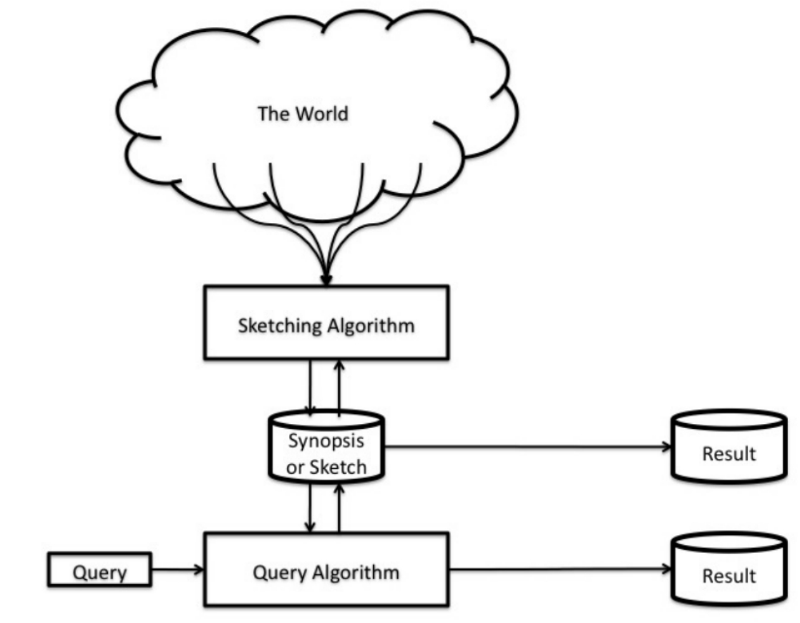
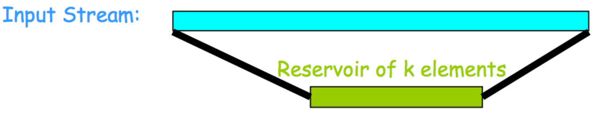
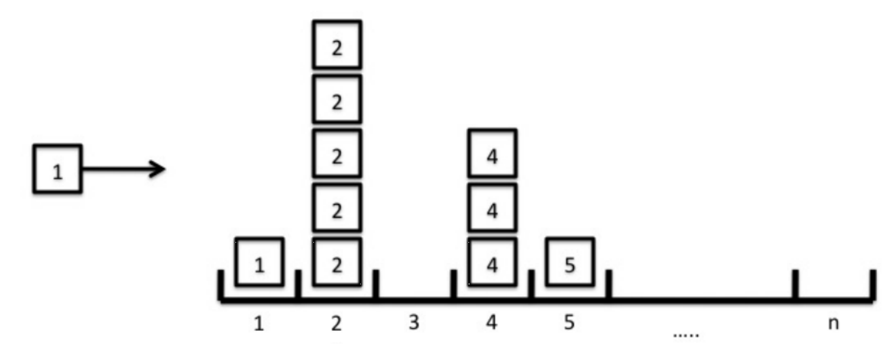
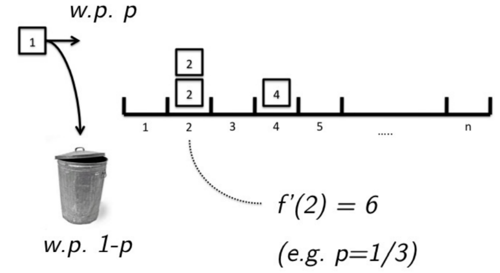
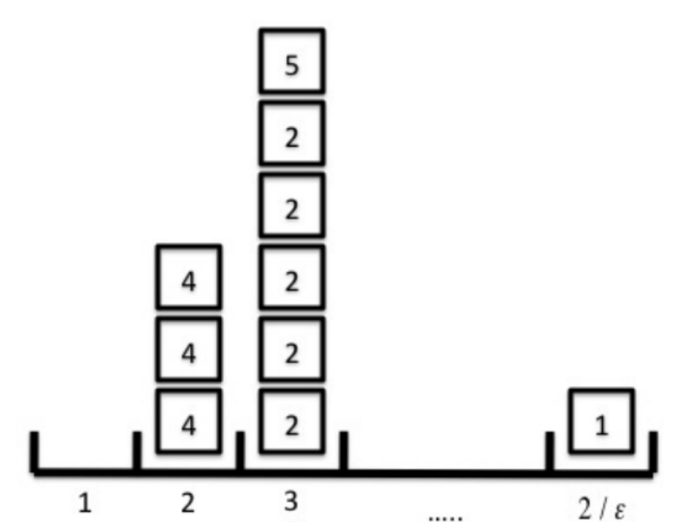
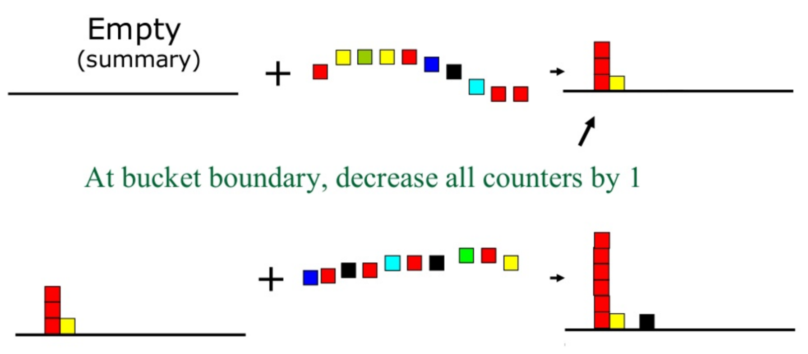

# Mining Data Streams

Traditional approaches assume all the data is available in a database, but sometimes the dataset is too large to store it or is genearted constantly. This is where mining data streams comes into play.

Data streams are used to process a high volume or continuous data that is arrivig at a rapid rate and the distribution changes on the fly. The data is evolving constantly, and we need to find and understand the changes, as well as  maintaining an updated model.

The data can change in a few different ways:

- **Feature Drift**: The distribution of input data changes
- **Real Concept Drift**: The relatio between the input data and the target changes
- **Arrival of new information**

The model can be adapted in two main ways, we can either replace the model periodicly, or increamentally update it.

Whe computing data streams, we must keep a low processing time per item, read it, processit and discard it. Also, we must provide with real time answers. This system will return mostly approximated answers but most runs will be approximately correct.

## Data Streams Processing

The first stage is to sample the stream. We need to fund an uniform random sample of the infinite data stream by choosing uniformly $k$ elements at random.

There are different ways to sample the stream:

- **Reservoir Sampling**: The goal here is to maintain a fixed-size uniform random sample. Put the first $k$ elements from the stream into the repository, and when the next element arrives add it to the reservoir with a given prbability $p$. If it was added, randomly remove an element from the reservoir

  

- **Moving Windows**: This method is useful when timeliness is important. Here we restrict samples to a window of recent data, as new data arrives, the old data expires.

- **Sketches**: This technique tries to summarize the entire data, often at multiple levels of detail.

- **Randomized Algorithms**: Mainly consider Monte Carlo algorithms, it has bounds on the running time but it may not return the correct result.

## Approaches

### Item Frequencies

- **Naive Approach**: This is just counting the occurances of elements in an array.

  

- **Sampling**: We sample with probability $p$ and estimate $f(i) = \frac1p A(i)$

  

- **Count-Min Sketch**: The space in the counters is limited, so the items are counted in buckets according to a has function.

  

### Identifying Frequent Items

**Loosy Counting** has applications in Frequent Pattern Mining, mainly with association rules. It will split the incoming stream in bukets of size $w$, compute the frequencies according to the bucket and then at the bucket boundary decrease all counters by one.

### Finding frequent Itemsets

The approach is to load as many buckets as possible to the main memory and delete an entry if the updated frequency is less than the bucket numer. Decrease the frequency by number of buckets.

### Count Distinct Items

To do this we use the Flajolet-Martin algorithm. It has this steps:

1. Set $n$ to $0$

2. For each input item:
   1. has the item into $i$ bit string
   2. Count trailing zeros into the bit string
   3. If the count is greater than $n$, then $n$ is assigned the count

This method assumes that we have a good hash function and that in random data, a sequence of $n$ zero bits will occur once in every 2^n^ elements on average.

## Technologies

- **Stream Processing Systems**: They can handle a nearly unlimited amount of data, but they only process one or very few items at a time.

