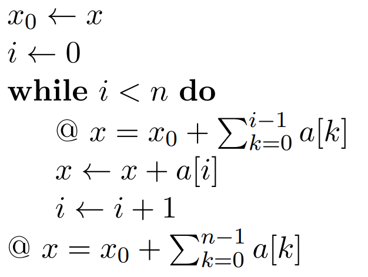

# Assignment 03

## 7

> Convert each of the following basic paths into SSA, and then write down its verification condition. Check whether the verification condition holds. If it holds, write down a short proof. If it does not hold, find a counter-example, that is, a variable assignment that both shows that the formula does not hold, and at the same time represents an initial state for which execution of the basic path results in a bug. For each of those steps, there are examples on the slides of Lecture 5.

### d

> $$
> \array{\bold{\text{assume }} k\le x&;& x \larr x-k &;& @~ x \ge0}
> $$

Converted to SSA:
$$
\array{\bold{\text{assume }} k\le x_1&;& x_2 \larr x_1-k &;& @~ x_2 \ge0}
$$
Verification Condition:
$$
\forall x_1,x_2,k.~~~[k \le x_1 \land x_2 = x_1 - k] \implies x_2 \ge 0
$$

$$
\array{
\text{My assumptions: } && \\
&& \text{Let $x_1,x_2,k$ be arbitrary but fixed variables}\\
&& [k \le x_1 \land x_2 = x_1 - k] \\
&& k \le x_1 \\
&&  x_1 - k \ge 0\\
&& x_2 = x_1 - k\\
&& x_2 = x_1 - k \ge 0\\
&&x_2 \ge 0

\\\\
\text{To prove: }&&  x_2 \ge 0
}
$$

### e

> $$
> \array{x \larr x-k&;&\bold{\text{assume }}k \le x &;& @~~x \ge 0}
> $$

Converted to SSA:
$$
\array{x_1 \larr x_0-k&;&\bold{\text{assume }}k \le x_1 &;& @~~x_1 \ge 0}
$$
Verification Condition:
$$
\forall x_1,x_0,k. [x_1 = x_0 - k \land k \le x_1 ]\implies x_1 \ge 0
$$
This is verification condition is not met. If we select the following values:
$$
\array{x_1 = -2& x_0 = -5 & k = -3}
$$
We can see that:
$$
[-2 = -5 - (-3) \land -3 \le -2] \implies -2 \ge 0
$$

### f

> $$
> \array{\bold{\text{assume }}k \ge 0&;&x \larr x-k &;&\bold{\text{assume }} k \le x &;&@~x \ge 0}
> $$

Converted to SSA:
$$
\array{\bold{\text{assume }}k \ge 0&;&x_1 \larr x_0-k &;& \bold{\text{assume }}k \le x_1 &;&@~x_1 \ge 0}
$$
The verification condition:
$$
\forall x_0,x_1,k. [k \ge 0 \land x_1 = x_0 - k \land k \le x_1] \implies x_1 \ge 0
$$

$$
\array{
\text{My assumptions: } && \\
&& \text{Let $x_0,x_1,k$ be arbitrary but fixed variables}\\
&& [k \ge 0 \land x_1 = x_0 - k \land k \le x_1] \\
&& 0 \le k \\
&& x_1 = x_0 - k \\
&& k \le x_1 \\
&& x_1 \le x_0\\
&& k \le x_0 \\
&& x_1 \ge x_0 - k \ge x_0 - x_0 \ge 0

\\\\
\text{To prove: }&&   x_1 \ge 0
}
$$

## 8

> Consider the following program (all variables range over the natural numbers including zero):
>
> 

### A

> Write down all basic paths of this program. Take care that the basic paths that begin at the loop invariant start with a corresponding assume statement.

This path represents the case where we never enter the loop:
$$
x_0 \larr x\\
i \larr 0\\
\bold{\text{assume }} i \ge n\\
@~ x = x_0 + \sum_{k=0}^{n-1}a[k]
$$
The verification condition is:
$$
\left[ x_0 = x \land i = 0 \land i \ge n \right] \implies x = x_0 + \sum_{k=0}^{n-1}a[k]
$$
The proof is:
$$
\array{
\text{My assumptions: } && \\
&& \left[ x_0 = x \land i = 0 \land i \ge n \right] \\
&& x_0 = x \\
&&  i = 0 \\
&& i \ge n \\
&& n \le 0
\\\\
\text{To prove: }&&   x = x_0 + \sum_{k=0}^{n-1}a[k]
}
$$
This holds because $x = x_0$ and $n \le 0$, so the summation will return $0$.

This path represents when we enter the loop the first time:
$$
x_0 \larr x\\
i \larr 0\\
\bold{\text{assume }} i < n\\
@~ x = x_0 + \sum_{k=0}^{i-1}a[k]
$$
The verification condition is:
$$
\left[x_0 = x \land i = 0 \land  i < n \right]  \implies x = x_0 + \sum_{k=0}^{i-1}a[k]
$$
We can prove it:
$$
\array{
\text{My assumptions: } && \\
&& \left[x_0 = x \land i = 0 \land  i < n \right] \\
&& x_0 = x \\
&&  i = 0 \\
&& i < n 
\\\\
\text{To prove: }&&  x = x_0 + \sum_{k=0}^{i-1}a[k] 
}
$$
This holds because $x = x_0$ and $i-1 < 0$, so the summation returns $0$.

This path represents when we iterate through the loop and don't leave it
$$
\bold{\text{assume }}  x = x_0 + \sum_{k=0}^{i-1}a[k]\\
x' \larr x + a[i]\\
i' \larr i + 1\\
\bold{\text{assume }} i' < n\\
@~ x' = x_0 + \sum_{k=0}^{i'-1}a[k]
$$
The verification condition is:
$$
\left[ x = x_0 + \sum_{k=0}^{i-1}a[k] \land x' =x + a[i] \land i' = i+1 \land   i' < n \right] \implies x' = x_0 + \sum_{k=0}^{i'-1}a[k]
$$
And we can prove it:
$$
\array{
\text{My assumptions: } && \\
&& x = x_0 + \sum_{k=0}^{i-1}a[k]\\
&& \left[ x' =x + a[i] \land i' = i+1 \land   i' < n \right]\\
&&  x' =x + a[i] \\ 
&& i' = i+1 \\
&&  i' < n \\
&& x' = x_0 +  \sum_{k=0}^{i-1}a[k] + a[i] \\
&& x' = x_0 +  \sum_{k=0}^{i'-1}a[k] 
\\\\
\text{To prove: }&&    x' = x_0 + \sum_{k=0}^{i'-1}a[k]     
}
$$

This path represents when we iterate through the loop and exit
$$
\bold{\text{assume }} @~ x = x_0 + \sum_{k=0}^{i-1}a[k]\\
x' \larr x + a[i]\\
i' \larr i + 1\\
\bold{\text{assume }} i' \ge n\\

@~ x' = x_0 + \sum_{k=0}^{n-1}a[k]
$$
The verification condition is
$$
\left[x = x_0 + \sum_{k=0}^{i-1}a[k] \implies \land x' = x+ a[i] \land i' = i+1 \land i' \ge n \right] \implies x' = x_0 + \sum_{k=0}^{n-1}a[k] 
$$
We can prove it:
$$
\array{
\text{My assumptions: } && \\
&&  x = x_0 + \sum_{k=0}^{i-1}a[k] \\
&& \left[x' = x+ a[i] \land i' = i+1 \land i' \ge n \right] \\
&& i'=i+1 \\
&& i' \ge n \\
&& x' = x+ a[i] =  x_0 + \sum_{k=0}^{i-1}a[k] + a[i] = x_0 + \sum_{k=0}^{n-1}a[k] 
\\\\
\text{To prove: }&&   x' = x_0 + \sum_{k=0}^{n-1}a[k] 
}
$$

WRONG! The problem is that n != i'
