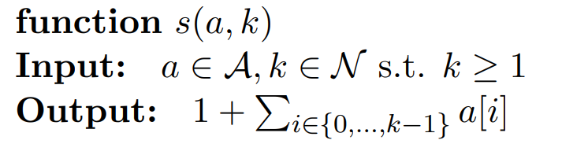
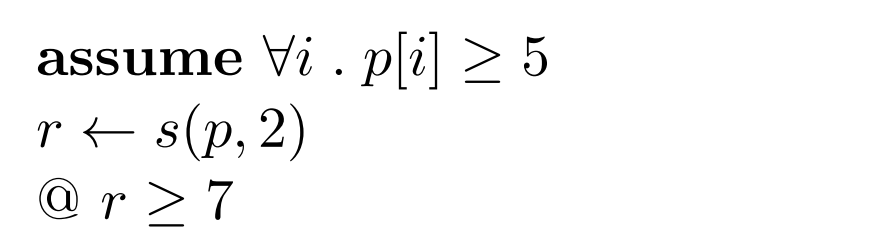

# Assignment 04

## 9

```
assume [y >= 1]
r <- x
i <- 1
while i < y do:
	@ r = summation{from 1}{to i} x AND i < y
	r <- r + x
	i <- i + 1
@ r = summation{from 1}{to y} x
return r

```

### C

For `x = 4` and `y = 5`

| `r`  | `i`  |
| :--: | :--: |
|  4   |  1   |
|  8   |  2   |
|  12  |  3   |
|  16  |  4   |

### D

Basic Paths:

1. 

   ```
   assume y >= 1
   r <- x
   i <- 1
   assume i >= y
   @ r = summation{from 1}{to y} x
   ```

   Verification condition:
   $$
   [y \ge 1 \land r = x \land i = 1 \land y \ge i] \implies r = \sum_{j=1}^{y} x
   $$
   Proof:
   $$
   \array{
   \text{My assumptions: } && \\
   && [y \ge 1 \land r = x \land i = 1 \land y \ge i]\\
   && y \ge 1 \\
   && i=1 \\
   && i \le y\\
   && y = 1 \\
   && r = x
   \\\\
   \text{To prove: }&& r = \sum_{j=1}^{y} x
   }
   $$
   Because $1 \le y \le 1$, we can safely say that $y=1$, and then we know that $r=x$, and the summation from $1$ to $1$ of $x$ is $x$, so the formula holds.

2. 

   ```
   assume [y >= 1]
   r <- x
   i <- 1
   assume i < y
   @ r = summation{from 1}{to i} x AND i < y
   ```

   The verification condition is:
   $$
   [y \ge 1 \land t = x \land i = 1 \land i < y ] \implies r = \sum_{j=1}^{i}x
   $$
   The proof is very similar to the first path.

3.  

   ```
   assume r = summation{from 1}{to i} x AND i < y
   r_1 <- r + x
   i_1 <- i + 1
   assume i_1 < y
   @ r_1 = summation{from 1}{to i_1} x
   ```

   The verification condition is:
   $$
   \left[r = \sum_{1}^{i} x \land i < y\land r_1 = r + x \land i_1 = i + 1 \land i_1 < y\right] \implies r_1 = \sum_{1}^{i_1} x
   $$
   The proof is:
   $$
   \array{
   \text{My assumptions: } && \\
   && \left[r = \sum_{1}^{i} x  \land i < y \land r_1 = r + x \land i_1 = i + 1 \land i_1 < y\right] \\
   && r = \sum_{1}^{i} x \\
   && r_1 = r + x  \\
   && i_1 = i + 1\\
   && i_1 < y
   
   \\\\
   \text{To prove: }&& r_1 = \sum_{1}^{i_1} x
   }
   $$
   This proof is valid because $r_1 = \sum_1^ix + x = \sum_1^{i+1}x$ and $i_1 = i +1$.

4.  

   ```
   assume r = summation{from 1}{to i} x AND i < y
   r_1 <- r + x
   i_1 <- i + 1
   assume i_1 >= y 
   @ r = summation{from 1}{to y} x
   ```

   The verification condition:
   $$
   \left[r = \sum_1^ix \land i < y \land r_1 = r + x \land i_1 = i +1 \land i_1 \ge y \right] \implies r_1 = \sum_1^yx
   $$
   The proof:
   $$
   \array{
   \text{My assumptions: } && \\
   && \left[r = \sum_1^ix \land i < y \land r_1 = r + x \land i_1 = i +1 \land i_1 \ge y \right]\\
   && r = \sum_1^ix\\
   &&  i_1 = i +1 \\
   && r_1 = r + x\\
   && i < y \\
   && i_1 \ge y\\
   && i_1 = y
   
   \\\\
   \text{To prove: }&&  r_1 = \sum_1^yx
   }
   $$
   The formula holds because $i_1 = i+1  \ge y$ and $i < y$, so $i_1 = y$. On the other side $r_1 = r + x = \sum_1^{i+1}x = \sum_1^yx$

## 10

```
assume r = 0 AND s = 0
for i <- 1 to n do:
	@
	if a[i] < 0 then:
		r <- r + 1
	@ r = |{k in {1,...,i}/ a[k] != 0}|
	if a[i] > 0 then:
		s <- s + 1
	@ s = |{k in {1,...,i}/ a[k] != 0}|
@ r + s = |{k in {1,...,n}/ a[k] != 0}|
```

### A

> For each verification condition of the program, write down whether it holds or not, and if not, also note the reason why. Apart from that, you do not have to write down anything, neither verification conditions themselves nor proofs.

THIS IS ALL WRONG. THE PROBLEM HERE IS THAT WE DON'T KNOW THE VALUES FOR THE VARIABLES THAT WE ARE CHECKING IN THE ASSERTIONS.

The assertions on line 6 and 9 do not hold all the time. The reason is quite simple, the both assertion check the same value against a counter which is updated on contradicting conditions, i.e. when the value is higher or lower than 0.

### B

> Change the assertions in the program in such a way that all verification conditions hold. Again, you do not have to prove anything. Still check each verification condition in an informal way.

```
assume r = 0 AND s = 0
for i <- 1 to n do:
	@ r = |{k in {1,...,i-1}/ a[k] < 0}| AND s = |{k in {1,...,i-1}/ a[k] > 0}|
	if a[i] < 0 then:
		r <- r + 1
	@ r = |{k in {1,...,i}/ a[k] < 0}| AND s = |{k in {1,...,i-1}/ a[k] > 0}|
	if a[i] > 0 then:
		s <- s + 1
	@ s = |{k in {1,...,i}/ a[k] > 0}| AND r = |{k in {1,...,i}/ a[k] < 0}|
@ r + s = |{k in {1,...,n}/ a[k] != 0}|
```

The updated program looks like this. This time we are validating against different values, made specifically for the counter they are using. The last assertion is not changed because it holds in the original version.

## 11

### A

> Write down a first-order predicate logical formula that represents the following I/O-specification in the way discussed in the lecture on functions and procedures:


$$
\forall a,k , r. k \ge 1 \land r = \text{s}(a,k)\implies r = 1+ \sum_{i =0}^{k-1}a[i]
$$

### B

>  Write down the verification condition of the following program:


$$
\forall i.(p[i] \ge 5) \land r = \text{s}(p,2) \implies r \ge 7
$$

### C

>  Check, whether the verification condition from the previous item holds—assuming that the function s returns, what it should return according to its specification. You do not have to prove anything, you just should be able to explain why it holds/does not hold

The verification condition holds because all the elements of the array are higher or equal than 5. Lets take the worst case where all the elements are 5, the function $\text{s}$ will return $1 + 5 + 5 = 11$ which is higher than 7.

### D

> Prove the verification condition, following the lecture on handling function calls (i.e., using the formula from item (a) as an assumption). Here, you may freely use whatever knowledge you have about arrays and integers (i.e., not only the axioms of the corresponding logical theories).

$$
\array{
\text{My assumptions: } && \\
&& [\forall i.(p[i] \ge 5) \land r = \text{s}(p,2)]\\
&& \forall i.(p[i] \ge 5)\\
&&  r = \text{s}(p,2)\\
&&  r = 1+ \sum_{i =0}^{1}p[i] = 1 + p[0] + p[1] \ge 1 + 5 + 5 = 11

\\\\
\text{To prove: }&&   r \ge 7
}
$$

REAL PROOF:
$$
\array{
\text{My assumptions: } && \\
&& [\forall i.(p[i] \ge 5) \land r = \text{s}(p,2)]\\
&& \forall i.(p[i] \ge 5)\\
&&  r = \text{s}(p,2)\\
&& r = 1 + p[0] + p[1] & \text{lemma 1}\\
&& p[0] \ge 5 \\
&& p[1] \ge 5 \\
&& p[0] + p[1] \ge 5 + 5 = 10 & \text{lemma 2} \\
&& 1+ (p[0] + p[1]) \ge 1 + 10 = 11 & \text{lemma 2} \\
&& r \ge 11 & \text{lemma 3}\\
&& 11 \ge 7
\\\\
\text{To prove: }&&   r \ge 7
}
$$

- Lema 1:
  $$
  a := p\\
  k := 2\\
  2 \ge 1 \implies \text{s}(p,2) = 1 + \sum_{i=0}^1 a[i] \\
  2 \ge 1 \\
  \text{s}(p,2) =1 + \sum_{i=0}^1 a[i] \\
  \text{s}(p,2) =1 + \sum_{i=0}^1 a[i] \implies p(\text{s}(p,2)) \implies p(1 + \sum_{i=0}^1 a[i]) \text{ with }p(\alpha) \equiv \alpha = x
  \\\\
  $$
  
- Lemma 2:
  $$
  \forall a,b,c,d. ((a \ge c \land b \ge d) \implies a + b \ge c + d )
  $$

- Lemma 3:
  $$
  1+ p[0] + p[1] = r \implies P(1+ p[0] + p[1]) \implies P(r)\\
  P(\alpha) \equiv \alpha \ge 11
  $$