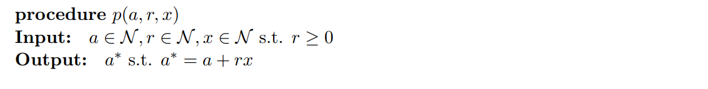
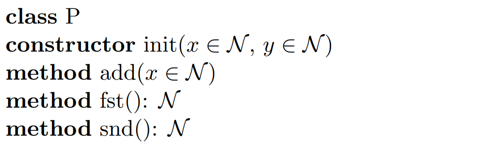
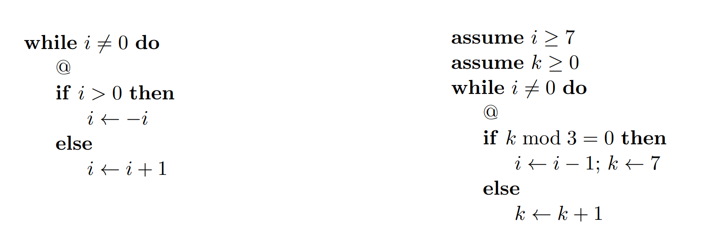
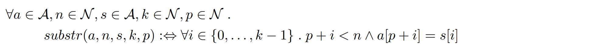

# 5

## 12

### A

>  Write down a first-order predicate logical formula that represents the following I/O-specification in the way discussed in the lecture on functions and procedures:
>
> 

$$
\forall a,a^*,r,x \in \mathcal{N}. r \ge 0 \land p(a,a*,r,x) \implies a^*. a^* = a + rx
$$

## 13

> Consider the following class
>
> 
>
> Whether the notation used is the object-oriented notation used in the lecture on abstract data types. Now translate the following basic path from object-oriented notation to procedural notation
>
> ```
> x <- init(0,1)
> y <- x
> x.add(7)
> y.add(1)
> assume x.fst() = y.snd()
> @ x.snd() < 10
> ```

The result is:

```
x <- init(0,1)
y <- x
x <- add(x,7)
y <- add(y,1)
assume fst(x) = snd(y)
@ snd(x) < 10
```

## 14

> Consider the following two programs
>
> Here, all variables range over the integers and, as usual in this course, the scope of control statements is given by indentation.

### A

> Write down a table showing the values of the program variables at the position of the missing loop invariant at all loop iterations for some non-trivial input.

First program, with input `i = 2`

```
i = 3, -3, -2, -1
```

Second Program, with input  `i=7,k=0`:

```
i = 7, 6, 6, 6, 5, 5, 5, 4, 4, 4, 3, 3, 3, 2, 2, 2, 1, 1, 1,
k = 0, 7, 8, 9, 7, 8, 9, 7, 8, 9, 7, 8, 9, 7, 8, 9, 7, 8, 9,
```

### B

> Provide a variant wrt. an arbitrary well-founded relation. Explain informally why your result is a variant (no assertions or formal proofs are necessary).

For the first program I will use the following well-founded relation:
$$
(a,b)\in R \subset \Z\times \Z \\ 
\iff \\
|a| > |b| \lor (|a| = |b| \land a > b)
$$
This relation is well-founded because it is constantly decreasing the absolute value of the number. To equal numbers cannot be part of the relation, and if two numbers with equal absolute value are in the relation, the right value must always be positive and the left one negative.

For example:
$$
(3,-3) \in R \iff |3| > |-3| \lor (|3| = |-3| \land 3 > -3 )
$$
Here the first section of the term fails because $|3| = 3 =|-3|$. The second part holds because $3 > -3$

Another example:
$$
(-3,-2) \in R \iff |-3| > |-2| \lor (|-3| = |-2| \land -3 > -2)
$$
Here the first term is valid, thus the pair is part of the relation.

For the second program I will use the following well-founded relation:
$$
((i,k),(i',k')) \in Q \subset\N^2\times\N^2 \\ \iff\\
i > i' \lor (i = i' \land (k-1) \text{ mod } 3 < (k'-1) \text{ mod } 3)
$$
This relation is well-founded because it will always drive the value of $i$ down to 0:

For example:
$$
((7,0),(6,7)) \in Q \iff 7 > 6 \lor (7 = 6 \land (0-1) \text{ mod } 3 = 2 <0= (1-1) \text{ mod } 3 )
$$
The first part of the term is valid, so the pair is part of the relation.

Another example>
$$
((6,8),(6,9)) \in Q \iff 6 > 6 \lor (6=6\land (8-1) \text{ mod } 3 = 1 < 2 = (9-1) \text{ mod } 3)
$$

## 15

> Consider the following program:
>
> ```pseudocode
> found <- False
> for i <- 0 to n-k do:
> 	@
> 	p <- True
> 	for j <- 0 to k-1 do:
> 		@
> 		if a[i+j] != s[j] then:
> 			p <- False
> 		@
> 	if p then:
> 		found <- True
> 	@
> @ found <=> exists r. substr(a,n,s,k,r)
> ```
>
> Here is the definition used:
>
> 

### A

> Add logical formulas as assertions to the program lines starting with @, trying to ensure that all verification conditions hold. It is not important that your answer is correct. But you must be able to: 
>
> - Either explain why you think your solution satisfies all verification conditions, or to 
> - Show several possibilities that you tried, explain why those possibilities are not a correct answer, and why you were not able to come up with a correct answer

```pseudocode
found <- False
// Se para en una posicion entre 0 y el final de la palabra menos el finial del subst
for i <- 0 to n-k do:
	// found = true if I already found a substring
	@ i <= n-k AND [found  = Exists t in {0,...,i-1}. substr(a,n,s,k,t)]
	p <- True
	// DEsde donde estoy parado,voy a chequear que el str chico este en los proximos
	// k elementos
	for j <- 0 to k-1 do:
		@ j <= k-1 AND (p = For all t in {0,...,j-1}. a[t + i] = s[t]) AND [found  = Exists t in {0,...,i-1}. substr(a,n,s,k,t)]
		// Si algun elemento no es del str chico, entonces es falso
		if a[i+j] != s[j] then:
			p <- False
		@ (p = For all t in {0,...,j}. a[t + i] = s[t]) AND AND [found  = Exists t in {0,...,i-1}. substr(a,n,s,k,t)]
	if p then:
		found <- True
	@ found = Exist t in [0,i]. substr(.)
@ found <=> exists r. substr(a,n,s,k,r)
```

We can also reuse substring instad of forall ...

p = inicio

n = len(a)

a = arreglo frande

s = arreglo chico

k = len(s)

