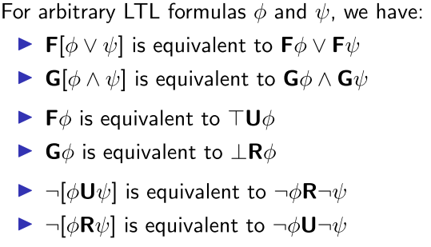

# Temporal Logic

How do we know that a given automaton will fulfill the specifications of a given system? We want to check this out in an automatic way if possible. For this we will use **temporal specification** and **properties** that we saw on a previous class.

We will simplify the automaton to get it as simple as possible, so we will only keep the **transition system**, which is:

- The set of states $S$
- The set of initial states $S_0$
- The transition relation $R \subseteq S \times S$

### Transition Systems

Given a transition system $(S,S_0,R)$, we will define a **path** as a list of states that can be connected using the transition relation $R$. Formally, this is translated to:
$$
(s_0,s_1,\dots) \in \Sigma_S / s_0 \in S_0, (s_0,s_1) \in R, (s1,s_2)\in R, \dots
$$
And we will use the following notation:
$$
s_0 \rightarrow s_1 \rightarrow \dots
$$

### Proprieties of States

A **state property** is a name that denotes a subset of the states $S$. For example, if our states are the temperatures, we can have a property *hot* that represents the following states (temperatures):
$$
\text{hot} : \{x\in S/s > 30^o\}
$$
We also have a function called **interpretation** that matches each state property to a set of states. If we keep using our example:
$$
\mathcal I(\text{hot}) = \{x\in S/s > 30^o\}
$$
A state property $p$ holds on a state $s$ if $s\in\mathcal I(p)$. We will use the following notation:
$$
s\models p
$$

### Temporal Specification

For a path $\pi$ of the form $(s_0,s_1,\dots)$ , we denote by:

- $\pi^i$, the $i^{th}$ suffix of $\pi$. This will return the path $(s_i,s_{i+1}, \dots)$
- $\pi(i)$ is the element $s_i$.

We say that a state property $p$ holds on a path $\pi$ if it holds on the first element of the path:
$$
\pi \models p \iff \pi(0) \models p
$$
We call **counter-example** of a property $p$ to a path that doesn't hold that property:
$$
\pi \not\models p
$$

#### Operators

We have different operators in temporal logic:

- $\pi \models Xp$: The property $p$ will hold on the next elements in the path:
  $$
  \pi \models Xp \iff \pi^1\models p \iff \pi(1) \models p
  $$

- $\pi \models Fp$: The property $p$ will eventually hold for some element in the path:
  $$
  \pi \models Fp \iff \exists k \in \N_0 / \pi^k\models p
  $$

- $\pi \models Gp$: The Property $p$ will always hold for all items of the path:
  $$
  \pi \models Gp \iff  \forall k \in \N_0 / \pi^k \models p
  $$

- $\pi \models pUq$: The property $q$ will hold until the property $p$ holds:
  $$
  \pi \models pUq \iff \exists i / \pi^i \models q \land \forall j < i, \pi^j \models p
  $$

- $\pi \models pRq$: The property $p$ will hold as long as the property $q$ doesn't hold:
  $$
  \forall j \in \N_0 \text{ if } \forall i < j \pi^i \not\models p \text{ then } \pi^i \models q 
  $$

We can also join and merge these operators and use regular Boolean operators to generate **Linear Temporal Logic** (LTL). Here every state property is an LTL formula, and we use the following operator priority:

1. $\neg,X,F,G$
2. $U,R$
3. $\land,\lor,\Rightarrow, \Leftrightarrow$

For the $U, R$ operators, we will use right-associativity.

We can also use the following list of equivalences

### Properties of Transition Systems

$$
(S,S_0,R) \models p \iff \forall \pi \in (S,S_0,R), \pi \models p
$$

Because of this, we can say that:
$$
(S,S_0,R) \models \neg p \not\equiv (S,S_0,R) \not\models p
$$
If the transition system is obvious, then we can write:
$$
\models p
$$

