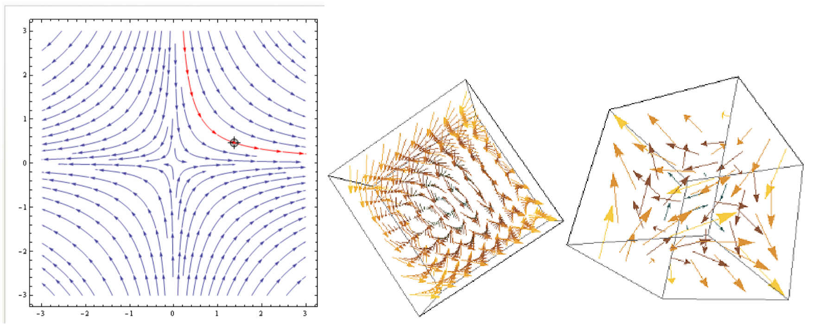

# Modeling Physical Environments

In the previous classes we saw transition systems that deal with discrete time steps, but in reality this is a continuous flow of time. Without it we cannot model real-world phenomena like time, speed, temperature, etc.

Time can be represented as a discrete signal over a set $S$. This is described as $\Sigma_S^D$ :

In the case of a continuous time signal over $S$, we can describe it as $\Sigma_S^C$: 

 States can also be modeled both as a continuous or discrete signal. We can also combinate all these set into two main signal types:

- **Analog Signal**: It is a continuous-time signal with continuous states.
- **Digital Signal**: It is a discrete-time signal with discrete states.

### Choosing a Model

In general, the type of model is not an inherent property of the reality we are modeling but dependent of the application and the modeling level. A good estimation for what model to choose is the following:

- If the system is some aspect of the physical world, the best model is continuous.
- If the system is a computation, then a discrete approach is usually best.

Of course this is not a perfect rule and sometimes computational systems have some continuous sections and real world systems have some discrete aspects.

## Modeling Components

A **discrete time system** with input set $I$ and output set $O$ is a relation between signals over $I$ and $O$, meaning it is a subset of $\Sigma_I^D \times \Sigma_O^D$.

A **continuous time system** with input set $I$ and output set $O$ is a relation between signals over $I$ and $O$, meaning it is a subset of $\Sigma_I^C \times \Sigma_O^C$. Examples of this type of components can be:

- **Amplifier**: 
  $$
  \{(i,o) : \forall t \in \R_{\ge 0}.o(t) = 2i(t)\}
  $$
  

- **Running Maximum**:
  $$
  \left\{(i,o): \forall t \in \R_{\ge0}.o(t) = \max_{\tau\in[0,t]}i(\tau) \right\}
  $$
  

- **Integrator**:
  $$
  \left\{
  (i,o): \forall t \in \R_{\ge 0}. o(t) = s_0 + \int_0^t i(\tau) \mathrm d\tau
  \right\}
  $$
  

  This component can also be described as:
  $$
  \{
  (i,o): \forall t \in \R_{\ge0}. \dot o(t) = i(t), o(0) = s_0
  \}
  $$

In continuous time systems  we di not have a sense of a *"Previous state"*. We must use continuous functions.

### Continuous Automaton

A **continuous automaton** is a quintuple:
$$
(n,p,q,S_0,R)
$$
Where:

- $n,p,q\in \N$ corresponds to $\R^n$ state space, $\R^p $ input space and $\R^q$ output space.

- $S_0 \subseteq \R^n$ is the set of initial states.

- $R \subseteq \R^p \times \R^n \times \R^n \times \R^q$ is the transition relation such that:
  $$
  \forall i\in \R^p, \forall s \in R^n. \exist s' \in \R^n, o\in \R^q/\\
  (i,s,s',o) \in R
  $$

The **behavior of the continuous automaton** is represented as $(i,o) \in \Sigma_I \times\Sigma_O$ if there exists an $s\in \Sigma_S$ such that:

- $s(0) \in S_0$
- $\forall t \in \R_{\ge 0}. (i(t),s(t),\dot s(t),o(t)) \in R$

An automaton $T$ represents the system:
$$
[\![T]\!] = \{(i,o) \in \Sigma_I \times\Sigma_O: (i,o) \text{ is a behavior of }T\}
$$

## Vector Fields

Vector fields are a representation of the evolution of the value of real variables. The direction of the arrows tells us how the value is changing. Formally they can be represented as:
$$
\array{
f:S \rarr \R^n & \text{for } S \subseteq \R^n}
$$
And the vector fields can reach an equilibrium when:
$$
x\in S / f(x) = 0
$$

Vector fields are alternatives to the state diagram in deterministic transition systems.

## Ordinary Differential Equations

Ordinary differential equations are defined as:
$$
\dot x = f(x)
$$
 Where $f$ is a vector field $f:S\rarr \R^n$. 

A solution of the equation $\dot x = f(x)$ is:
$$
x:\R_{\ge 0}\rarr \R^n / \forall t \in \R_{\ge 0}. \dot x(t) = f(x(t))
$$
Such solution is also called a **trajectory of the differential equation**. In discrete transition systems this would be the equivalent to a path.

## Timed Automata

Timed automata are a mix of both continuous and discrete systems. Their clocks and assignment are continuous by nature, also their delay transitions. On the other side, Locations and action transitions are explicitly discrete. 

In timed automata the differential equations always look like this:
$$
\array{\dot x = 1 & \forall \text{clock }x \in X}
$$
This is because timed automata represents only endpoints of solutions. Their corresponding vector field is represented as:

## Non-determinism

We usually have non-determinism coming from unmodeled details or the system's environment. This is usually modeled in any of the following ways
$$
\dot x = 2x +0.5 \pm 0.1\\
\dot x = 2x + [0.4,0.6]\\
2x+0.4  \le \dot x \le 2x + 0.6
$$
In this example we do not know the exact value of the constant $0.5$, but we know it has a margin of error of $0.1$. 

When we are dealing with non-determinism we do not have an unit direction for our vector field, but a set of possibilities $F:S\rarr 2^{\R^n}$or even a relation $r:S \times \R^n$. This results in a **differential inclusion** $\dot u \in F(u)$ or a **differential relation** $r(u,\dot u)$

## Comparison between types

