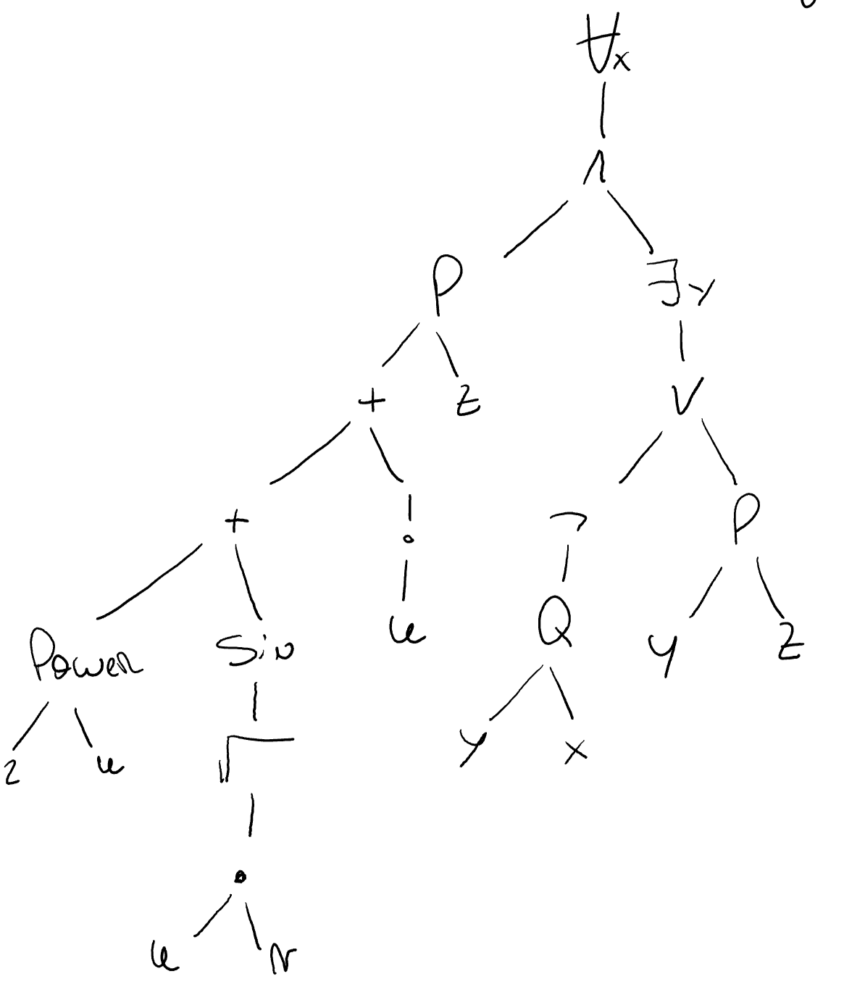

# Lab 1

## 1.1

For this exercise I'm going to model a plane as a means of transportation. For this model, I'm only going to consider the aerodynamics of the plane, as well as the jet turbines, flaps and control center from the pilot's cabin. We only need these components because they are the only ones needed to successfully simulate an airplane flying in the air.

We could think of a worst level of abstraction that could also include non essential parts of the airplane for this specific task, like for example, taking into consideration the entertainment system or even the bathroom disposal system. But these would be bad choices because they are not necessary parts of an airplane to fly, but make flights more comfortable for the users.

Given that the model's outputs will be different depending on time, and that their order will not be interchangeable, this model is dynamic. 

## 1.2

- Plane:
  - Flying component:
    - Jet turbines:
      - Asps: Modeled by some differential equations that optimize aerodynamics for speed and air intake for the engine.
      - Jet Engine: Modeled using mathematical equations that take into account the air and fuel coming into the plane, and calculates the thrust this engine should produce.
      - Fuel delivery: A set of mathematical equations that take into consideration altitude, temperature and speed to calculate how much fuel must be delivered to the jet engines.
    - Control Center:
      - Analog controls: Input device from the pilot to control the aircraft
      - Main Computer: Electronic device that communicates the pilots actions to the component of the plane responsible for it. It also takes receives measurements from those components and shows them to the pilot.  
    - Flaps:
      - Mechanical activators: A set of valves and levers that move the flaps to change the direction or speed of the aircraft.
      - Shape: Modeled by some differential equations that optimize aerodynamics.
    - Body of the ship: Modeled by some differential equations that optimize aerodynamics for take off, landing and cruising
  - Entertainment component:
    - Displays
    - Wifi
    - Phone calls
    - ...
  - ...

## 1.3

 ### A)

### B)

Free variables: $z$

Bound variables: $x,y$

### C)

$$
\empty[x\leftarrow w] := \empty \\
\empty[y \leftarrow w]:= \forall x.[P(x,z)\land \exists y. [\neg Q(y,x) \lor P(y,z)]]\\

\empty[z \leftarrow f(x)] := \forall x.[P(w,f(x)) \land \exists y.[\neg Q(y,x)\lor P(y,f(x))]]
$$

### D)

$$
\empty' := 

\forall x.[P(2^u+\sin(\sqrt{uv})+u!,z) \land \exists y.[\neg Q(y,x) \lor P(y,z)]]
$$

## 1.4

### A)

$$
Q \Rightarrow [\neg Q \Rightarrow R] \\
Q \Rightarrow [Q \lor R] \\
\neg Q \lor [Q \lor R] \\
[\neg Q \lor Q] \lor R \\
\top \lor R \\
\top \\
R \lor \neg R
$$

### B)

$$
P \Rightarrow [Q \land R] \\
\neg P \lor [Q \land R] \\
[\neg P \lor Q] \land [\neg P \lor R] \\
[P \Rightarrow Q] \land [P \Rightarrow R]
$$

### C)

$$
\neg \forall x.[A(f(x)) \Rightarrow B(x)]\\
\exists x.\neg[A(f(x)) \Rightarrow B(x)] \\
\exists x.\neg [\neg A(f(x)) \lor B(x)] \\
\exists x.[\neg\neg A(f(x)) \land \neg B(x)] \\
\exists x.[A(f(x)) \land \neg B(x)]
$$

## 1.5

$$
A \setminus(B\cup A) \subseteq \empty \\
\forall x.[x\in A\setminus(B\cup A)] \Rightarrow x \in \empty \\
\forall x. [x \in \{a/ a\in A \land \neg a\in (B\cup A) \}] \Rightarrow x\in \empty \\
\forall x. [x \in A \land \neg[ x \in B \lor x \in A] ] \Rightarrow x\in \empty\\
\forall x. [x \in A \land [\neg x \in B \land \neg x \in A] ] \Rightarrow x\in \empty\\
\forall x. [[x \in A \land \neg x \in A ]\land \neg x \in B ] \Rightarrow x\in \empty\\
\forall x. [\bot \land \neg x \in B] \Rightarrow x \in \empty\\
\forall x.\bot \Rightarrow x \in \empty\\
\forall x. \top\\
\top
$$

## 1.6

### A)

$$
R =\{(\text{Danube},\text{AT}),(\text{Danube},\text{RO})\} \subseteq \text{Rivers} \times \text{Countries}
$$

### B)

$$
S = \{(0,0),(1,2),(2,4),(3,1),(4,3)\}
$$

