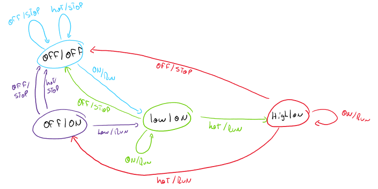
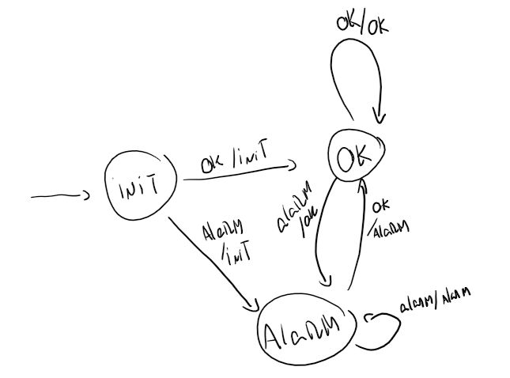
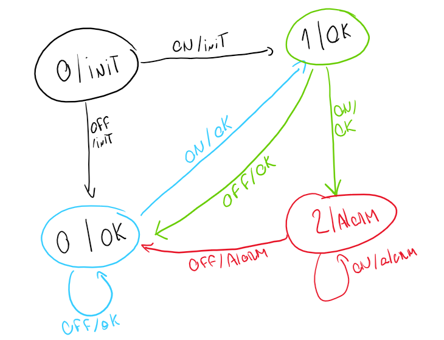
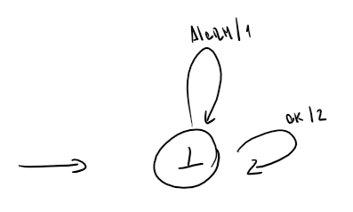
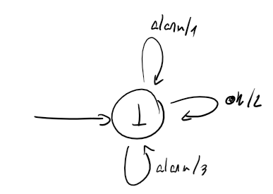
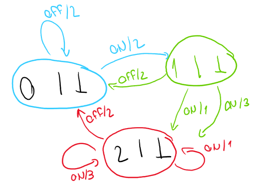
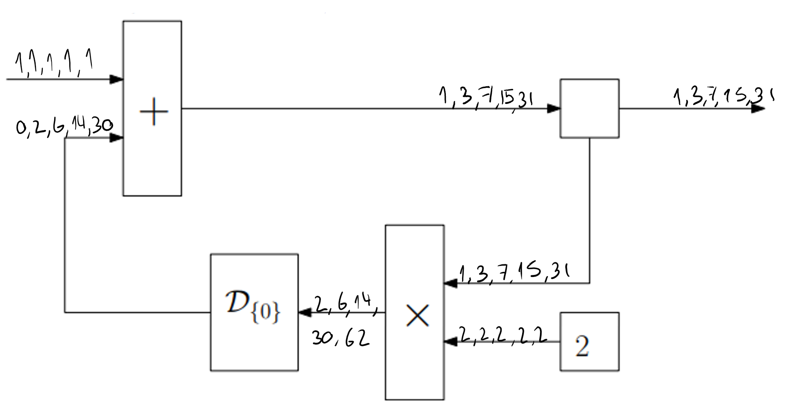
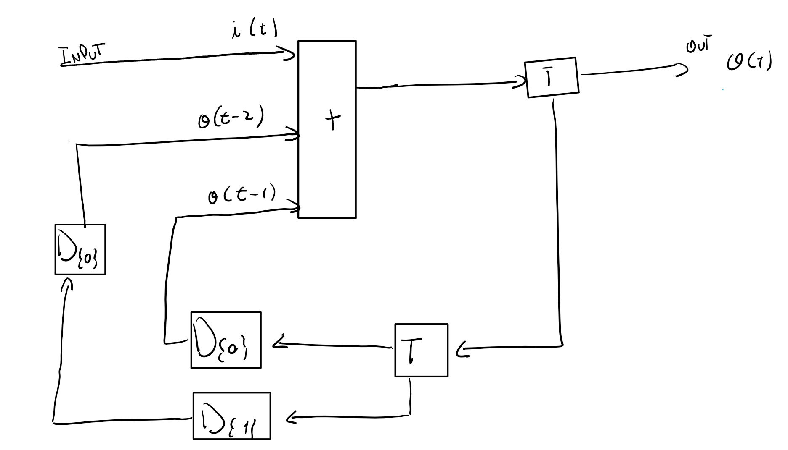

# Lab 3

## 3.1

This system is **receptive**, **non-deterministic** and it is **not memoryless**.

## 3.2

### A)

### B)

### C)

### D)

### E)

## 3.3

## 3.4

## 3.5

$$
\mathcal I (f) =\{x/x > 732\}\\
\mathcal I(g) = \{x/x < 200\}
$$

### A)

$$
\pi \models g \Rightarrow FGf\\
\pi \models g \Rightarrow \pi\models FGf\\
\pi(0) \in I(g) \Rightarrow \exists i \in \N_0 / \pi^i \models Gf\\
x_0  < 200 \Rightarrow \exists i\in \N_0 / \forall j \in \N_0 / \pi^{i+j} \models f\\
x_0  < 200 \Rightarrow  \exists i\in \N_0 / \forall j \in \N_0 / \pi^{i+j}(0) \in \mathcal I(f)
\\
x_0  < 200 \Rightarrow  \exists i\in \N_0 / \forall j \in \N_0 / x_{i+j}>732
$$

### B)

$$
\pi \models G[f \land Fg] \\
\forall i \in \N_0/ \pi^i\models f \land  \pi^i \models Fg\\
\forall i \in \N_0/ [ \pi^i(0) \in \mathcal I(f) \land \exists j \in \N_0 / \pi^{i+j} \models g ]\\
\forall i \in \N_0/ [ x_i > 732 \land \exists j \in \N_0 / \pi^{i+j} \in \mathcal I(g) ]\\

\forall i \in \N_0/ [ x_i > 732 \land \exists j \in \N_0 / x_{i+j} < 200 ]\\
$$

## 3.6

### A)

**False**. Counter Example:
$$
\pi = (\text{green},\text{green},\dots,\text{green})
$$

### B)

**False**. Counter example:
$$
\pi = (\text{green},\text{yellow},\text{red}, \dots,\text{green},\text{yellow},\text{red})
$$

### C)

**True**.
$$
\models \text{red} \Rightarrow F \text{yellow}\\
\models \text{red} \Rightarrow \models F \text{ yellow} \\
\pi(0) \models \text{red} \Rightarrow  \exists i \in \N_0 / \pi^i\models\text{ yellow} \\

\neg\bot \lor \exists i \in \N_0 / \pi^i\models\text{ yellow} \\
\top \lor \exists i \in \N_0 / \pi^i\models\text{ yellow}\\
\top
$$

 ### D)

**False**. Counter example:
$$
\pi = (\text{green},\text{yellow},\text{red},\text{green},\text{green},\dots,\text{green})
$$

### E)

**True**.
$$
\pi \models G[\text{yellow} \Rightarrow X \text{ red}]\\
\forall i \in \N_0 / \pi^i \models \text{yellow} \Rightarrow \pi^i \models X \text{ red}\\

\forall i \in \N_0 / \pi^i(0) \in \mathcal I(\text{yellow}) \Rightarrow \pi^{i+1} \models \text{red}
\\
\forall i \in \N_0 / \pi^i(0) \in \mathcal I(\text{yellow}) \Rightarrow \pi^{i+1} \in \mathcal I(\text{red})\\
\top
$$
If $\pi^i(0) \not \in \mathcal I(\text{yellow})$, the formula is valid.

if \pi^i(0) \in \mathcal I(\text{yellow}) then the only possible connection is to the state $\text{red}$, causing $\pi^{i+1}(0) \in \mathcal I(\text{red})$, thus the formula will be true.

### F)

**False**.
$$
\pi \models [\text{green} \Rightarrow \text{green }U\text{ yellow}]\\
\pi\models \text{green} \Rightarrow \pi \models \text{green }U\text{ yellow}\\

\pi\models \text{green} \Rightarrow \exists i / \pi^i \models \text{yellow} \land \forall j < i, \pi^j \models \text{green}\\
$$
From here I can create a counter example:
$$
\pi = (\text{green}, \dots,\text{green})
$$
Here we can see that there if $\pi(0) \models \text{green}$, then there won't exists an $i\in \N_0/ \pi^i \models \text{yellow}$ because it is constantly looping around $\text{green}$.

