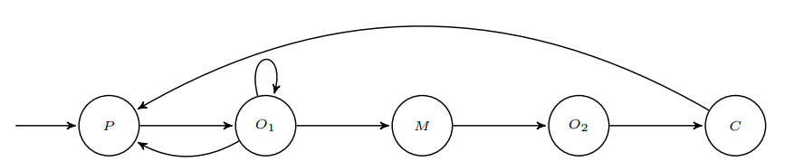
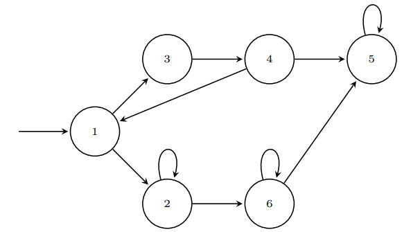

#  Lab 4

## 4.1

### A) It doesn't hold

$$
\models [po \implies Fm] \\
\models [po] \implies \models[Fm]\\
\neg \models [po] \ \lor \models [Fm] \\
$$

Here we will see that $\models po$ holds:
$$
\pi \models po\\
\pi(0) \models po \\
\pi(0) = P \in \mathcal I(po) = \{P,O_1,O_2\}
$$
And we continue with our formula:
$$
\neg \top \ \lor \models [Fm] \\
\bot \lor \models [Fm] \\
\models Fm
$$

Now that we know that the formula will hold only if the formula $\models Fm$ holds, I'm going to present a counter example that proves this is false:
$$
P \rarr O_1 \rarr O_1 \rarr \dots \rarr O_1
$$
If we follow the path that is constantly looping over $O_1$, we will never reach one of the states of $\mathcal I(m) = \{m\}$, thus is a valid counter example.

### B) It holds

$$
\models [o \implies Fm] \\
\models[o] \implies \models[Fm] \\
\neg \models[o] \lor \implies[Fm]
$$

Here we will evaluate $\models o$:
$$
\pi \models o\\
\pi(0) \models o \\
\pi(0) = P \not \in \mathcal (o) = \{O_1,O_2\}
$$
This the formula $\models o$ does not hold. Now we are going to continue with our main formula:
$$
\neg \bot \lor \models[Fm]\\
\top \lor \models [Fm] \\
\top
$$
Thus the formula holds.

### C) It doesn't hold

$$
\models [poUm]
$$

This formula does not hold, here is the counter example:
$$
P \rarr O_1 \rarr O_1 \rarr \dots \rarr O_1
$$
In this path we are currently looping over $O_1$, therefore there doesn't exist $i$ such that $\pi^i \models m$ because  $\pi(j) \not \in \mathcal I(m) \forall j \in \N_0$.

### D) It holds

$$
\models oRpo 
$$

 In the initial state, any path will have $P$:
$$
\pi(0) \models po \land \pi(0) \not \models o
$$
In the next step, all paths will contain $O_1$, validating the $o$ formula:
$$
\pi(1) \models o \land \pi(1) \models po
$$

## 4.2

### A) It holds

$$
\begin{align}
(a,b,c,d,b) \models Fp && \mathcal I(p)  = \{p\}
\end{align}
$$

$$
\Leftrightarrow \exists 0\le l \le {n-2} / t(n-1) = t(l) \implies \exists 0 \le k \le {n-1} / t(k) \models p\\
\top \implies \top\\
\top
$$

We'll investigate the first part of the implication:
$$
\exists 0\le l \le {n-2} / t(n-1) = t(l)\\
$$
If I take $l=1$, then the formula is true:
$$
t(n-1) = b = t(1)
$$
 Now onto the second part:
$$
\exists 0 \le k \le {n-1} / t(k) \models p\\
\array{
k=0 && t(0) = a \not \in \mathcal I(p) = \{d\}\\
k=1 && t(1) = b \not \in \mathcal I(p) = \{d\}\\
k=2 && t(2) = c \not \in \mathcal I(p) = \{d\}\\
k=3 && t(3) = p \in \mathcal I(p) = \{d\}\\
}
$$
If we pick $k=3$, the second part of the implication is true.

### B) It holds

$$
\array{
(a,c,b,d,c,d) \models G[\neg p \lor q] & \mathcal I(p) = \{a,b\}, \mathcal I(q) = \{a,b,d\}
}\\
\Leftrightarrow \forall k \in \{0,\dots,n-1/ t(k) \models [\neg p \lor q]\}
\\
\Leftrightarrow \forall k \in \{0,\dots,n-1/ t(k) \models [\neg p] \lor t(k) \models[q]\}
$$

If we examine it case by case:
$$
\array{
k=0 & t(0)  = a \not \models \neg p & a \models q & \bot \lor \top = \top\\
k=1 & t(1)  = c \models \neg p & c \not \models q & \top \lor \top = \top\\
k=2 & t(2)  = b \not \models \neg p & b \models q & \bot \lor \top = \top\\
k=3 & t(3)  = d \models \neg p & d \models q      & \top \lor \bot = \top\\
k=4 & t(4)  = c \models \neg p & c \not \models q & \top \lor \bot = \top\\
k=5 & t(5)  = d \models \neg p & d \models q      & \top \lor \top = \top\\
}
$$
Now that we see that the formula holds for all $k$, the the property hold for the path.

### C) It holds

$$
\array{(g,b,h,a) \models FGp && \mathcal I(p) = \{p\}}\\
\Leftrightarrow \exists i \in\{0,\dots,n-2\}/t(n-1) = t(i) \implies\exists j\in\{0,\dots,n-1\}/ t(j) \models Gp
$$

We can see that the first part of the implication is false, because there is no loop in our path. Knowing this, we can say that the property holds.

### D) It holds

$$
\array{(c) \models Xp && \mathcal I(p) = \{b\}}
$$

$$
\Lrarr(c)^1 = () \models p
$$

And because we are working with an empty path, the property holds.

### E) It holds

$$
\array{ (a,b,c,b,a) \models p \implies Fq & \mathcal I(p) =\{c\},\mathcal I(q)=\{b\} }
\\
(a,b,c,b,a) \models [p]  \implies (a,b,c,b,a) \models [Fq]
$$

I will first analyze  the first part of the implication:
$$
(a,b,c,b,a) \models p \\
(a,b,c,b,a)(0) \models p \\
a \models p\\
\cancel{a \in \mathcal I(p)}
$$
So the first part is false, which means that we don't care about the last part of the implication, because the property already holds:
$$
\bot \implies ?\\
{\neg \bot}\  \lor\  ? \\
\top\ \lor\ ?\\
\top
$$

### F) Does not hold

$$
\array{(a,b,d,c,a,c) \models G[p \implies Fq] &\mathcal I(p) =\{b,c\},\mathcal I(q)=\{b\}}\\
\Lrarr \forall i \in \{0,\dots,n-1\} /t(i) \models [p \implies F q]
$$

After looking at the path, I can see that if I choose $i = 3$, the property won't hold:
$$
(c,a,c) \models [p \implies Fq]
$$
The first element $c$ is a part of the interpretation of the property $p$, which forces the second part of the implication to be hold if we want the formula to hold:
$$
(c,a,c) \models Fq  \\
\Lrarr \exists k \in \{0,\dots,n-2\}/ t(n-1) = t(k) \implies \exists j \in\{0,\dots,n-1\}/t(j) \models q
$$
Again the first part of the implication holds with $k = 0$, but this time no $j \in \{0,\dots,n-1\}$ exists for the property to hold. 

## 4.3

### A)

$$
\array{\text{BMC}(G\text{ok},i)&\mathcal I(\text{ok}) =\{1,2,3,4,5,6\}& i\in \N_0}
$$

We will go through all the values of $i$:

- $i=0$: In this case the path is empty, causing the property to hold.

- $i=1$: The path of length 1 is $(1)$, and we can see that $t(1)  = 1 \in \mathcal I(\text{ok}) =\{1,2,3,4,5,6\}$. So the property holds

- $i=2$: Now we have two paths:
  $$
  \array{
  A: &(1,2)\\
  B: & (1,3)
  }
  $$
  For both paths we can see that the property $\text{ok}$ holds, because all elements are part of the interpretation of the property.

- $i=3$: We have 3 paths:
  $$
  \array{
  A: &(1,2,6)\\
  B: &(1,2,2)\\
  C: &(1,3,4)
  }
  $$
  Similar to the previous case, the property holds for the three paths as the elements from each path are included in the interpretation of the property.

- $i=4$: 
  $$
  \array{
  A:&(1,2,6,5) \\
  B:&(1,2,6,6)\\
  C:&(1,2,2,6)\\
  D:&(1,2,2,2)\\
  E:&(1,3,4,5)\\
  F:&(1,3,4,1)
  }
  $$
  Similar to the previous case, the property holds for all paths as the elements from each path are included in the interpretation of the property.

We can see that because the interpretation of the property $\text{ok}$ contains all the states from the transition system, and our formula includes $G$, that will test if the property holds for all the states of each given path, the property will hold for all $i\in\N_0$.

### B)

$$
\array{
\text{BMC}(F\text{goal},i) & \mathcal I(\text{goal}) = \{2,3\}& i\in\N_0
}
$$

- $i=0$: The property holds because this is an empty path.

- $i=1$: Here property doesn't hold because there's only one state and it does not model the property. Here is the counter example:
  $$
  t =(1)
  $$

- $i=2$: Here we don't have any loops, so the definition for the $F$ operator in Bounded LTL tells us that property holds.

- $i \ge 3$: Here the formula still holds, but for a different reason. We have cases where there are no loops, such as :
  $$
  A:(1,3,4,5)\\
  B:(1,2,6)
  $$
  In this cases, just like before, the property holds because in Bounded LTL if we have the $F$ operator and no loops, it will hold the formula.

  In other cases where we have loops, such as:
  $$
  C:(1,3,4,1)\\
  D:(1,2,2,2)
  $$
  We can see that the property still holds. If the paths contains loops, then we need to find some element in the path for which the property holds, and in our case we can see that in all ouf our paths, the second element will be $2$ or $3$, and for both of those elements the property holds.

So, we can say that the property holds for $i \in \N_0 \setminus\{1\}$. In the case of $i=1$ the property doesn't hold.

### C)

$$
\array{
\text{BMC}(F\text{goal},i) & \mathcal I(\text{goal}) = \{4,5,6\} & i \in \N_0
}
$$

This property doesn't hold for any value of $i$ except for $0$. I will show counter examples for the first values of $i$ and then make a generic counter example for higher values.

- $i=0$: The property holds because we are using an empty path.

- $i=1$: Counter example:
  $$
  t=(1)
  $$

- $i=2$: Counter example:
  $$
  t=(1,2)
  $$

- $i\ge3$: For all values of $i$ higher than 2, we can always find a counter example for the property. I'm going to use the path that continuously loops around 2, $i-1$ times:
  $$
  t=(1,2,2,2,\dots,2)
  $$

### D)

$$
\array{
\text{BMC}(XG\text{ok}) & \mathcal I(\text{ok}) =\{1,2,3,4,5,6\} & i\in\N_0
}
$$

Similar to exercise **A)**, the formula will hold for all $i\in \N_0$. But here we have two special cases that we need to evaluate:

-  $i=0$: Here we have an empty path, but thanks to the $X$ operator we are going to evaluate the $G$ operator from the second element on the path, but because it is an empty path, we will still evaluate $G$ on an empty path, forcing the formula to hold.
- $i=1$: Here our path is not empty, but it only has one element in it. If apply the $X$ operator, then the $G$ operator will be evaluated on an empty path, and again, the formula will hold.
- $i \ge 2$: The justification as to why the property will hold on all paths longer than 1 is similar to **A)**. The $G$ operator will check that every element of the new path (we are removing the first element ($1$) with the operator $X$) models the property, and because the set of states of the transition system is the same as the interpretation of the property $\text{ok}$, all paths will held the property.

## 4.4

$$
\left\{
\array{
1:\top, \top\\
2: \top, \bot \\
3: \bot,\top\\ }
\right\}
$$

$$
\left(\mathbb B^2, \{(v_0,v_1) / v_0 \land v_1\}, \left\{ (v_0,v_1) \left|

\array{
[v_0 \land v_1 \land v_0' \land \neg v_1']
\\ \lor \\
[v_0 \land \neg v_1 \land v_0' \land v_1']
\\ \lor \\
[v_0 \land \neg v_1 \land \neg v_0' \land v_1']
\\ \lor \\
[\neg v_0 \land v_1 \land \neg v_0' \land v_1']

}

\right. \right\} \right)
$$

## 4.5

### A)

$$
[P\lor \neg Q \lor \neg R] \land [\neg P \lor Q \lor R] \land [\neg Q\lor R]\\
\array{
\text{recursive call} [P \larr \bot] &[\bot\lor \neg Q \lor \neg R] \land [\neg \bot \lor Q \lor R] \land [\neg Q\lor R]\\
\text{Simplification} &[\neg Q \lor \neg R] \land [\neg Q\lor R]\\
\text{Pure Literal Elimiation}[Q\larr \bot] &[\top \lor \neg R] \land [\top\lor R]\\
\text{Simplification}& \top
}
$$

### B)

$$
[\neg P \lor Q \lor R]\land P \land [\neg Q \lor R] \land [\neg Q \land \neg R]\\
\array{
\text{Recursive call}[P\larr\bot] & [\top \lor Q \lor R]\land \top \land [\neg Q \lor R] \land [\neg Q \land \neg R]\\
\text{Simplification} & [\neg Q \lor R] \land [\neg Q \land \neg R]\\
\text{Pure Literal Elimiation}[Q\larr \bot] &[\top \lor \neg R] \land [\top\lor R]\\
\text{Simplification}& \top
}
$$

