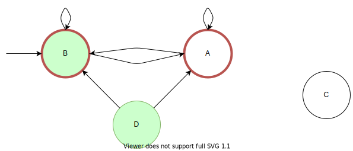
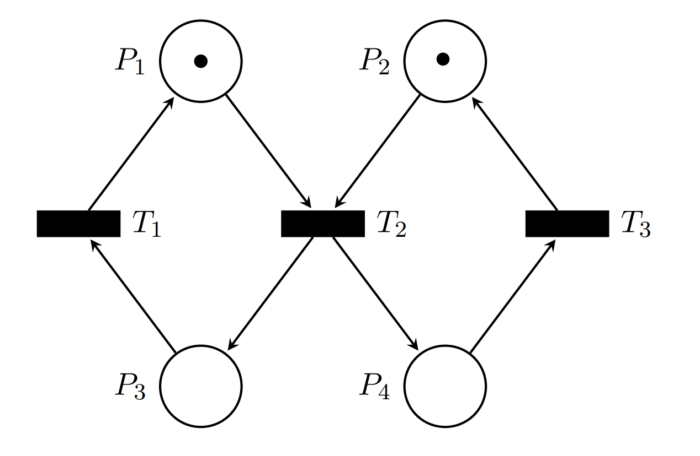

# Lab 5

## 5.1

$$
(\mathbb B^2, \{(v_0,v_1)|v_0 \land v_1\}, \{((v_0,v_1),(v_0',v_1')) | (v_0 \lor v_1) \land v_1'\})
$$

In addition we have the set of states $V = \{(v_0,v_1) \in \mathbb B^2|v_1\}$ and the set of safe states $\mathcal I(p) = \{(v_0,v_1) \in \mathbb B ^2 | v_0\}$ 

### A)

$$
\array{
node & v_0 &v_1 \\
A :& 0 &1 \\
B:& 1&1\\
C:&0&0\\
D:&1&0
}
$$

Where the green filling represents $\mathcal I(p)$ and the red border represents $V$.

### B)

 $V$ is not a safety certificate because $V \not \subseteq \mathcal I(p)$. We can see in the transition system that starting from $B$ we can me a transition to $A$, which is not a safe state, bus is part of the set $V$.   

### C)

There are 3 safety conditions:

1. $\forall x. x \in S_0 \implies x \in V$
   $$
   \forall x \in \{A,B,C,D\}. x \in S_0 \implies x \in V\\
   \array{
   1:&\\
   &x\in \{A,C,D\}. x \in S_0 \implies x\in V \\
   & \bot \implies x \in V\\ 
   & \top\\
   2:&\\
   & B \in S_0 \implies B \in V\\
   & \top \implies \top\\
   & \top
   }
   $$
   So the first safety condition holds.

2. $\forall x,x'. (x \in V \land (x,x')\in R) \implies x' \in V$
   $$
   \forall x,x' \in \{A,B,C,D\}. (x \in V \land (x,x')\in R) \implies x' \in V\\
   \array{
   1:&\\
   & x\in \{A,B\},x'\in \{A,B\}. (x \in V \land (x,x')\in R) \implies x' \in V\\
   & (\top \land \top) \implies \top\\
   & \top\\
   2: &\\
   & x\in \{C,D\},x'\in \{A,B,C,D\}. (x \in V \land (x,x')\in R) \implies x' \in V\\
   & (\bot \land (x,x')\in R) \implies x' \in V\\
   & \top\\
   3:&\\
   & x\in \{A,B\},x'\in \{C,D\}. (x \in V \land (x,x')\in R) \implies x' \in V\\
   & (\top \land \bot) \implies \top\\
   & \top
   }
   $$
   So the second safety condition holds.

3. $\forall x. x \in V \implies x \in \mathcal I(ok)$
   $$
   x \in \{A,B,C,D\}. x \in V \implies x \in \mathcal I(ok)\\
   \array{
   1:&\\
   & x \in \{A\}. x \in V \implies x\in \mathcal I(ok)\\
   & \top \implies \bot\\
   & \bot\\
   2:&\\
   & x \in \{B\}. x \in V \implies x\in \mathcal I(ok)\\
   & \top \implies \top\\
   &\top\\
   3:&\\
   & x \in \{C\}. x \in V \implies x\in \mathcal I(ok)\\
   & \bot \implies \bot\\
   & \top\\
   
   4:&\\
   & x \in \{D\}. x \in V \implies x\in \mathcal I(ok)\\
   & \bot \implies \top\\
   & \top \\
   }
   $$
   So, because the formula does not hold for all x,it doesn't hold.

## 5.2

### A)

The reach set is:
$$
\{A,B,C\}
$$
And we can find the invariant as the supersets of the reach set:
$$
\array{
1:&\{A,B,C\}\\
2:&\{A,B,C,D\}\\
3:&\{A,B,C,E\}\\
4:&\{A,B,C,D,E\}
}
$$

### B)

The invariants $1,3$ are inductive and the invariant $4$ is trivially inductive.

## 5.3

### A)

$$
(\N_0^2,\{(0,1)\},\{((x_1,x_2),(x_1',x_2'))| x_1' = x_1 + 1 \mod 3, x_2' = x_2 + 1 \mod 2\})
$$

I will demonstrate is by adding states to a set $V$. According to the algorithm initially it contains the initial state.
$$
V_0=\{(0,1)\}\\
V_1=\{(0,1),(1,0)\}\\
V_2=\{(0,1),(1,0),(2,1)\}\\
V_3=\{(0,1),(1,0),(2,1),(0,0)\}\\
V_4=\{(0,1),(1,0),(2,1),(0,0),(1,1)\}\\
V_5=\{(0,1),(1,0),(2,1),(0,0),(1,1),(2,0)\}\\
V_6=\{(0,1),(1,0),(2,1),(0,0),(1,1),(2,0)\} = V_5\\
$$
The set $V_6$ is an inductive invariant.

### B)

$$
(\Z,\{x|x \ge 20\}, \{(x,x')|x' \ge 0 \land \frac {x}{2}-1 \le x' \le \frac x 2\})
$$

Similar to the previous exercise, we will initialize the set $V$ with the initial states:
$$
V_0 = \{x\in \Z | x \ge 20\}\\
$$
First we are going to add all the elements such that $x' \in \Z| 10 \le x < 20$:

We know that each transition from $x$ will lead to $\frac x 2 -1$ and $\frac x 2$ while the value is positive or zero. With this in mind, we can use the initial states that range from $20$ to $40$ and obtain $x' \in [9,20)$.
$$
V_1 = \{x\in \Z | x \ge 20\} \cup \{x \in \Z | 9 \le x < 20\}\\
$$
Now we can use the same tactic as in the previous state, but with the new elements to add to $V$ the values $[3,10)$:
$$
V_2 = \{x\in \Z | x \ge 20\} \cup \{x \in \Z | 9 \le x < 20\} \cup \{x \in \Z | 3 \le x < 9\}\\
$$
Another iteration and we get:
$$
V_3 = \{x\in \Z | x \ge 20\} \cup \{x \in \Z | 9 \le x < 20\} \cup \{x \in \Z | 3 \le x < 10\} \cup \{x \in \Z | 0 \le x < 3\}\\\
V = \N_0
$$
This is an inductive invariant set.

## 5.4

## 5.5

$$
\array{
S_1:&\\
&(\text{init},\{x \mapsto 0, y \mapsto 0 \})
\overset {10} \rarr (\text{run},\{x \mapsto 10, y\mapsto0 \})\\
&\overset {12} \rarr (\text{run},\{x \mapsto 0, y\mapsto0 \})
\overset {12} \rarr (\text{run},\{x \mapsto 0, y\mapsto0 \})\\
&\overset {12} \rarr (\text{run},\{x \mapsto 0, y\mapsto0 \})
\overset {12} \rarr (\text{run},\{x \mapsto 0, y\mapsto0 \})\\

S_2:&\\
&(\text{init},\{x \mapsto 0, y \mapsto 0 \})
\overset {20} \rarr (\text{run},\{x \mapsto 20, y\mapsto0 \})\\
&\overset {12} \rarr (\text{run},\{x \mapsto 0, y\mapsto0 \})
\overset {12} \rarr (\text{run},\{x \mapsto 0, y\mapsto0 \})\\
&\overset {12} \rarr (\text{run},\{x \mapsto 0, y\mapsto0 \})
\overset {12} \rarr (\text{run},\{x \mapsto 0, y\mapsto0 \})\\
}
$$

## 5.7

### B)

$$
\array{
\mathcal P(XG\text{safe}) = &\\
&1 \times \mathcal P_{(S,1_B,R)}(G\text{safe})\\
& \mathcal P_{(S,1_B,R)}(\neg F \neg\text{safe})\\
& 1 - \mathcal P_{(S,1_B,R)}(F \neg\text{safe})\\
& 1- (0.1 \times \mathcal P_{(S,1_C,R)}(\neg\text{safe}) + 0.7 \times \mathcal P_{(S,1_D,R)}(\neg\text{safe}) + 0.2 \times \mathcal P_{(S,1_A,R)}(\neg\text{safe}))\\

& 1- (0.1 \times (1-\mathcal P_{(S,1_C,R)}(\text{safe})) + 0.7 \times(1 - \mathcal P_{(S,1_D,R)}(\text{safe}))\\ & + 0.2 \times (1-\mathcal P_{(S,1_A,R)}(\text{safe}))\\

& 1- (0.1 \times (1-0) + 0.7 \times(1 - 1)) + 0.2 \times (1-1 \times 1))\\
& 0.9
}
$$

## 5.7

### B)

The petri net is bounded because it is $2-$bounded. We can se that it only has 2 tokens and in al transitions the amount of tokens needed in the input is the same as in the output, assuring that no tokens are created or destroyed.

To evaluate if petri net is live, we need to check that every transition is live. 

We'll start with $T_3$. Here we can see that in only has one marking as an input and initially it has one token, so we can fire the transition and we are in the following state:

Now, $T_2$ has 2 marking as inputs, both with one token. We can fire this transition and it will send one token to $P_3$ and $P_4$:

Finally, we can fire $T_1$ and get to the initial state of the petri net:

Now that we checked that all transitions are live, the petri net is live.

