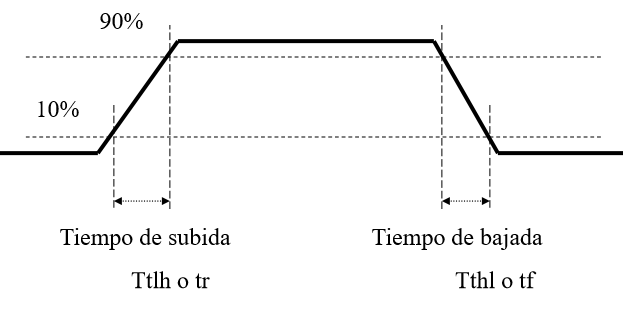

# Integrados

Existen 2 grandes familias logicas de circuitos integrados:

- **TTL** (Transistor-Transistor Logic)
- **CMOS** (Complementary Metal-Oxide Semiconductor)

Y estos difieren en los siguentes aspectos:

- **Niveles de tension de entrada y salida**.

- **Niveles de corriente de entrada y salida**.

- **Velocidad de conmutacion**: 

  Los cambios de estado en la salida y la entrada son en realidad cambios en la tension, por lo que no se producen de forma instantanea, sino que durante un periodo de tiempo. La velocidad con la que se puede cambiar la tension para pasar de un 0 a un 1 es la velocidad de conmutacion.

  

- **Tiempo de propagacion**:

  De la misma forma que con la velocidad de conmutacion, los cambios en la tension no suceden de forma instantanea. Por esto, si un integrado tiene varias compuertas logicas, la señal no va a pasar de forma instantanea de la primer compuerta hasta la ultima, sino que va a tardar tiempo en pasar por las compuertas intermedias.

Todos los integrados suelen tener una entrada `EN` (Enable) la cual es necesario activarla para poder utilizar el integrado. Tambien hay integrados que tienen mas de una entrada de habilitacion.

Entre los integrados comunes estan:

- **Sumador**
- **Contador**
- **Decodificador**

## Clock

Existen integrados que se encargan de generar una señal que se repite constantemente a una cierta velocidad (medida en Hz). Estos integrados especiales son fundamentales para el funcionamiento de una computadora ya que se utilizan para resolver los problemas de sincronismo en los circuitos combinacionales, causados por el tiempo de propagacion.

En una PC todos los integrados comparten a la misma señal de CLK.

