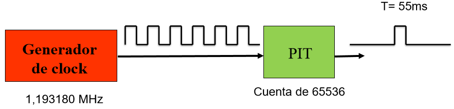

# Periféricos

Existen varios tipos de periféricos en una PC, entre los cuales se encuentran:

- [Timer Programable](#Timer Programable) (PIT)
- [Reloj de Tiempo Real](#Real Time Clock) (RTC)
- Teclado
- Disco Magnetico
- DMA
- BIOS

## Timer Programable

Un timer programable es un chip que permite generar una señal cada cierta cantidad de ticks del CLK, y además puede ser programado, es decir, el programador elije cada cuantos ticks se genera esta señal. 

En las primeras PCs se utilizo el integrado 8254/3 como timer, que permitía tener hasta 3 contadores distintos con un solo chip.

El chip permite además un contador 0, que es denominado `timer tick` y es el patrón de referencia de tiempo de todas las PCs sin importar el modelo o velocidad del procesador.

## Real Time Clock

Es un integrado que se alimenta con una pila y es el encargado de llevar la cuenta de que día y que hora es actualmente, sin importar si se apaga la computadora. Tambien tiene informacion sobre que disco rígido esta instalado, la memoria, etc (Pila de la BIOS).

