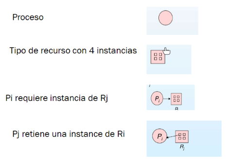

# Abrazo mortal

## Caracterización

Para que suceda un abrazo mortal tienen que cumplirse las siguientes situaciones en simultaneo:

- **Exclusión Mutua**: Solamente un proceso a la vez puede usar un recurso. No recursos de uso compartido
- **Tengo y espero**: Todos los procesos involucrados tienen algún recurso retenido y esperan por otros recursos retenidos por otro proceso.
- **No desalojo**: Los recursos solo pueden ser liberados voluntariamente por el proceso que los retiene. Si el sistema operativo detecta un abrazo mortal y puede quitar los recursos, entonces no seria un abrazo mortal.
- **Espera Circular**: Existe un conjunto de procesos bloqueados tal que un proceso espera por un proceso que tiene otro proceso, y a su vez este proceso espera a un recurso de otro proceso, eventualmente hasta que un proceso espera a que el primer proceso libere su recurso.

## Representación

Se puede representar a esta situación como un grafo de alocaciones de recurso. Este grafo tiene un conjunto de vértices $V$ y un conjunto de flechas $E$.

Los elementos de este grafo se pueden representar de la siguiente forma:

Si este grafo no tiene ciclos, entonces no puede existir un abrazo mortal. Por otro lado, si tiene ciclos y hay solo una instancia de cada tipo de recurso, entonces hay un abrazo mortal, si hay mas e una instancia de cada tipo de recurso, entonces puede haber un abrazo mortal, pero no esta asegurado.

## Resolución

Para resolver este problema hay 3 enfoques:

- <u>Asegurarse de que el sistema nunca ingrese a un estado de abrazo mortal.</u>
- <u>Permitir que el sistema ingrese en un abrazo mortal, y después recuperarlo</u>:
- <u>Ignorar el problema</u> (solución implementada en la mayoría de los SO).

### Como evitarlo

Para lograr esto se tiene que limitar la forma de obtener recursos. Para lograrlo, la forma mas fácil es hacer que sea imposible estar en la situación de **tengo y espero**:

 Se debe garantizar que cuando un proceso pida un recurso, no tenga otros recursos. El problema de esta implementación es que los procesos deben pedir todos los recursos de una sola vez y una mala utilización de recursos, que puede llevar a una posible inanición.

Otra forma de lograr esto es bloqueando a un proceso y liberando todos los recursos que tiene reservados cuando un proceso pide un recurso que no esta disponible instantáneamente. Los recursos que fueron liberados se agregan a una lista de recursos deseados, y el proceso se desbloqueara cuando se le puedan asignar todos los recursos (nuevos y viejos).

Esto también se puede evitar haciendo imposible la **espera circular**. Para lograrlo simplemente tengo que asignarle una jerarquía entre todos los tipos de procesos y que cada proceso tenga que pedir los recursos en un orden determinado. De esta forma no puede haber espera circular y no puede suceder un abrazo mortal. Esta implementación obliga a los procesos a que pidan varios recursos por avanzado. 

Por otro lado, podemos dejar que el sistema entre en abrazo mortal y luego rescatarlo, en base a algoritmos y conocimiento de los procesos.

**Estado Seguro**: El sistema esta en estado seguro si existe una secuencia para todos los procesos. Una secuencia $<P_1,\dots,P_n>$ es segura si para cada $P_i$, los recursos que aun puede pedir $P_i$ pueden ser satisfechos por los recursos disponibles mas los recursos en poder de todos los procesos $P_j / j<i$. Si los recursos que necesita $P_i$ no están disponibles inmediatamente, entonces $P_i$ tiene que esperar a que todos los $P_j$ terminen. ==FALTA==

Si esta el sistema esta en estado seguro, entonces no puede haber abrazo mortal, pero si no esta en estado seguro, entonces es posible que el sistema entre en un abrazo mortal.

