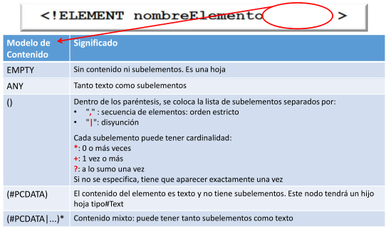
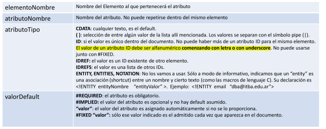

# Validación con el Esquema DTD

DTD es una gramática para describir la estructura de documentos XML. Dicha gramática es una **extensión a gramáticas libres de contexto** . Esta forma de describir al esquema se basa fuertemente en expresiones regulares. Tiene que haber una regla por cada elemento distinto del documento. 

## Declaracion del DTD

Si un documento quiere ser validado con cierto DTD debe hacerlo en su prologo. Esto se puede hacer de forma _inline_ o con un archivo externo. El tag que se utiliza es el `DOCTYPE`, y se indica por cual de los elementos del DTD comienza su raíz, ya que en la definición del DTD no hay orden.

Si se quiere declarar el DTD _inline_:

```xml
<?xml version="1.0"?>
<!DOCTYPE nombreRaiz [
        <!-- Reglas DTD -->
    ]>
<nombreRaiz>
</nombreRaiz>
```

Si se lo declara en otro archivo:

```xml
<?xml version="1.0"?>
<!DOCTYPE nombreRaiz SYSTEM "archivo.dtd">
<nombreRaiz>
</nombreRaiz>
```


## Reglas para definir Elementos

Las reglas para los elementos pueden definirse con la siguiente tabla:



Y se define una regla de la siguiente forma:

```dtd
<!ELEMENT nombreDelELemento modelo>
```

## Reglas para definir Atributos

Las reglas para definir atributos se encuentran en la siguiente tabla:



Y se definen a las reglas de la siguiente forma:

```dtd
<!ATTLIST NombreElemento	NombreAtt1	tipoAtt1	valorDefault1
    						NombreAtt2	tipoAtt2	valorDefault2
    						...
>
```

## Limitaciones

- Los contenidos son texto sin tipo (No se puede especificar que sea un `int` o un `Date`)
- El DTD no es un documento XML, por lo que se necesita otro parser.
- La frecuencia repetitiva solo permite `+` o `*`, es decir que no es exacta.
- Al expresar un elemento mixto se pierden las  validaciones de orden de los elementos.
- Los contenidos del tipo `ID` no pueden empezar con un numero.