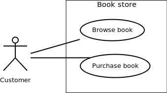

# UMD: Casos de Uso

## Diagramas de Casos de Uso

Los diagramas de casos de uso pertenecen a una categoría de diagramas UML. Estos diagramas intentan representar de forma grafica el funcionamiento de un sistema. Están compuestos por un conjunto de acciones (**casos de uso**) que el sistema puede realizar, además de uno o mas **actores** y sus dependencias.

#### Actor

Un actor puede ser definido como un objeto o un conjunto de objetos externos al sistema, que interactúan con el sistema para realizar una tarea. Estos actores pueden ser humanos, dispositivos u otros sistemas. Los actores pueden ser clasificados de dos formas:

- **Actores primarios**: Son los usuarios principales del sistema, quienes realizan las acciones que permite el sistema.
- **Actores secundarios**: Hacen algún servicio para el sistema, pero el sistema no fue diseñado para que ellos hagan acciones importantes.

Un actor se puede identificar haciendo las siguientes preguntas:

- <u>Quien se beneficia mas del sistema?</u> Esta pregunta te responde quien es tu actor primario.
- <u>Quien mantiene el sistema?</u> Esta pregunta te ayuda a encontrar potenciales usuarios
- <u>Con que Software/hardware interactúa?</u>

En los diagramas se suele dibujar a los actores principales en la esquina superior izquierda.

#### Caso de Uso

Un caso de uso es una funcionalidad del sistema. Los casos de uso incluyen tanto a los escenarios satisfactorios y los que no lo son.

Luego de definir a los actores primarios y secundarios, tenemos que elegir la funcionalidad del sistema.

#### Sujetos

El sujeto es el sistema que se esta considerando actualmente. Por ejemplo, los casos de uso son de nuestro sujeto, es decir, de nuestro sistema.

## Representación Grafica

Los actores son representados por personas de palito y con su nombre escrito debajo. Un caso de uso se muestra escribiendo el nombre dentro de un elipse. El sujeto se denota dibujando un rectángulo, donde se van a ubicar los casos de uso y el nombre del sujeto.

#### Asociación entre Actores y Casos de Uso

Los casos de uso siempre son ejecutados por un actor, entonces los actores y los casos de uso están conectados por asociaciones binarias que indican que estos se están comunicando. Por esto, todo actor debe estar asociado al menos con un caso de uso y  todo caso de uno con un actor. No se suelen mostrar las asociaciones entre actores, pero se puede mostrar la jerarquía entre ellos.

## Relaciones de Casos de Uso

Hay 3 tipos de relaciones de casos de uso:

- **Relaciones Inclusivas**: Se utilizan para marcan un comportamiento que esta compartido por mas de un caso de uso. Se puede hacer una analogía a escribir funciones en un programa para evitar repetir código.

  

- **Relaciones Extendidas**: Se usan para mostrar casos de uso que son una variación de un caso de uso existente. Se usan para marcar cambios que surgen cuando una asumpción que se hizo durante el planeo del proyecto fue falsa.

  

- **Relaciones Generalizadas**: Las relaciones generalizadas se usan para representar herencia entre casos de uso. Las clases derivadas serian casos de uso especializados a partir de un caso de uno ya existente.

  

