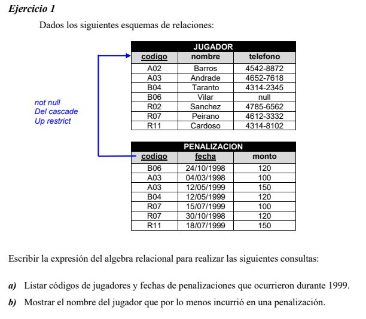
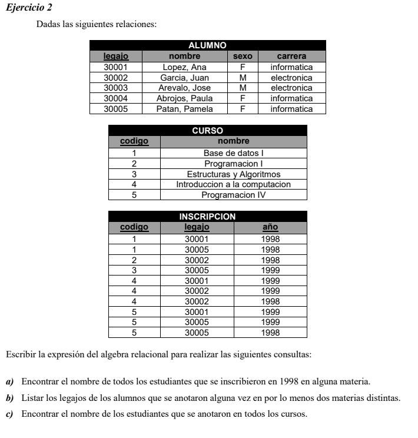
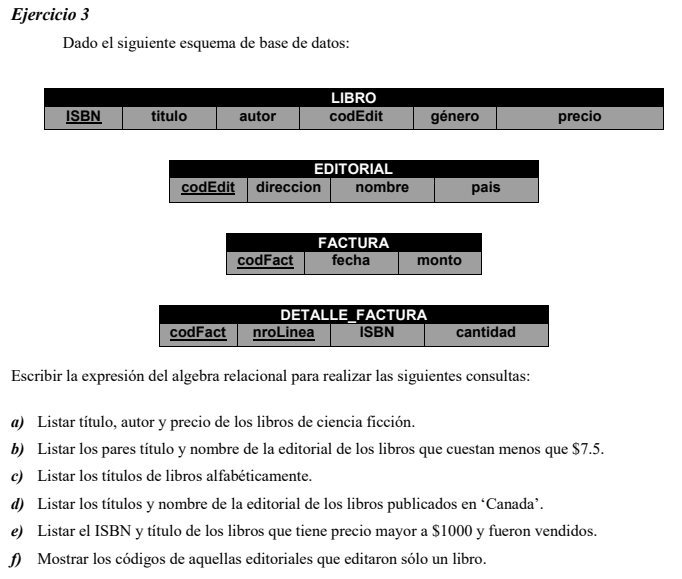
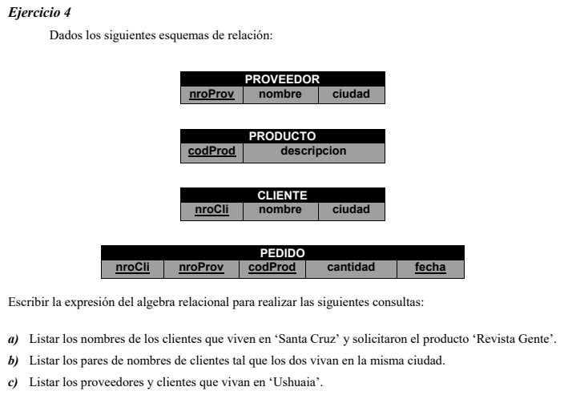
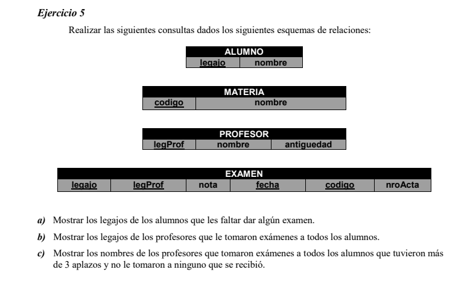

# Algebra relacional

**a)**
$$
\pi_{codigo,fecha}(\theta_{{1/1/1999} \le \text{ fecha }  \le {31/12/1999}}(\text{PENALIZACION}))
$$
**b)**
$$
\pi_{nombre}(\text{JUGADOR}\Join \text{PENALIZACION} )
$$

**a)**
$$
\pi_{nombre}(\theta_{año = 1998}(\text{INSCRIPCION}) \Join ALUMNO)
$$
**b)**
$$
\pi_{ins1.legajo}(\theta_{ins1.legajo = ins2.legajo\ \&\ ins1.ano = ins2.ano}(\rho_{(ins1)}(\text{INSCRIPCION}) \Join \rho_{(ins2)}(\text{INSCRIPCION}) ))
$$
**c)**
$$
\text{LegajosWithAllCourses} \leftarrow \pi_{codigo,legajo}(\text{INSCRIPCION})\div \pi_{codigo}(\text{CURSO})\\
\pi_{nombre}(\text{LegajosWithAllCourses} \Join \text{ALUMNO})
$$

**a)**
$$
\pi_{titulo,autor,precio}(\theta_{genero = \text{ciencia ficcion}}(\text{LIBRO}))
$$
**b)**
$$
\pi_{titulo,nombre}(\text{EDITORIAL}\Join \theta_{precio \lt7.5}(LIBRO) )
$$
**c)**
$$

$$
**d)**
$$
EditCodEnCanada \leftarrow (\pi_{codEdit,pais}(\theta_{pais = \text{Canada}}(\text{EDITORIAL})))\\
LibrosCanadienses \leftarrow \pi_{codEdit,titulo}(\text{LIBROS}) \div \text{EditCodEnCanada}\\
\pi_{}
$$

**a)**
$$
\pi_{nombre}(\theta_{\text{ciudad = 'Santa Cruz'}}(CLIENTE)\Join\theta_{\text{descripcion = "Revista Gente"}}(PRODUCTO\Join PEDIDO))
$$
**b)**
$$
\pi_{\text{cli1.nombre,cli2.nombre}}(\theta_{\text{cli1.ciudad = cli2.ciudad}}(\rho_{cli1}(CLIENTE) \Join \rho_{cli2}(CLIENTE)))
$$
**c)**
$$
\pi_{nombre}(\theta_{\text{ciudad = 'Ushuaia'}}(\pi_{nombre,ciudad}(PROVEEDOR)\cup\pi_{nombre,ciudad}(CLIENTE)))
$$

**a)**
$$
\pi_{legajo}(\theta_{\text{legajo !=legajo2}}(\rho_{(legajo2)}(EXAMEN)\Join ALUMNO))
$$
**b)**
$$
\pi_{legProf}(\pi_{legajo,legProf}(EXAMEN)\div \pi_{legProf}(PROFESOR))
$$
**c)**
$$

$$

