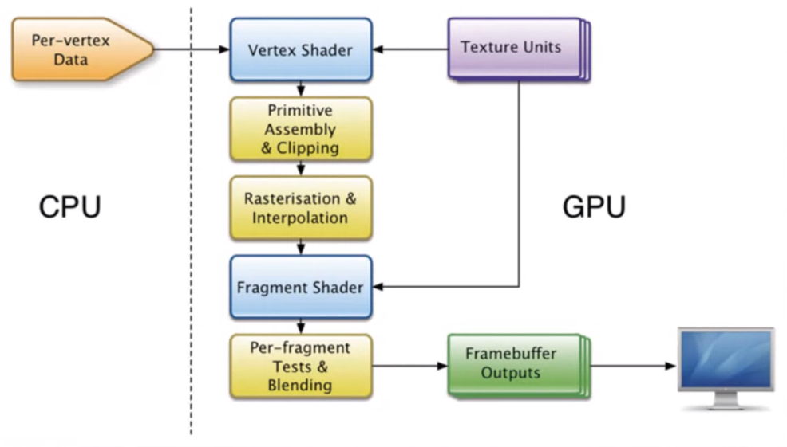
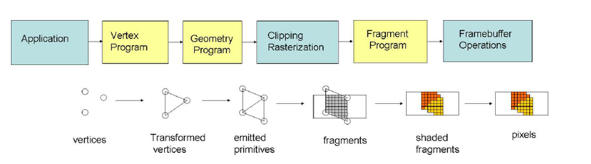

# Renderer

Para renderizar los sprites en la computadora, a la GPU se le pasan *meshs*. Estos elementos son como la piel del sprite, compuestos por triangulos. 

La GPU recibe esta malla, la separa en triangulitos y aplica un *vertex shader* a cada uno de ellos. Este programa se ejecuta una vez por vertice. Por eso es importante utilizar la menor cantidad de vertices posibles, el problema es que cuantos mas vertices utilizo, mas detalle puede tener nuestro sprite.

Como vemos en el pipeline, luego del vertex shader, los triangulos que esten dentro de la pantalla a la proxima etapa, mientras que lo que no estan son eliminados. En el caso de los triangulos que esta parcialemnte en la pantalla se les crean nuevos vertices para que esten comopletamente en la pantalla.

La progima etapa es la rasterizacion. Por cada uno de estos trianfulos se va a crear un fragmento, se va a evaluar que pixeles van a estar dentro del triangulo y se los agrega al fragmento. Cuantos mas grandes sean los triangulos, mas fragmentos va a haber.

Luego se pasa por el fragment shader, donde se procesa a los fragmenos y se les asigna el color, entre otras cosas.

Por ultimo se ejecuta los testeos por fragmento, eligiendo cuales estan mas adelante o mas atras.

## Pipeline

### Vertex Shader

Aca entran los datos de los vertices de una malla, y salen los triangulos ya proyectados a la pantalla. El objeto viene cargado con *model-space coordinates*, es decir, las cordenadas relativas al modelo. Es necesario convertir a esas coordenadas a *world-space coordinates*. Pero ademas es necesario tener en cuenta el punto de vista de la camara, ya que desde ese angulo vamos a estar renderizando a los elementos, a esto se lo llama *camera-space coordinates*.

El ultimo paso es la proyeccion, donde elementos como el field of view afectan a lo que se ve en la camara. La proyeccion puede ser **perspectiva**, donde los rayos salen de un solo punto, o proyeccion **ortografica**, donde los rayos que salen de la camara son paralelos. Los planos *near* y *far* establecen a partir de que punto en $z$ y hasta que punto se van a dibujar los meshs. Si los planos estan muy cerca se empiezan a generar artefactos en pantalla.

Todos estos cambios de coordenadas se realizan mediante transforamciones lineales. A estos vectores de posicion se los multiplica por una matrix $4\times 4$ (el cuarto elemento es la traslacion). Luego se normaliza a valores en $[-1,1]$.

El CPU suele analizar que partes del mesh esta en pantalla para que la GPU pueda procesarlo mas rapido.

#### Shader

El shader es como se va a renderizar el mesh. En un archivo de shader de unity se pueden crear varios shaders para el mismo mesh, la idea es indicar el nivel de detalle con el tag `LOD` y escribir distintos shaders para que no cueste lo mismo dibujarlo si esta a 500 metros o a 1 metro.

Los shaders en si pueden ser programados en muchos lenguajes y estos suelen estar basados en una gran diversidad de elnguajes de programacion como java o assembly.

#### Material

El material es la union entre el objeto y el shader.

#### Texturas

Es una forma de guardar informacion, la informacion puede ser obtenida utiliazando coordenadas. Las coordenadas se mapean a la mesh con las coordenadas uv.

### Rastering

El rasterizado permite pasar de una forma primitiva compuest apor 3 vertices a un fragmento alineado a la grilla de pixeles con profundidad. Por cada fragmento se genera su posucion uv en base a una interpolacion de los 3 vertices.