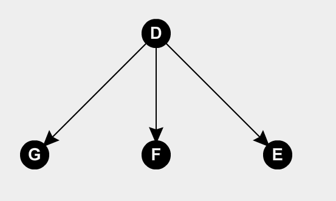

# Arbol Dirigido

Un **arbol dirigido** es un digrafo cuyo grafo subyacente es un arbol. Por ejemplo:

Ahora podemos definir a un **arbol con raiz**, dado que todo arbol dirigido tiene un vertice distinguido $r$ llamado raiz tal que solo hay un camino directo entre $r$ y cualquier otro vertice. En el ejemplo anterior, el vertice $D$ es el vertice raiz.

Se dice que la **profundidad** de un vertice es la distancia entre el vertice raiz y ese vertice. Por ejemplo, en el caso anterior los vertices $G$,$F$ y $E$ tienen una profundidad 1. Tambien se lo llama **nivel** del vertice.

De la misma forma se define la **altura** como la longitud del camino mas largo desde la raiz. En el ejemplo podemos decir que la altura es 1.

Tambien podemos definir relaciones entre los nodos, siendo la primera la relacion de **Padre**, que se usa para marcar que un vertice precede inmediatamente a otro vertice, $D$ es padre de $G$. Tambien se definen **Hijos**, siendo utilizados para marcar a un vertice que sucede inmediatamente a otr vertice, $F$ es hijo de $D$. Si dos vertices tienen al mismo padre, entonces son **hermanos**, $G$, $F$ y $E$ son hermanos.

Si queremos relacionar vertices que no estan inmediatamente relacionados, podemos decir que un vertice $w$ es **descendiente** de un vertice $v$ si existe un camino unico $v-w$. Si $w \neq v$, entonces se dice que $w$ es un **descendiente propio** de $v$ y $v$ un **ancetesor propio** de $w$.

Los nodos **hoja** son aquellos que no tienen nodos hijos.

Se puede representar a los arboles dirigidos como un **dibujo plano estandar**, que implica dibujar la raiz arriba de todo y luego los vertices que estan debajo ponerlos en el mismo nivel horizontalmente.

## Definiciones

- **Arbol Dirigido**: es un digrafo cuyo grafo subyacente es un arbol
- **Arbol con Raiz**: Un arbol con raiz es un arbol dirigido con un vertice distinguido $r$ llamado raiz tal que solo hay un camino directo entre $r$ y cualquier otro vertice.
- **Profundidad**: En un arbol con raiz, la profundidad de un vertice v es la distancia a la raiz.
- **Altura**: Es la distancia entre la raiz y el vertice mas profundo.

## Teoremas

- Un arbol dirigido es representable como un arbol raiz $\Leftrightarrow$ un vertice tiene un grado de entrada 0 y todos los demas grados de entrada 1.