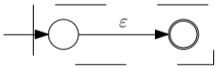
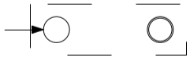
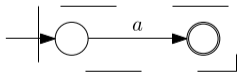
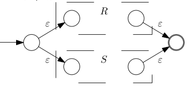
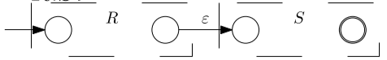
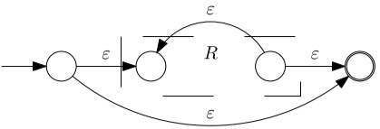

# Conversions

## Between RE and FA

There are several methods to convert a regular expression into a finite automaton.

### Method of Neighbors

Also called Glushkov's method.

To use this algorithm we need to assign all symbols of the regular expressions a number from $1$ to $n$. Then we will create each of the following sets:

- $Z$: This set is also named starter set. It contains all the symbols that can be the first element of a string.
- $P$: Also called set of neighbors, here we store all the possible combinations of two symbols that can be next to each other in any possible string of the language. Later we will use this set to create the transitions.
- $Q$: It is the set of all states. We always have to include the state $q_0$ because we are going to add it manually and all the other states will be the numbers $1,\dots,n$ from before.
- $F$: It is composed of all the symbols that can be the last elements of a string.

Lastly, we are going to stablish the transition function $\delta$. First we will connect the new state $q_0$ to all initial states from $Z$, because the elements are written as $\text{symbol}_{state}$, this means that we'll create the following mapping:
$$
\delta(q_0,\text{symbol}) = \text{state}
$$
Then, we will create the transitions from the set $P$. Here our elements are written as $\text{letter}_\text{state1}\text{transition}_{\text{state2}}$ and we will map them as:
$$
\delta(\text{state1},\text{transition}) =\text{state2}
$$
All undefined transitions will be redirected to $\emptyset$.

We can also see the algorithm here:

### Method of Derivatives

This algorithm works using the theorem of *Bound of Dissimilarities*:

>Every regular expression has only a finite number of dissimilar derivatives

More specifically, the following corollary:

> DFA can be constructed from a Regular Expression using the algorithm if only similarity among derivates is recognized.

The main idea of this algorithm is to accumulate unique derivatives in a set until no more expressions are added.

Each of the expressions in that set will represent a state, where the original expression is the initial state. The final states are decided as the expressions within the set that contain the empty string in the language they represent.

The transitions are created from the derivation themselves, for example if I have the following set:
$$
U = \{ab,b\}
$$
Then I would have a transition from $ab \overset a {\rightarrow } b$. This is because:
$$
\frac {\part ab}{\part a} = b \\
$$
The actual algorithm can be found here:

### Thompson's Method

Thompson's method works constructing and merging different automaton. The most basic parts of the automaton are:

- $U = \epsilon$:

  

- $U = \emptyset$:

  

- $U = a, \forall a \in \Sigma$:

  

- $U = R + S$

  

- $U = R.S$:

  

- $U = R^*$

  

After combining all the parts we will obtain a NFA with epsilon transitions.

## Between RE and FA

We are using the following theorem:

> For every NFA $M$ a regular expression $V$ can be constructed such that:
> $$
> L(M) = L(V)
> $$

We are also defining an **Extended Finite Automaton (EFA)** $M$ is $(Q,\sigma,\gamma,q_0,F)$ where:

- $Q$ is a finite set of states.

- $\Sigma$ is a finite input alphabet.

- $\gamma$ is a mapping function from $Q\times Q \rightarrow R_T$ ($R_T$ is a subset of REs over $\Sigma$)

- $q_0$ is the initial state, $q_0 \in Q$

- $F$ is the set of final states, $F \subseteq Q$ 

  If the transition from $p$ to $q$ is not defined, then $\gamma(p,q) = \emptyset~~\forall p,q \in Q$ 

> Let $M = (Q,\Sigma,\gamma,q_0,F)$ be an EFA. Assume that $q\in Q$ is neither a start state or a final state, then the equivalent EFA is $M' = (Q \setminus \{q\},\Sigma,\gamma',q_0,F )$ where the mapping $\gamma'$ is defined for every pair $p,r \in (Q\setminus\{q\})$ as:
> $$
> \gamma'(p,r) = \gamma(p,r) + \gamma(p,q)\gamma(q,q)^*\gamma(q,r)
> $$

### Elimination of States

Elimination of States works by removing states on the NFA and replacing them with regular expressions that represent that state. To work with this algorithm we need to create a new initial state is connected using an $\epsilon$-transition to the previous initial state. In the same way, we need to connect all the final states to a new final state using $\epsilon$-transitions. In the end  we should only have the new initial and final states that we just created.

### Solution of Regular Equations

The idea on this algorithm is to create regular equations from the automaton and them solve them, creating the Regular Expression. For this we have to take into considerations all transitions from a state. For example, if the state A has a transition to state B with the action 1 and to itself with the action 2, we get the following regular expression:
$$
X_A = X_A2 + X_B2
$$
If the state is also final, then we have to add $+ ~\epsilon$. 

All we have to do now is to solve all the regular equations and express the resulting regular expression as:
$$
V \leftarrow X_{p_1} + X_{p_2}+ \dots + X_{p_i}~~~\forall p_i \in F
$$
Here is the formal algorithm:

## Between RG and RE

We will assume that for given $A,B \in N$ there is at most one production rule of the form:
$$
A \rightarrow \alpha B\\
A \rightarrow \alpha
$$
