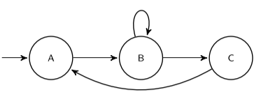

# Boolean Satisfiability

Because BMC problem are very hard to solve an compute for all possible inputs, we are going to convert BMC to **boolean satifiability** (SAT). Then we will check if the SAT is satisfiable or not.

### Boolean Encoding of BMC

Every finite transition system $(S,S_0,R)$ can be encoded as a Boolean transition system. For the new transition system we are going to need $\lceil \log_2|S|\rceil$ variables. In this transition we are going to represent the set of initial states, the states and the transition relation as a binary formula. 

There are different ways of creating a Boolean encoding of BMC:

- **Disjunctive Normal Form**: This is the simplest form of encoding, where we represent the system  as the space where the states are described, the set of initial states and the set of transitions. We also should provide a lookup table to identify the states and their given encoding.

  For example, if we have the following transition system:

  

  Described formally as:
  $$
  \left(\{A,B,C\}, \{A\},\left\{\array{(A,B)\\(B,B)\\(B,C)\\(C,A)}\right\}\right)
  $$
  It can be converted to the following transition system:
  $$
  \left\{\mathbb{B}^2,\{(\top,\top)\},\left\{
  \array{
  ((\top,\top),(\top,\bot))\\
  ((\top,\bot),(\top,\bot))\\
  ((\top,\bot),(\bot,\top))\\
  ((\bot,\top),(\top,\top))
  }
  \right\}\right\}
  $$
  With the following encoding:
  $$
  \left\{\array{A:(\top,\top)\\
  B:(\top,\bot)\\
  C:(\bot,\top)}
  \right\}
  $$
  Now we can finally obtain the boolean encoding of BMC:
  $$
  \left(\mathbb{B}^2, \left\{(v_0,v_1)|v_0\land v_1\right\},\left\{((v_0,v_1),(v_0',v_1')\left|
  \array{
  [v_0\land v_1\land v_0'\land \neg v_1']
  \\ \lor \\
  [v_0 \land \neg v_1 \land v_0' \land \neg v_1']
  \\ \lor \\
  [v_0 \land \neg v_1 \land \neg v_0' \land v_1'] 
  \\ \lor \\
  [\neg v_0 \land v_1 \land v_0' \land v_1']
  }
  
  \right.\right\} \right)
  $$

## Boolean Satisfiability

The **SAT** algorithm is used to verify Boolean satisfiability. In order to verify our models we need to input the transition system, initial state and final state as a boolean formula:
$$
\phi = \text{initial state} \land \text{transition system} \land \text{property}
$$
And it will return the satisfying assignment if it exists or $\text{unsat}$ if the formula is not satisfiable.

Because we want a counter example each time that BMC is not satisfiable, we don't try to check that our property holds, but rather the opposite. For a given property $\phi$ and length $n$, we are looking to use SAT to verify the following formula:
$$
\neg \text{BMC}(\phi,n)
$$
If the formula holds, it will return the variable assignment and thus we will have a counter example for $\text{BMC}(\phi,n)$. If the formula is not satisfiable, then $\text{BMC}(\phi,n)$ holds.

For the following transition system:
$$
(\mathbb{B}^k,\{\vec v | S_0\}\,\{(\vec v,\vec v ') | T \} )
$$
Where $S_0, T,\text{ok}$ are boolean formulas encoding the corresponding sets, $\vec v, \vec v'$ are boolean variables representing the states of the transition system, and our path or length $n$ is composed of $k$-tuple of boolean vectors $(\vec v^0,\vec v^1,\dots,\vec v^{n-1})$. We want to represent the formula:
$$
\neg \text{BMC}(G\text{ok},n)
$$
And we will do it as such:
$$
S_0[\vec v \leftarrow \vec v^0] \land \bigwedge_{i=1}^{n-2} T[\vec v \leftarrow \vec v^i,\vec v' \leftarrow \vec v^{i+1}] \land \bigvee_{i\in\{0,\dots,n-1\}} \neg ok[\vec v \leftarrow \vec v^i]
$$
Here we are applying **symbolic model checking**, which uses symbols for representing big sets. In the case of infinite states, this is our only possible choice to solve them.

## SAT Solvers

Before diving into SAT solvers, we need to stablish some terminology:

- **Literal** refers to a boolean variable or its negation
- **Clause**: a disjunction of literals. I believe its the operation of $\land,\lor,\Rightarrow$ over two literals.

The naïve approach is pretty simple, yet inefficient. For a given formula, the algorithm will return $\top$ if it is satisfiable or $\bot$ if it's not.  

```pseudocode
Input: f // boolean formula
Output: True or False

f_ = simplify(f)
if f_ is Boolean Constant
	return f_
v = free variable of f_
return SAT(f_[v <- False]) or SAT(f_[v <- True])
```

To get a more powerful version of this algorithm we have to implement the following changes:

- **Unit Propagation**: It assigns a value to a literal. We do this in a way that looks for the formula to be satisfiable. If setting the variable to $\bot$ causes the formula to not be satisfiable, then we will assign $\top$.
- **Pure Literal Elimination**: If a variable only occurs as positively or negatively, we can automatically assign a truth value that evaluates all corresponding clauses to $\top$.

This new algorithm is called SAT+ o **DPLL**:

```pseudocode
Input: f // boolean formula
Output: True or False

f_ = simplify(f)
if f_ is Boolean Constant
	return f_

if f_ == f
	v = free variable in a clause with only one literal
	b = value that doesn't cause f_ to be not satisfiable
	return SAT(f_[v <- b])

v = free variable of f_
return SAT(f_[v <- False]) or SAT(f_[v <- True])
```


